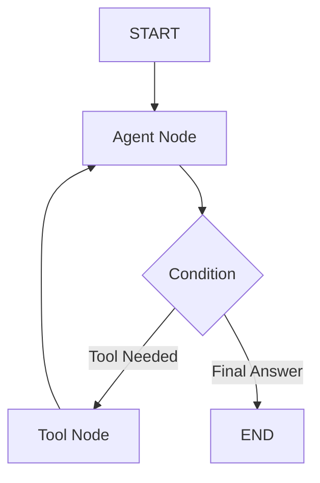

# 🕸️ LangGraph Fundamentals — The New Standard for Agents
> **Level:** Core Engineering | **Language:** Hinglish | **Goal:** Reliable autonomous agents build karne ke liye LangGraph ke fundamental concepts: Nodes, Edges, State, aur Cycles ko master karein.

---

## 🧭 1. Beginner-Friendly Hinglish Explanation
LangGraph ka matlab hai **"AI ka Flowchart"**. 

Ab tak humne LangChain mein "Chains" (Seedhi line) dekhi thi. Lekin agents hamesha seedhi line mein kaam nahi karte. Wo loops mein kaam karte hain:
- "Tool chalao -> Result dekho -> Phir se tool chalao."
LangGraph humein ek **Graph (Jal)** banane deta hai jisme AI peeche bhi ja sakta hai (Cycles).

Ye 2026 mein agents banane ka **Industry Standard** hai kyunki ye aapko "Fine-grained Control" deta hai.

---

## 🧠 2. Deep Technical Explanation
LangGraph LLMs ke sath stateful, multi-actor applications build karne ke liye ek library hai.
- **The State:** Ek shared dictionary ya Pydantic object jo current world-view ko represent karta hai. Graph ka har node is state se read aur write karta hai.
- **Nodes:** Simple Python functions jo state ko lete hain, kuch kaam karte hain (jaise LLM call karna), aur updated state return karte hain.
- **Edges:** Nodes ke beech transition ko define karte hain.
    - **Normal Edges:** Humesha A se B ki taraf jate hain.
    - **Conditional Edges:** Ye decide karne ke liye LLM ka use karte hain ki B, C ya END par jana hai.
- **Cycles:** Pichle node par wapas loop back karne ki ability. Yahi "Self-correction" aur "Iterative Search" ko enable karta hai.
- **Compilation:** Graph ko ek "Runnable" mein convert karna jise kisi bhi doosre LangChain component ki tarah invoke kiya ja sake.

---

## 🏗️ 3. Architecture Diagrams


```mermaid
graph TD
    START --> N1[Agent Node]
    N1 --> CE{Condition}
    CE -- "Tool Needed" --> T[Tool Node]
    T --> N1
    CE -- "Final Answer" --> END
```

---

## 💻 4. Production-Ready Code Example (Simple Agentic Graph)

```python
from langgraph.graph import StateGraph, START, END

# 1. Define State
class State(dict):
    messages: list

# 2. Define Node Logic
def call_model(state: State):
    # LLM logic here
    return {"messages": state["messages"] + ["Model Response"]}

# 3. Define Graph Structure
builder = StateGraph(State)
builder.add_node("model", call_model)

builder.add_edge(START, "model")
builder.add_edge("model", END)

# 4. Compile
graph = builder.compile()

# res = graph.invoke({"messages": ["Hi"]})
# print(res)
```

---

## 🌍 5. Real-World Use Cases
- **Self-Correcting Code Agents:** Node A code likhta hai, Node B tests run karta hai. Agar tests fail ho jayein, toh ye wapas Node A par chala jata hai.
- **Research Agents:** Ek loop mein info search karna jab tak enough data collect na ho jaye.
- **Multi-step Reasoning:** Ek complex math problem ko har logical step ke liye nodes mein break karna.

---

## ❌ 6. Failure Cases
- **Infinite Cycles:** Graph ek hi node mein phasa hua hai (No exit condition).
- **State Overwrite:** Do nodes same state key ko galat data se overwrite kar dete hain.
- **Graph Complexity:** Itne saare nodes aur edges ki debug karna mushkil ho jaye.

---

## 🛠️ 7. Debugging Guide
- **Breakpoint Debugging:** LangGraph aapko state inspect karne ke liye kisi bhi node par "Interrupts" set karne deta hai.
- **Visualizer:** `graph.get_graph().draw_mermaid()` use karke dekhein ki kya aapka logic aapki drawing se match karta hai.

---

## ⚖️ 8. Tradeoffs
- **LangGraph:** Complex, iterative, aur stateful agents ke liye perfect hai.
- **LangChain Chains:** Loops ke bina simple, one-off tasks ke liye better hai.

---

## ✅ 9. Best Practices
- **Use TypedDict for State:** Humesha state ka schema define karein taaki type errors na hon.
- **Add 'Max Iterations':** Conditional edges mein hamesha ek counter rakhein taaki loop 10 baar ke baad band ho jaye.

---

## 🛡️ 10. Security Concerns
- **Cycle Exploits:** Attacker query aisi likhta hai jo agent ko infinite loop mein phasa de to drain your API credits.

---

## 📈 11. Scaling Challenges
- **Serialization:** Graph state ko database mein save karna aur load karna (Check-pointing) in high-speed apps.

---

## 💰 12. Cost Considerations
- **Turn-based Billing:** Har edge transition ek potential LLM call hai. Per query "Hops" ke number ko monitor karein.

---

## 📝 13. Interview Questions
1. **"LangChain aur LangGraph mein difference kya hai?"**
2. **"Conditional edge ka role kya hota hai graph mein?"**
3. **"Cycles in LangGraph: Unhe handle kaise karte hain?"**

---

## ⚠️ 14. Common Mistakes
- **Mutating State Directly:** State ko return karne ki jagah function ke andar modify karna (Always return the update).
- **Missing START/END:** Graph ko start ya khatam karne ka rasta na dena.

---

## 🚀 15. Latest 2026 Industry Patterns
- **Human-in-the-loop Graphs:** Aise graphs jo automatically ek specific node par pause ho jate hain aur aage badhne se pehle human dwara "Approve" click karne ka wait karte hain.
- **Graph as a Service:** Agentic graphs ko independent microservices ke roop mein deploy karna.

---

> **Expert Tip:** LangGraph turns a "Stupid Chain" into a **"Smart Workflow"**. If your agent needs to "Think again", you need LangGraph.
