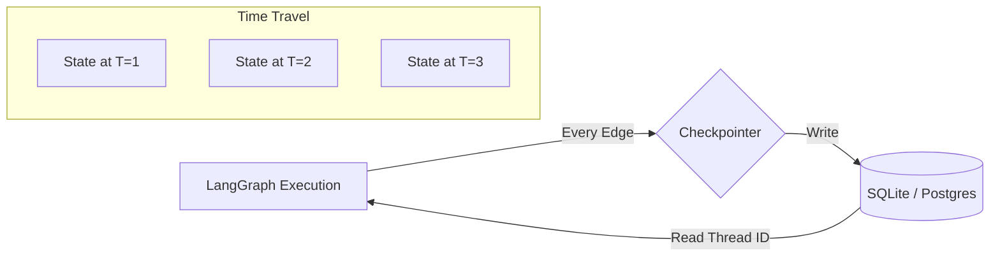

# 💾 Persistence & Checkpoints — The Agent's Save Game
> **Level:** Core Engineering | **Language:** Hinglish | **Goal:** Master the use of Checkpointers to save agent state, enable multi-session conversations, and implement "Time Travel" debugging.

---

## 🧭 1. Beginner-Friendly Hinglish Explanation
Persistence aur Checkpoints ka matlab hai **"Game Save karna"**. 

Imagine aap ek video game khel rahe ho aur light chali gayi. Agar checkpoint nahi hai, toh aapko level 1 se shuru karna padega. 
AI Agents ke saath bhi yahi hota hai:
- User ne 10 messages bheje.
- System crash ho gaya ya server restart hua.
- **Persistence:** Saara data database mein save ho gaya.
- **Checkpoints:** Agent ko pata hai wo last "Node" par kahan tha.

Iska sabse bada fayda ye hai ki aap **"Time Travel"** kar sakte ho. Matlab, agar agent ne galti ki, toh aap peeche jaakar use sudhaar sakte ho bina poori conversation restart kiye.

---

## 🧠 2. Deep Technical Explanation
Checkpoints are snapshots of the **Thread State** at every step (edge) of the graph execution.
- **The Checkpointer:** A persistent storage backend (SQLite, Postgres, Redis) that LangGraph uses to write the state object.
- **Thread ID:** Every conversation has a unique `thread_id`. The checkpointer stores states indexed by this ID.
- **Checkpoints vs Memory:**
    - **Memory:** Shared during a single run (RAM).
    - **Persistence:** Lasts across restarts and sessions (Disk/DB).
- **Time Travel:** By passing a `checkpoint_id` (or `thread_ts`), you can load the graph at a specific point in time and re-execute from there.
- **Human-in-the-loop:** Persistence is what enables HITL. The graph saves state, pauses (terminates the process), and waits for an external trigger to resume.

---

## 🏗️ 3. Architecture Diagrams



---

## 💻 4. Production-Ready Code Example (SQLite Persistence)

```python
from langgraph.checkpoint.sqlite import SqliteSaver
import sqlite3

# 1. Setup SQLite DB
conn = sqlite3.connect("checkpoints.db", check_same_thread=False)
memory = SqliteSaver(conn)

# 2. Compile Graph with Checkpointer
# app = workflow.compile(checkpointer=memory)

# 3. Run with a Thread ID
config = {"configurable": {"thread_id": "user_123"}}
# app.invoke({"messages": ["Hi"]}, config)

# 4. Next time you call with SAME thread_id, it remembers everything!
# app.invoke({"messages": ["What did I say earlier?"]}, config)
```

---

## 🌍 5. Real-World Use Cases
- **Customer Support Bots:** User 2 din baad wapas aata hai aur bot ko pichli baatein yaad hoti hain.
- **Long-running Tasks:** Agents that work for hours (like researching a topic) and need to save progress in case of server failure.
- **A/B Testing States:** Saving a specific point in a conversation and testing two different AI responses from that exact point.

---

## ❌ 6. Failure Cases
- **Database Lock:** SQLite mein multiple threads ek saath likhne ki koshish karein (Use Postgres for high scale).
- **State Versioning:** Aapne code badal diya (State schema change), par database mein purana state saved hai (Deserialization error).
- **Security Leak:** User A ka `thread_id` guess karke User B uski private chat history access kar le.

---

## 🛠️ 7. Debugging Guide
- **Inspect Checkpoints:** Use `app.get_state(config)` to see the exact JSON saved in the DB.
- **History Exploration:** `app.get_state_history(config)` lets you see all previous versions of the state for that thread.

---

## ⚖️ 8. Tradeoffs
- **Checkpoints:** Essential for reliability and multi-session, but adds database latency and storage cost.
- **Stateless:** Faster and cheaper, but "Forgets" everything once the request is over.

---

## ✅ 9. Best Practices
- **Unique Thread IDs:** Always use UUIDs or authenticated User IDs as `thread_id`.
- **Cleanup Policy:** Database se purane checkpoints (e.g. older than 30 days) delete karne ka script rakhein.

---

## 🛡️ 10. Security Concerns
- **State Encryption:** Encrypt the state blobs in the database to prevent direct data theft from the disk.

---

## 📈 11. Scaling Challenges
- **Postgres Checkpointer:** At scale, you need `PostgresSaver` with connection pooling to handle thousands of concurrent state writes.

---

## 💰 12. Cost Considerations
- **Storage Cost:** 1 million users ka conversation state millions of rows/blobs occupy kar sakta hai.

---

## 📝 13. Interview Questions
1. **"LangGraph mein 'Thread ID' ka kya mahatva hai?"**
2. **"Time-travel debugging kaise implement karenge?"**
3. **"Persistence vs Short-term memory mein kya fark hai?"**

---

## ⚠️ 14. Common Mistakes
- **No Checkpointer:** Prod app banana bina checkpointer ke.
- **Shared Thread IDs:** Alag users ke liye same ID use karna.

---

## 🚀 15. Latest 2026 Industry Patterns
- **Cloud-Native Checkpointing:** Using serverless databases (like Supabase or Upstash Redis) to handle agent state globally.
- **State Branching:** Allowing an agent to "Fork" its state into two parallel paths to explore different strategies simultaneously.

---

> **Expert Tip:** Persistence is the difference between a **Chatbot** and an **Application**. Never ship an agent without a Save button.
