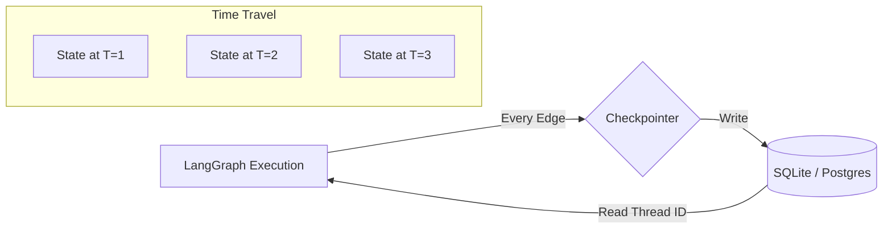

# 💾 Persistence & Checkpoints — The Agent's Save Game
> **Level:** Core Engineering | **Language:** Hinglish | **Goal:** Agent state save karne, multi-session conversations enable karne, aur "Time Travel" debugging implement karne ke liye Checkpointers ke use ko master karein.

---

## 🧭 1. Beginner-Friendly Hinglish Explanation
Persistence aur Checkpoints ka matlab hai **"Game Save karna"**. 

Imagine aap ek video game khel rahe ho aur light chali gayi. Agar checkpoint nahi hai, toh aapko level 1 se shuru karna padega. 
AI Agents ke saath bhi yahi hota hai:
- User ne 10 messages bheje.
- System crash ho gaya ya server restart hua.
- **Persistence:** Saara data database mein save ho gaya.
- **Checkpoints:** Agent ko pata hai wo last "Node" par kahan tha.

Iska sabse bada fayda ye hai ki aap **"Time Travel"** kar sakte ho. Matlab, agar agent ne galti ki, toh aap peeche jaakar use sudhaar sakte ho bina poori conversation restart kiye.

---

## 🧠 2. Deep Technical Explanation
Checkpoints graph execution ke har step (edge) par **Thread State** ke snapshots hote hain.
- **The Checkpointer:** Ek persistent storage backend (SQLite, Postgres, Redis) jise LangGraph state object ko write karne ke liye use karta hai.
- **Thread ID:** Har conversation ki ek unique `thread_id` hoti hai. Checkpointer is ID se index karke states store karta hai.
- **Checkpoints vs Memory:**
    - **Memory:** Shared during a single run (RAM).
    - **Persistence:** Lasts across restarts and sessions (Disk/DB).
- **Time Travel:** `checkpoint_id` (ya `thread_ts`) pass karke, aap graph ko ek specific point in time par load kar sakte hain aur wahan se re-execute kar sakte hain.
- **Human-in-the-loop:** Persistence hi HITL ko enable karti hai. Graph state save karta hai, pause karta hai (process ko terminate karta hai), aur resume karne ke liye external trigger ka wait karta hai.

---

## 🏗️ 3. Architecture Diagrams


```mermaid
graph LR
    G[LangGraph Execution] -->|Every Edge| C{Checkpointer}
    C -->|Write| DB[(SQLite / Postgres)]
    DB -->|Read Thread ID| G
    
    subgraph "Time Travel"
    V1[State at T=1]
    V2[State at T=2]
    V3[State at T=3]
    end
```

---

## 💻 4. Production-Ready Code Example (SQLite Persistence)

```python
from langgraph.checkpoint.sqlite import SqliteSaver
import sqlite3

# 1. Setup SQLite DB
conn = sqlite3.connect("checkpoints.db", check_same_thread=False)
memory = SqliteSaver(conn)

# 2. Compile Graph with Checkpointer
# app = workflow.compile(checkpointer=memory)

# 3. Run with a Thread ID
config = {"configurable": {"thread_id": "user_123"}}
# app.invoke({"messages": ["Hi"]}, config)

# 4. Next time you call with SAME thread_id, it remembers everything!
# app.invoke({"messages": ["What did I say earlier?"]}, config)
```

---

## 🌍 5. Real-World Use Cases
- **Customer Support Bots:** User 2 din baad wapas aata hai aur bot ko pichli baatein yaad hoti hain.
- **Long-running Tasks:** Aise agents jo ghanton kaam karte hain (jaise topic research karna) aur server failure ke case mein progress save karne ki zaroorat hoti hai.
- **A/B Testing States:** Conversation mein ek specific point ko save karna aur us exact point se do different AI responses ko test karna.

---

## ❌ 6. Failure Cases
- **Database Lock:** SQLite mein multiple threads ek saath likhne ki koshish karein (Use Postgres for high scale).
- **State Versioning:** Aapne code badal diya (State schema change), par database mein purana state saved hai (Deserialization error).
- **Security Leak:** User A ka `thread_id` guess karke User B uski private chat history access kar le.

---

## 🛠️ 7. Debugging Guide
- **Inspect Checkpoints:** DB mein saved exact JSON dekhne ke liye `app.get_state(config)` ka use karein.
- **History Exploration:** `app.get_state_history(config)` aapko us thread ke state ke saare previous versions dekhne deta hai.

---

## ⚖️ 8. Tradeoffs
- **Checkpoints:** Reliability aur multi-session ke liye essential hain, par database latency aur storage cost add karte hain.
- **Stateless:** Faster aur cheaper hai, par request end hone ke baad sab kuch "Bhool" jata hai.

---

## ✅ 9. Best Practices
- **Unique Thread IDs:** Humesha UUIDs ya authenticated User IDs ko `thread_id` ki tarah use karein.
- **Cleanup Policy:** Database se purane checkpoints (e.g. older than 30 days) delete karne ka script rakhein.

---

## 🛡️ 10. Security Concerns
- **State Encryption:** Disk se direct data theft ko rokne ke liye database mein state blobs ko encrypt karein.

---

## 📈 11. Scaling Challenges
- **Postgres Checkpointer:** Scale par, thousands of concurrent state writes handle karne ke liye connection pooling ke sath `PostgresSaver` ki zaroorat hoti hai.

---

## 💰 12. Cost Considerations
- **Storage Cost:** 1 million users ka conversation state millions of rows/blobs occupy kar sakta hai.

---

## 📝 13. Interview Questions
1. **"LangGraph mein 'Thread ID' ka kya mahatva hai?"**
2. **"Time-travel debugging kaise implement karenge?"**
3. **"Persistence vs Short-term memory mein kya fark hai?"**

---

## ⚠️ 14. Common Mistakes
- **No Checkpointer:** Prod app banana bina checkpointer ke.
- **Shared Thread IDs:** Alag users ke liye same ID use karna.

---

## 🚀 15. Latest 2026 Industry Patterns
- **Cloud-Native Checkpointing:** Agent state ko globally handle karne ke liye serverless databases (jaise Supabase ya Upstash Redis) ka use karna.
- **State Branching:** Agent ko state ko do parallel paths mein "Fork" karne dena taaki simultaneously different strategies explore ki ja sakein.

---

> **Expert Tip:** Persistence is the difference between a **Chatbot** and an **Application**. Never ship an agent without a Save button.
