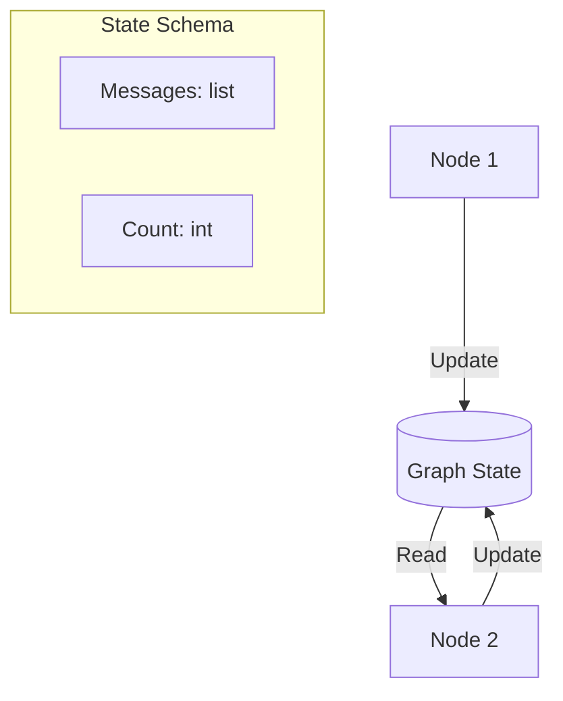

# 💾 State Management in LangGraph — The Agent's Memory
> **Level:** Core Engineering | **Language:** Hinglish | **Goal:** State Schema, Reducers, aur data kaise agentic graph ke through flow karta hai, in concepts ko master karein.

---

## 🧭 1. Beginner-Friendly Hinglish Explanation
State Management ka matlab hai **"Agents ki Diary"**. 

Imagine ek agent hai jo recipe bana raha hai. 
- Node 1: "Pyaj kaato." (Ye info diary mein likhi gayi).
- Node 2: "Pyaj ko bhuno." (Ye Node 2 ne diary se padha).
- Node 3: "Masala dalo." 

Agar ye "Diary" (State) na ho, toh Node 2 ko pata hi nahi chalega ki Node 1 ne kya kiya. LangGraph mein State wo object hai jo har node ke beech mein "Travel" karta hai aur saari updates store karta hai.

---

## 🧠 2. Deep Technical Explanation
LangGraph mein state poore graph execution ke liye **Single Source of Truth** hoti hai.
- **The State Schema:** Ek `TypedDict` ya `Pydantic` class jo define karti hai ki kaunsa data allowed hai (e.g., `messages`, `sender`, `next_step`).
- **Reducers (Annotated):** Ye sabse powerful feature hai. Ye define karta hai ki jab koi node value return karta hai toh state *kaise* update hoti hai.
    - **Overwrite (Default):** Purani value ko nayi value se replace kar diya jata hai.
    - **Append (using `operator.add`):** Nayi value ko purani value mein add kar diya jata hai (message lists ke liye common hai).
- **Channels:** Internally, LangGraph state variables ko store karne ke liye "Channels" use karta hai.
- **Isolation:** Har graph run ki apni independent state hoti hai, jo different users ke beech data leaks ko rokti hai.

---

## 🏗️ 3. Architecture Diagrams


```mermaid
graph TD
    S[(Graph State)]
    N1[Node 1] -->|Update| S
    S -->|Read| N2[Node 2]
    N2 -->|Update| S
    
    subgraph "State Schema"
    M[Messages: list]
    C[Count: int]
    end
```

---

## 💻 4. Production-Ready Code Example (Using Reducers)

```python
from typing import Annotated, TypedDict
from operator import add

# 1. Define State with an Append Reducer
class GraphState(TypedDict):
    # 'add' matlab naya message puraane list mein jud (append) jayega
    messages: Annotated[list, add]
    current_task: str # Default is overwrite

# 2. Node logic
def node_a(state: GraphState):
    return {"messages": ["Message from Node A"], "current_task": "Task 1"}

def node_b(state: GraphState):
    # Node B sees the message from Node A
    print(f"I saw: {state['messages']}")
    return {"messages": ["Message from Node B"]}

# Combined state after both nodes: 
# ["Message from Node A", "Message from Node B"]
```

---

## 🌍 5. Real-World Use Cases
- **Conversation History:** Har user aur AI message ko `messages` list mein append karna.
- **Task Tracking:** "Completed Tasks" ki list store karna taaki agent kaam repeat na kare.
- **Variable Storage:** Poore graph mein `user_id` ya `session_token` ko track karna.

---

## ❌ 6. Failure Cases
- **State Bloat:** List mein itne messages add ho gaye ki model ki context window full ho gayi.
- **Accidental Overwrite:** `Annotated` use karna bhool jana aur poori history delete ho jana.
- **Large State Serialization:** State mein itni badi images ya files rakhna ki state save karne mein latency aaye.

---

## 🛠️ 7. Debugging Guide
- **Print State at each Node:** Function ke start mein `print(state)` karein to verify input.
- **Snapshot Inspection:** Graph ke bahar se current state dekhne ke liye `graph.get_state(config)` ka use karein.

---

## ⚖️ 8. Tradeoffs
- **TypedDict:** Lightweight aur fast hai par runtime validation provide nahi karta.
- **Pydantic:** Robust validation hai par slightly slower aur zyada verbose hai.

---

## ✅ 9. Best Practices
- **Atomic Updates:** Ek node mein sirf wahi state update karein jiske liye wo banaya gaya hai.
- **Pruning Logic:** Ek "Summarizer Node" rakhein jo `messages` list bahut lambi hone par use summarize kar de (To prevent bloat).

---

## 🛡️ 10. Security Concerns
- **Sensitive Data in State:** State humesha encrypted database mein save karein (Checkpointers) agar usme PII (Private Info) hai.

---

## 📈 11. Scaling Challenges
- **Concurrent Updates:** LangGraph ise thread-safe checkpointers ke throw handle karta hai, par bahut high speed updates abhi bhi performance issues cause kar sakte hain.

---

## 💰 12. Cost Considerations
- **Context Tokens:** Large states ka matlab hai har subsequent node ke liye zyada input tokens. State size ko minimize karein!

---

## 📝 13. Interview Questions
1. **"LangGraph mein 'Reducer' ka kya kaam hota hai?"**
2. **"State overwrite vs State append mein decision factors kya hain?"**
3. **"State management multi-agent systems mein kaise handle karenge?"**

---

## ⚠️ 14. Common Mistakes
- **Mutating state in-place:** `state['list'].append(x)` (GALAT). Humesha naya dictionary return karein `return {"list": [x]}`.
- **Wrong Annotation:** `Annotated[list, add]` ki jagah sirf `list` likhna.

---

## 🚀 15. Latest 2026 Industry Patterns
- **Differential State Updates:** Tokens bachane ke liye LLM ko state ke sirf "Changed" parts hi bhejna.
- **Time-Travel Debugging:** Failed node ko different parameters ke sath retry karne ke liye state ko pichle "Checkpoint" par wapas le jana.

---

> **Expert Tip:** State is the **Lifeblood** of your graph. If you manage your state well, your agents will never lose their "Focus".
