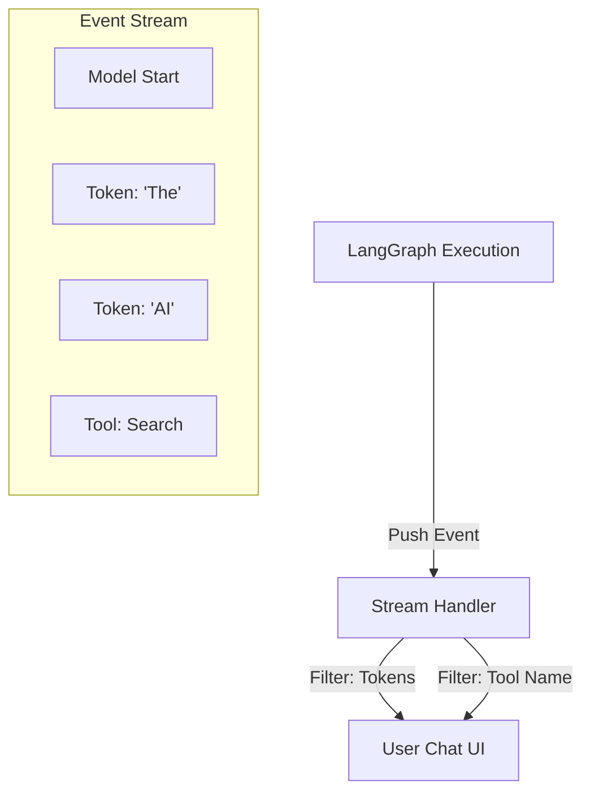

# 🌊 Streaming Events — Live Visibility for Agents
> **Level:** Advanced | **Language:** Hinglish | **Goal:** Master the techniques of streaming agent thoughts, tool calls, and final answers in real-time to the user interface.

---

## 🧭 1. Beginner-Friendly Hinglish Explanation
Streaming ka matlab hai **"Live Telecast"**. 

Imagine aapne agent ko bola: "Puraani history search karo aur summary banao." Isme 20 second lagenge. 
- **Non-Streaming:** User 20 second tak khali screen dekhta hai (Boring). 
- **Streaming:** User ko real-time mein dikhta hai: 
    - "Searching history..." 
    - "Found 5 documents..." 
    - "Writing summary: AI is..." (One word at a time).

Streaming se user ko "Wait" karna bura nahi lagta kyunki unhe dikh raha hai ki AI "Soch" raha hai.

---

## 🧠 2. Deep Technical Explanation
LangGraph supports granular streaming via the `astream_events` API (V2).
- **Event Types:**
    - `on_chat_model_stream`: Streaming the actual tokens of the LLM response.
    - `on_tool_start`: Signal that an agent has started using a tool.
    - `on_chain_start/end`: Signal when a specific node in the graph begins or finishes.
- **Filtering Events:** In production, you don't want to show "Internal Debug Logs" to the user. You must filter only `on_chat_model_stream` for the final UI.
- **Intermediate Steps:** Showing the "Thought Process" (ReAct steps) so the user understands *how* the agent reached the answer.
- **Async Iterators:** Using `async for` to consume the stream in the backend (FastAPI) and send it to the frontend via **Server-Sent Events (SSE)**.

---

## 🏗️ 3. Architecture Diagrams



---

## 💻 4. Production-Ready Code Example (FastAPI Streaming)

```python
from fastapi import FastAPI
from fastapi.responses import StreamingResponse

app = FastAPI()

async def event_generator(query):
    # Hinglish Logic: Graph ke har event ko pakdo aur user ko bhejo
    async for event in graph.astream_events({"messages": [query]}, version="v2"):
        kind = event["event"]
        if kind == "on_chat_model_stream":
            content = event["data"]["chunk"].content
            if content:
                yield f"data: {content}\n\n"
        elif kind == "on_tool_start":
            yield f"data: [Using Tool: {event['name']}]\n\n"

@app.get("/chat-stream")
async def chat_stream(query: str):
    return StreamingResponse(event_generator(query), media_type="text/event-stream")
```

---

## 🌍 5. Real-World Use Cases
- **Research Chatbots:** Showing the user which websites are being searched in real-time.
- **Coding Assistants:** Streaming the code block as it's being written.
- **Customer Support:** Showing "Agent is typing..." and then the response words.

---

## ❌ 6. Failure Cases
- **Broken Pipes:** Client ne browser tab band kar diya par backend stream chalta raha (Resource leak).
- **Latency Spikes:** Network slow hone ki wajah se stream "Jumpy" (Atak-atak kar) ho rahi hai.
- **Internal Leakage:** Galti se tool ke arguments (e.g. API keys) stream mein user ko dikh jana.

---

## 🛠️ 7. Debugging Guide
- **Log Event Types:** Print `event["event"]` and `event["name"]` to see the sequence of triggers.
- **cURL testing:** Use `curl -N http://localhost:8000/chat-stream?query=Hi` to test if streaming works without a frontend.

---

## ⚖️ 8. Tradeoffs
- **Streaming:** Excellent User Experience, feels faster, transparent.
- **Non-Streaming:** Simple to implement, easy to cache, but feels slow for long-running agents.

---

## ✅ 9. Best Practices
- **Content Aggregation:** Token-by-token update karne ki jagah frontend par chunks ko join karein.
- **Status Indicators:** Use specialized events to show "Thinking..." animations.

---

## 🛡️ 10. Security Concerns
- **Sensitive Metadata:** Ensure that the `data` payload of events doesn't contain internal trace IDs or private configurations.

---

## 📈 11. Scaling Challenges
- **Concurrent Connections:** Streaming apps maintain many open HTTP connections (SSE), requiring high-performance servers like Gunicorn with Uvicorn workers.

---

## 💰 12. Cost Considerations
- **No extra token cost:** Streaming uses the same tokens as non-streaming. However, the extra server bandwidth might add a small cost.

---

## 📝 13. Interview Questions
1. **"LangGraph astream_events v2 kyu use karein?"**
2. **"Token-by-token streaming aur Node-by-node streaming mein kya fark hai?"**
3. **"Server-Sent Events (SSE) vs Websockets for agents?"**

---

## ⚠️ 14. Common Mistakes
- **No Version in astream_events:** `version="v2"` mention na karna (Old versions are less reliable).
- **Blocking the stream:** Stream ke beech mein koi heavy sync operation karna jisse flow ruk jaye.

---

## 🚀 15. Latest 2026 Industry Patterns
- **Multi-Modal Streaming:** Streaming video/audio generation frames in parallel with text thoughts.
- **Interactive Streams:** Allowing the user to "Stop" or "Edit" the stream mid-way if they see the agent is going in the wrong direction.

---

> **Expert Tip:** Streaming is **Psychological Speed**. Even if the agent takes 30 seconds, a stream makes it feel like it started in 1 second.
