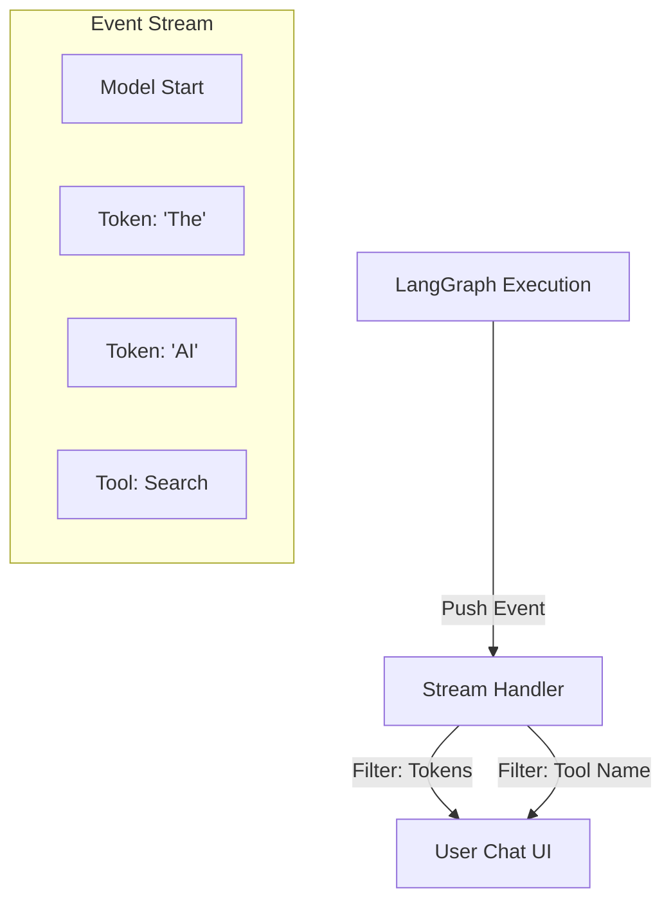

# 🌊 Streaming Events — Live Visibility for Agents
> **Level:** Advanced | **Language:** Hinglish | **Goal:** Real-time user interface par agent thoughts, tool calls, aur final answers ko stream karne ki techniques ko master karein.

---

## 🧭 1. Beginner-Friendly Hinglish Explanation
Streaming ka matlab hai **"Live Telecast"**. 

Imagine aapne agent ko bola: "Puraani history search karo aur summary banao." Isme 20 second lagenge. 
- **Non-Streaming:** User 20 second tak khali screen dekhta hai (Boring). 
- **Streaming:** User ko real-time mein dikhta hai: 
    - "Searching history..." 
    - "Found 5 documents..." 
    - "Writing summary: AI is..." (One word at a time).

Streaming se user ko "Wait" karna bura nahi lagta kyunki unhe dikh raha hai ki AI "Soch" raha hai.

---

## 🧠 2. Deep Technical Explanation
LangGraph `astream_events` API (V2) ke through granular streaming support karta hai.
- **Event Types:**
    - `on_chat_model_stream`: LLM response ke actual tokens ko stream karna.
    - `on_tool_start`: Signal ki agent ne tool use karna start kar diya hai.
    - `on_chain_start/end`: Signal jab graph mein koi specific node begin ya finish hota hai.
- **Filtering Events:** Production mein, aap user ko "Internal Debug Logs" nahi dikhana chahte. Final UI ke liye aapko sirf `on_chat_model_stream` filter karna hoga.
- **Intermediate Steps:** "Thought Process" (ReAct steps) dikhana taaki user samajh sake ki agent answer tak *kaise* pahuncha.
- **Async Iterators:** Backend (FastAPI) mein stream consume karne ke liye `async for` ka use karna aur use **Server-Sent Events (SSE)** ke throw frontend par bhejna.

---

## 🏗️ 3. Architecture Diagrams


```mermaid
graph TD
    G[LangGraph Execution] -->|Push Event| S[Stream Handler]
    S -->|Filter: Tokens| U[User Chat UI]
    S -->|Filter: Tool Name| U
    
    subgraph "Event Stream"
    E1[Model Start]
    E2[Token: 'The']
    E3[Token: 'AI']
    E4[Tool: Search]
    end
```

---

## 💻 4. Production-Ready Code Example (FastAPI Streaming)

```python
from fastapi import FastAPI
from fastapi.responses import StreamingResponse

app = FastAPI()

async def event_generator(query):
    # Hinglish Logic: Graph ke har event ko pakdo aur user ko bhejo
    async for event in graph.astream_events({"messages": [query]}, version="v2"):
        kind = event["event"]
        if kind == "on_chat_model_stream":
            content = event["data"]["chunk"].content
            if content:
                yield f"data: {content}\n\n"
        elif kind == "on_tool_start":
            yield f"data: [Using Tool: {event['name']}]\n\n"

@app.get("/chat-stream")
async def chat_stream(query: str):
    return StreamingResponse(event_generator(query), media_type="text/event-stream")
```

---

## 🌍 5. Real-World Use Cases
- **Research Chatbots:** User ko real-time mein dikhana ki kaunsi websites search ki ja rahi hain.
- **Coding Assistants:** Code block jaise-jaise likha ja raha ho use stream karna.
- **Customer Support:** "Agent is typing..." dikhana aur fir response words.

---

## ❌ 6. Failure Cases
- **Broken Pipes:** Client ne browser tab band kar diya par backend stream chalta raha (Resource leak).
- **Latency Spikes:** Network slow hone ki wajah se stream "Jumpy" (Atak-atak kar) ho rahi hai.
- **Internal Leakage:** Galti se tool ke arguments (e.g. API keys) stream mein user ko dikh jana.

---

## 🛠️ 7. Debugging Guide
- **Log Event Types:** Triggers ki sequence dekhne ke liye `event["event"]` aur `event["name"]` print karein.
- **cURL testing:** Streaming bina frontend ke kaam karti hai ya nahi ye test karne ke liye `curl -N http://localhost:8000/chat-stream?query=Hi` use karein.

---

## ⚖️ 8. Tradeoffs
- **Streaming:** Excellent User Experience, faster aur transparent feel hota hai.
- **Non-Streaming:** Implement karna simple hai, cache karna easy hai, par long-running agents ke liye slow feel hota hai.

---

## ✅ 9. Best Practices
- **Content Aggregation:** Token-by-token update karne ki jagah frontend par chunks ko join karein.
- **Status Indicators:** "Thinking..." animations dikhane ke liye specialized events use karein.

---

## 🛡️ 10. Security Concerns
- **Sensitive Metadata:** Ensure karein ki events ke `data` payload mein internal trace IDs ya private configurations na hon.

---

## 📈 11. Scaling Challenges
- **Concurrent Connections:** Streaming apps kai open HTTP connections (SSE) maintain karti hain, jiske liye Gunicorn with Uvicorn workers jaise high-performance servers ki zaroorat hoti hai.

---

## 💰 12. Cost Considerations
- **No extra token cost:** Streaming same tokens use karti hai jitne non-streaming. Halanki, extra server bandwidth thoda extra cost add kar sakti hai.

---

## 📝 13. Interview Questions
1. **"LangGraph astream_events v2 kyu use karein?"**
2. **"Token-by-token streaming aur Node-by-node streaming mein kya fark hai?"**
3. **"Server-Sent Events (SSE) vs Websockets for agents?"**

---

## ⚠️ 14. Common Mistakes
- **No Version in astream_events:** `version="v2"` mention na karna (Old versions less reliable hote hain).
- **Blocking the stream:** Stream ke beech mein koi heavy sync operation karna jisse flow ruk jaye.

---

## 🚀 15. Latest 2026 Industry Patterns
- **Multi-Modal Streaming:** Text thoughts ke parallel mein video/audio generation frames stream karna.
- **Interactive Streams:** User ko stream ko beech mein "Stop" ya "Edit" karne dena agar wo dekhein ki agent galat direction mein ja raha hai.

---

> **Expert Tip:** Streaming is **Psychological Speed**. Even if the agent takes 30 seconds, a stream makes it feel like it started in 1 second.
