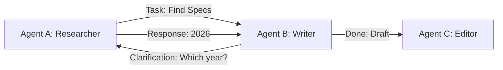

# 🤝 Agent-to-Agent (A2A) Communication — Peer-to-Peer Intelligence
> **Level:** Advanced | **Language:** Hinglish | **Goal:** Master the techniques of direct agent-to-agent communication, handoffs, and collaborative problem-solving.

---

## 🧭 1. Beginner-Friendly Hinglish Explanation
A2A Communication ka matlab hai **"AI ka aapas mein baat karna"**. 

Socho ek project hai: "Ek website banao". 
- **Agent A (Planner):** Website ka structure banata hai.
- **Agent B (Coder):** Code likhta hai.
- **Agent C (Reviewer):** Code check karta hai.

Agar Agent A seedha Agent B ko bolta hai "Ye lo plan, ab code likho", toh use **A2A Communication** kehte hain. Isme koi "Manager" (Supervisor) ki zarurat nahi hoti, agents aapas mein "Handshake" karke kaam karte hain.

---

## 🧠 2. Deep Technical Explanation
A2A communication can be **Synchronous** (Direct call) or **Asynchronous** (Message Queue).
1. **The Handoff Pattern:** One agent finishes a task and "Yields" control to another agent along with the current state.
2. **Standard Message Formats:** Using JSON schemas or FIPA-ACL to ensure both agents understand the `sender`, `receiver`, and `content`.
3. **Capability Negotiation:** Agent A asks Agent B: "Kya tum SQL query chala sakte ho?" Agent B responds: "Haan, main level 3 certified SQL agent hoon."
4. **Protocols:** Using **XMPP**, **MQTT**, or dedicated AI protocols like **AgentProtocol** for cross-framework talk.
5. **Conflict Resolution:** What happens if two agents disagree? implementing "Voting" or "Tie-breaker" logic.

---

## 🏗️ 3. Architecture Diagrams



---

## 💻 4. Production-Ready Code Example (Simple Handoff)

```python
# Hinglish Logic: Ek agent kaam khatam karke doosre ka 'Address' return karta hai
def researcher_agent(state):
    print("Researching data...")
    state["data"] = "Found 2026 trends"
    # Logic: Transfer control to 'writer'
    return "writer"

def writer_agent(state):
    print(f"Writing report using {state['data']}")
    return "FINISH"

# Graph implementation manages the 'Next' hop
```

---

## 🌍 5. Real-World Use Cases
- **Supply Chain:** A "Buyer Agent" negotiating price with a "Vendor Agent".
- **Software Dev:** A "Coder Agent" sending a pull request to a "Linter Agent".
- **Gaming:** Multi-agent NPCs coordinating to surround a player.

---

## ❌ 6. Failure Cases
- **Deadlocks:** Agent A is waiting for B, and B is waiting for A.
- **State Corruption:** Agent A ne data galat format mein bheja, aur Agent B crash ho gaya.
- **Infinite Delegation:** Ek agent kaam karne ke bajaye doosre ko pass karta ja raha hai.

---

## 🛠️ 7. Debugging Guide
- **Communication Logs:** Record karein: "Who sent what to whom at what time?"
- **Sequence Diagrams:** Visualise the flow of messages to find where the logic broke.

---

## ⚖️ 8. Tradeoffs
- **Peer-to-Peer (A2A):** Fast and decentralized, but hard to monitor and control.
- **Supervisor Pattern:** Easy to control but creates a bottleneck at the manager.

---

## ✅ 9. Best Practices
- **Strict Interfaces:** Humesha define karein ki ek agent doosre se kya mang sakta hai.
- **Time-to-Live (TTL):** Har message ka ek expiry time rakhein taaki purane messages loop mein na ghoomein.

---

## 🛡️ 10. Security Concerns
- **Impersonation:** Agent C bankar koi malicious agent B ko galat command bhej de. Use **Digital Signatures**.
- **Data Privacy:** Sensitive data sirf "Need-to-know" basis par share karein.

---

## 📈 11. Scaling Challenges
- **Network Latency:** Agents alag servers par hon toh messaging slow ho sakti hai. Use **gRPC**.

---

## 💰 12. Cost Considerations
- **Double Inference:** Jab do agents aapas mein "Chat" karte hain, toh dono ki API cost lagti hai. Keep chatter concise.

---

## 📝 13. Interview Questions
1. **"Handoff pattern kya hota hai?"**
2. **"Multi-agent system mein 'Deadlock' kaise avoid karenge?"**
3. **"State transfer agent communication mein kaise handle hoti hai?"**

---

## 🚀 15. Latest 2026 Industry Patterns
- **Autonomous Negotiation:** Agents that have their own budgets and pay each other in tokens for services.
- **Swarm Intelligence:** Hundreds of tiny agents communicating via "Pheromones" (shared data state) to solve massive problems.

---

> **Expert Tip:** A2A is about **Delegation**. A great agent knows exactly when to stop and let someone else take over.
