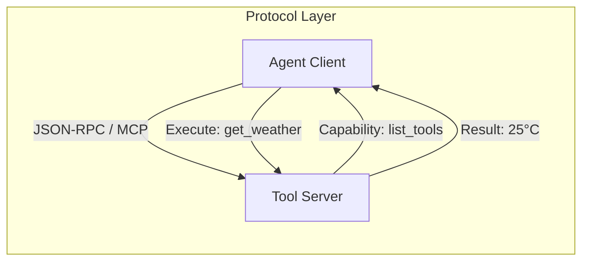

# 📜 Agent Protocols — The Language of Machines
> **Level:** Advanced | **Language:** Hinglish | **Goal:** Master the standardized protocols (MCP, JSON-RPC, FIPA) that allow agents from different frameworks to talk to each other and share tools.

---

## 🧭 1. Beginner-Friendly Hinglish Explanation
Agent Protocols ka matlab hai **"Agents ke beech ki dosti ki bhasha"**. 

Imagine aapke paas ek Agent A (OpenAI) hai aur ek Agent B (Anthropic). 
- Agar unhe ek saath kaam karna hai, toh unhe ek common language chahiye. 
- Jaise internet `HTTP` par chalta hai, agents ke liye naye protocols ban rahe hain jaise **MCP (Model Context Protocol)**. 
- Iska fayda ye hai ki aap ek baar Tool banate hain aur wo kisi bhi agentic framework mein chal jata hai.

Protocols ensure karte hain ki "Chaos" na ho aur saare systems ek doosre ke saath "Seamlessly" connect ho sakein.

---

## 🧠 2. Deep Technical Explanation
Protocols in agentic AI define the communication lifecycle, message format, and tool discovery.
1. **MCP (Model Context Protocol):** Introduced by Anthropic, it allows models to connect to data sources and tools using a standardized server-client architecture.
2. **JSON-RPC for Agents:** A lightweight remote procedure call protocol using JSON. It defines how an agent sends a `method` call and receives a `result` or `error`.
3. **FIPA-ACL (Foundation for Intelligent Physical Agents):** A legacy but theoretically solid protocol that defines "Speech Acts" like `Request`, `Inform`, `Propose`, and `Refuse`.
4. **Agent Communication Language (ACL):** Modern implementations often use Pydantic schemas to enforce structure in message passing.
5. **Tool Discovery:** How an agent "Queries" a server to find out what tools are available (e.g., `list_tools` method).

---

## 🏗️ 3. Architecture Diagrams



---

## 💻 4. Production-Ready Code Example (MCP-like Tool Definition)

```python
# Hinglish Logic: Ek standard format define karo taaki koi bhi agent ise samajh sake
class AgentProtocolMessage:
    def __init__(self, method, params, id):
        self.jsonrpc = "2.0"
        self.method = method
        self.params = params
        self.id = id

    def to_json(self):
        return json.dumps(self.__dict__)

# Example: Discovery request
discovery = AgentProtocolMessage("list_tools", {}, id=1)
print(f"Protocol Request: {discovery.to_json()}")
```

---

## 🌍 5. Real-World Use Cases
- **Cross-Framework Agents:** A LangGraph agent using a tool server built in CrewAI.
- **Enterprise Tool Hubs:** A central server where all company APIs are hosted as "MCP Tools" for any AI agent to use.
- **Multi-Vendor Orchestration:** Microsoft's AutoGen talking to an OpenAI Assistant using a shared protocol.

---

## ❌ 6. Failure Cases
- **Version Mismatch:** Client `v2` protocol use kar raha hai aur Server sirf `v1` samajhta hai.
- **Payload Bloat:** Protocol headers itne bade ho gaye ki latency badh gayi.
- **Parsing Error:** Non-standard JSON format ki wajah se communication break hona.

---

## 🛠️ 7. Debugging Guide
- **Protocol Sniffing:** Use tools like `Wireshark` or `Postman` to see raw messages between agents.
- **Schema Validation:** Use Pydantic to ensure incoming messages follow the protocol strictly.

---

## ⚖️ 8. Tradeoffs
- **Standardized Protocols:** High compatibility and scalability but adds a layer of complexity.
- **Custom Scripts:** Fast and simple for 1 agent but "Impossible" to scale for multi-agent systems.

---

## ✅ 9. Best Practices
- **Use MCP:** 2026 mein MCP industry standard banta ja raha hai, hamesha ise preference dein.
- **Idempotency:** Protocol mein `request_id` rakhein taaki same message dobara aane par galti na ho.

---

## 🛡️ 10. Security Concerns
- **Unauthorized Tool Discovery:** Attacker protocol ka use karke aapke saare internal tools ki list nikal leta hai.
- **Man-in-the-middle:** Communication ko intercept karke parameters badal dena. (Always use WSS/HTTPS).

---

## 📈 11. Scaling Challenges
- **High Concurrency:** Lakhon messages ko serialize aur deserialize karne ka CPU overhead.

---

## 💰 12. Cost Considerations
- **Metadata Overhead:** Standard protocols extra tokens consume karte hain metadata ke liye. Key names chote rakhein.

---

## 📝 13. Interview Questions
1. **"Model Context Protocol (MCP) kyu important hai?"**
2. **"JSON-RPC vs REST for agent communication?"**
3. **"Discovery phase agent protocols mein kya hota hai?"**

---

## ⚠️ 14. Common Mistakes
- **Hardcoding Endpoints:** Protocol messages mein static URLs dalna.
- **No Error Mapping:** Server error ko protocol-standard format mein na bhej karke "Raw Traceback" bhej dena.

---

## 🚀 15. Latest 2026 Industry Patterns
- **Universal Tool Interface (UTI):** A newer protocol that allows agents to use physical hardware (Robots) via a standardized cloud API.
- **Streaming Protocols:** Protocols specifically designed for low-latency voice/video agent communication.

---

> **Expert Tip:** A protocol is a **Contract**. If the contract is solid, your agent network is unbreakable.
