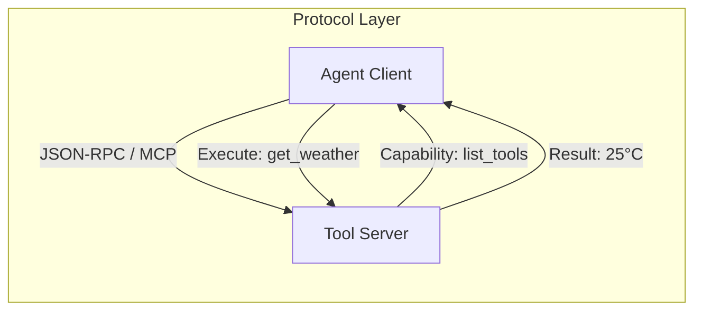

# 📜 Agent Protocols — The Language of Machines
> **Level:** Advanced | **Language:** Hinglish | **Goal:** Standardized protocols (MCP, JSON-RPC, FIPA) ko master karein jo alag-alag frameworks ke agents ko aapas mein baat karne aur tools share karne enable karte hain.

---

## 🧭 1. Beginner-Friendly Hinglish Explanation
Agent Protocols ka matlab hai **"Agents ke beech ki dosti ki bhasha"**. 

Imagine aapke paas ek Agent A (OpenAI) hai aur ek Agent B (Anthropic). 
- Agar unhe ek saath kaam karna hai, toh unhe ek common language chahiye. 
- Jaise internet `HTTP` par chalta hai, agents ke liye naye protocols ban rahe hain jaise **MCP (Model Context Protocol)**. 
- Iska fayda ye hai ki aap ek baar Tool banate hain aur wo kisi bhi agentic framework mein chal jata hai.

Protocols ensure karte hain ki "Chaos" na ho aur saare systems ek doosre ke saath "Seamlessly" connect ho sakein.

---

## 🧠 2. Deep Technical Explanation
Agentic AI mein protocols communication lifecycle, message format, aur tool discovery define karte hain.
1. **MCP (Model Context Protocol):** Anthropic dwara introduce kiya gaya, ye models ko standardized server-client architecture ka use karke data sources aur tools se connect karne deta hai.
2. **JSON-RPC for Agents:** JSON use karne wala ek lightweight remote procedure call protocol. Ye define karta hai ki kaise agent ek `method` call bhejta hai aur `result` ya `error` receive karta hai.
3. **FIPA-ACL (Foundation for Intelligent Physical Agents):** Ek legacy par theoretically solid protocol jo `Request`, `Inform`, `Propose`, aur `Refuse` jaise "Speech Acts" ko define karta hai.
4. **Agent Communication Language (ACL):** Modern implementations aksar message passing mein structure enforce karne ke liye Pydantic schemas ka use karte hain.
5. **Tool Discovery:** Kaise agent ek server ko "Query" karta hai ye pata lagane ke liye ki kaunse tools available hain (e.g., `list_tools` method).

---

## 🏗️ 3. Architecture Diagrams


```mermaid
graph LR
    A[Agent Client] -- "JSON-RPC / MCP" --> S[Tool Server]
    S -- "Capability: list_tools" --> A
    A -- "Execute: get_weather" --> S
    S -- "Result: 25°C" --> A
    
    subgraph "Protocol Layer"
    A
    S
    end
```

---

## 💻 4. Production-Ready Code Example (MCP-like Tool Definition)

```python
# Hinglish Logic: Ek standard format define karo taaki koi bhi agent ise samajh sake
class AgentProtocolMessage:
    def __init__(self, method, params, id):
        self.jsonrpc = "2.0"
        self.method = method
        self.params = params
        self.id = id

    def to_json(self):
        return json.dumps(self.__dict__)

# Example: Discovery request
discovery = AgentProtocolMessage("list_tools", {}, id=1)
print(f"Protocol Request: {discovery.to_json()}")
```

---

## 🌍 5. Real-World Use Cases
- **Cross-Framework Agents:** CrewAI mein built tool server use karne wala ek LangGraph agent.
- **Enterprise Tool Hubs:** Ek central server jahan company ke saare APIs "MCP Tools" ke roop mein hosted hote hain taaki koi bhi AI agent use kar sake.
- **Multi-Vendor Orchestration:** Microsoft AutoGen ka ek shared protocol use karke OpenAI Assistant se baat karna.

---

## ❌ 6. Failure Cases
- **Version Mismatch:** Client `v2` protocol use kar raha hai aur Server sirf `v1` samajhta hai.
- **Payload Bloat:** Protocol headers itne bade ho gaye ki latency badh gayi.
- **Parsing Error:** Non-standard JSON format ki wajah se communication break hona.

---

## 🛠️ 7. Debugging Guide
- **Protocol Sniffing:** Agents ke beech raw messages dekhne ke liye `Wireshark` ya `Postman` jaise tools use karein.
- **Schema Validation:** Ensure karne ke liye ki incoming messages protocol ko strictly follow karein, Pydantic use karein.

---

## ⚖️ 8. Tradeoffs
- **Standardized Protocols:** High compatibility aur scalability par complexity ki ek extra layer add karta hai.
- **Custom Scripts:** Fast aur simple hai par 10-15 tools se zyada manage karna impossible hai.

---

## ✅ 9. Best Practices
- **Use MCP:** 2026 mein MCP industry standard banta ja raha hai, hamesha ise preference dein.
- **Idempotency:** Protocol mein `request_id` rakhein taaki same message dobara aane par galti na ho.

---

## 🛡️ 10. Security Concerns
- **Unauthorized Tool Discovery:** Attacker protocol ka use karke aapke saare internal tools ki list nikal leta hai.
- **Man-in-the-middle:** Communication ko intercept karke parameters badal dena. (Always use WSS/HTTPS).

---

## 📈 11. Scaling Challenges
- **High Concurrency:** Lakhon messages ko serialize aur deserialize karne ka CPU overhead.

---

## 💰 12. Cost Considerations
- **Metadata Overhead:** Standard protocols extra tokens consume karte hain metadata ke liye. Key names chote rakhein.

---

## 📝 13. Interview Questions
1. **"Model Context Protocol (MCP) kyu important hai?"**
2. **"JSON-RPC vs REST for agent communication?"**
3. **"Discovery phase agent protocols mein kya hota hai?"**

---

## ⚠️ 14. Common Mistakes
- **Hardcoding Endpoints:** Protocol messages mein static URLs dalna.
- **No Error Mapping:** Server error ko protocol-standard format mein na bhej karke "Raw Traceback" bhej dena.

---

## 🚀 15. Latest 2026 Industry Patterns
- **Universal Tool Interface (UTI):** Ek naya protocol jo agents ko standardized cloud API ke throw physical hardware (Robots) use karne deta hai.
- **Streaming Protocols:** Low-latency voice/video agent communication ke liye specifically designed protocols.

---

> **Expert Tip:** A protocol is a **Contract**. If the contract is solid, your agent network is unbreakable.
