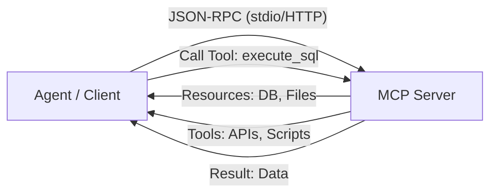

# 🔌 Model Context Protocol (MCP) — The Future of Tools
> **Level:** Advanced | **Language:** Hinglish | **Goal:** Master the Model Context Protocol (MCP) for connecting agents to data sources and tools in a standardized, cross-platform way.

---

## 🧭 1. Beginner-Friendly Hinglish Explanation
MCP ka matlab hai **"AI ka USB port"**. 

Pehle kya hota tha? Agar aapne ek tool banaya LangChain ke liye, toh wo LlamaIndex ya CrewAI mein nahi chalta tha. Har framework ka apna tarika tha.
**MCP (Model Context Protocol)** ne ise solve kar diya. Ye Anthropic dwara banaya gaya ek open standard hai.
- **MCP Server:** Ye aapka data ya tool host karta hai (e.g., Google Drive, SQL Database).
- **MCP Client:** Ye aapka agent hai jo server se connect hota hai.

Ek baar MCP server banao, aur use kisi bhi AI model ya framework ke saath connect karo. Ye 2026 mein AI integration ka sabse bada standard hai.

---

## 🧠 2. Deep Technical Explanation
MCP operates on a **Client-Server Architecture** using JSON-RPC.
1. **Resources:** Static data that the model can read (e.g., files, documentation).
2. **Tools:** Executable functions that the model can call (e.g., `get_weather`, `run_query`).
3. **Prompts:** Pre-defined templates that the server provides to the client.
4. **Transport:** MCP can run over `stdio` (local) or `HTTP/SSE` (remote).
5. **Discovery:** When a client connects, it calls `list_tools` and `list_resources` to understand what the server can do.

---

## 🏗️ 3. Architecture Diagrams



---

## 💻 4. Production-Ready Code Example (MCP Server Snippet)

```python
# Hinglish Logic: Ek simple MCP server jo weather tool provide karta hai
from mcp.server import Server

app = Server("weather-service")

@app.tool()
def get_weather(city: str) -> str:
    """Get the current weather for a city."""
    # Logic to fetch weather
    return f"Weather in {city} is 25°C and sunny."

if __name__ == "__main__":
    app.run()
```

---

## 🌍 5. Real-World Use Cases
- **Unified Enterprise Search:** One MCP server connects to Slack, Jira, and Confluence; any company agent can now search across all three.
- **Safe Database Access:** Agents query a database via an MCP server that enforces strict security rules.
- **Local File Management:** Using the MCP "Filesystem" server to let Claude or GPT-4 edit local code safely.

---

## ❌ 6. Failure Cases
- **Transport Disconnect:** Stdio pipe crash hone se communication band ho jana.
- **Schema Mismatch:** Client aur Server ke beech tool arguments ka format alag hona.
- **Rate Limiting:** MCP server ke peeche wali API (e.g. Google) ka limit hit ho jana.

---

## 🛠️ 7. Debugging Guide
- **MCP Inspector:** Use the official MCP Inspector tool to test your server without an agent.
- **Logs:** Server side par `stderr` logs check karein (kyunki `stdout` communication ke liye use hota hai).

---

## ⚖️ 8. Tradeoffs
- **MCP:** High interoperability, industry standard, but requires setting up a separate server process.
- **Custom Functions:** Fast to write for a single script but doesn't scale across different AI tools.

---

## ✅ 9. Best Practices
- **Strict Typing:** Humesha Pydantic/Typescript use karein parameters define karne ke liye.
- **Description is Key:** Tool ki description bahut achi likhein, kyunki LLM usi ko dekh kar faisla leta hai.

---

## 🛡️ 10. Security Concerns
- **Remote Execution:** MCP server ko hamesha restricted permissions ke saath run karein.
- **Token Leakage:** Ensure karein ki server API keys ko logs mein print na kare.

---

## 📈 11. Scaling Challenges
- **State Management:** MCP servers usually "Stateless" hote hain. Sessions handle karne ke liye extra logic chahiye.

---

## 💰 12. Cost Considerations
- **Extra Overhead:** MCP adds a small latency and serialization cost compared to direct function calls.

---

## 📝 13. Interview Questions
1. **"MCP kyu banaya gaya (Problem statement)?"**
2. **"MCP Server aur Client ke beech transport protocols konse hote hain?"**
3. **"Resources aur Tools mein kya fark hai MCP mein?"**

---

## 🚀 15. Latest 2026 Industry Patterns
- **MCP Hubs:** Centralized registries (like npm for AI tools) where you can download pre-built MCP servers for anything.
- **Edge MCP:** Running MCP servers on low-power devices to let AI control local hardware.

---

> **Expert Tip:** If you're building tools for AI in 2026, **Build an MCP Server**. It's the only way to stay compatible with the entire ecosystem.
