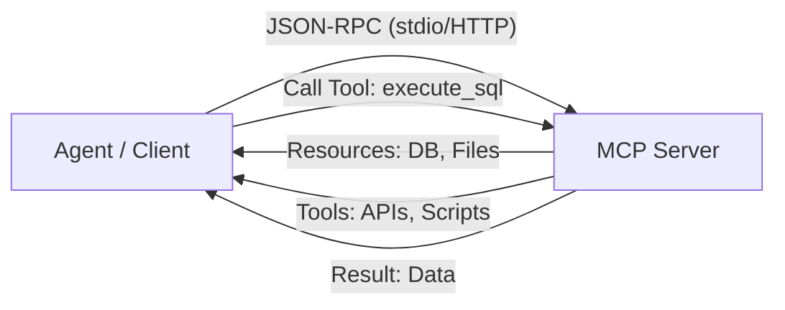

# 🔌 Model Context Protocol (MCP) — The Future of Tools
> **Level:** Advanced | **Language:** Hinglish | **Goal:** Standardized aur cross-platform tarike se agents ko data sources aur tools se connect karne ke liye Model Context Protocol (MCP) ko master karein.

---

## 🧭 1. Beginner-Friendly Hinglish Explanation
MCP ka matlab hai **"AI ka USB port"**. 

Pehle kya hota tha? Agar aapne ek tool banaya LangChain ke liye, toh wo LlamaIndex ya CrewAI mein nahi chalta tha. Har framework ka apna tarika tha.
**MCP (Model Context Protocol)** ne ise solve kar diya. Ye Anthropic dwara banaya gaya ek open standard hai.
- **MCP Server:** Ye aapka data ya tool host karta hai (e.g., Google Drive, SQL Database).
- **MCP Client:** Ye aapka agent hai jo server se connect hota hai.

Ek baar MCP server banao, aur use kisi bhi AI model ya framework ke saath connect karo. Ye 2026 mein AI integration ka sabse bada standard hai.

---

## 🧠 2. Deep Technical Explanation
MCP JSON-RPC ka use karke ek **Client-Server Architecture** par kaam karta hai.
1. **Resources:** Static data jise model read kar sakta hai (e.g., files, documentation).
2. **Tools:** Executable functions jinhe model call kar sakta hai (e.g., `get_weather`, `run_query`).
3. **Prompts:** Pre-defined templates jo server client ko provide karta hai.
4. **Transport:** MCP `stdio` (local) ya `HTTP/SSE` (remote) par run ho sakta hai.
5. **Discovery:** Jab client connect hota hai, toh wo server capabilities ko samajhne ke liye `list_tools` aur `list_resources` call karta hai.

---

## 🏗️ 3. Architecture Diagrams


```mermaid
graph LR
    A[Agent / Client] -- "JSON-RPC (stdio/HTTP)" --> S[MCP Server]
    S -- "Resources: DB, Files" --> A
    S -- "Tools: APIs, Scripts" --> A
    A -- "Call Tool: execute_sql" --> S
    S -- "Result: Data" --> A
```

---

## 💻 4. Production-Ready Code Example (MCP Server Snippet)

```python
# Hinglish Logic: Ek simple MCP server jo weather tool provide karta hai
from mcp.server import Server

app = Server("weather-service")

@app.tool()
def get_weather(city: str) -> str:
    """Get the current weather for a city."""
    # Logic to fetch weather
    return f"Weather in {city} is 25°C and sunny."

if __name__ == "__main__":
    app.run()
```

---

## 🌍 5. Real-World Use Cases
- **Unified Enterprise Search:** Ek MCP server Slack, Jira, aur Confluence se connect karta hai; ab company ka koi bhi agent in teeno ke across search kar sakta hai.
- **Safe Database Access:** Agents database ko ek MCP server ke throw query karte hain jo strict security rules enforce karta hai.
- **Local File Management:** Claude ya GPT-4 ko safely local code edit karne dene ke liye MCP "Filesystem" server ka use karna.

---

## ❌ 6. Failure Cases
- **Transport Disconnect:** Stdio pipe crash hone se communication band ho jana.
- **Schema Mismatch:** Client aur Server ke beech tool arguments ka format alag hona.
- **Rate Limiting:** MCP server ke peeche wali API (e.g. Google) ka limit hit ho jana.

---

## 🛠️ 7. Debugging Guide
- **MCP Inspector:** Bina agent ke apne server ko test karne ke liye official MCP Inspector tool ka use karein.
- **Logs:** Server side par `stderr` logs check karein (kyunki `stdout` communication ke liye use hota hai).

---

## ⚖️ 8. Tradeoffs
- **MCP:** High interoperability aur industry standard hai, par ek separate server process set up karne ki zaroorat hoti hai.
- **Custom Functions:** Single script ke liye likhna fast hai par different AI tools ke across scale nahi karta.

---

## ✅ 9. Best Practices
- **Strict Typing:** Humesha Pydantic/Typescript use karein parameters define karne ke liye.
- **Description is Key:** Tool ki description bahut achi likhein, kyunki LLM usi ko dekh kar faisla leta hai.

---

## 🛡️ 10. Security Concerns
- **Remote Execution:** MCP server ko hamesha restricted permissions ke saath run karein.
- **Token Leakage:** Ensure karein ki server API keys ko logs mein print na kare.

---

## 📈 11. Scaling Challenges
- **State Management:** MCP servers usually "Stateless" hote hain. Sessions handle karne ke liye extra logic chahiye.

---

## 💰 12. Cost Considerations
- **Extra Overhead:** Direct function calls ke comparison mein MCP thoda latency aur serialization cost add karta hai.

---

## 📝 13. Interview Questions
1. **"MCP kyu banaya gaya (Problem statement)?"**
2. **"MCP Server aur Client ke beech transport protocols konse hote hain?"**
3. **"Resources aur Tools mein kya fark hai MCP mein?"**

---

## 🚀 15. Latest 2026 Industry Patterns
- **MCP Hubs:** Centralized registries (jaise AI tools ke liye npm) jahan se aap kisi bhi cheez ke liye pre-built MCP servers download kar sakte hain.
- **Edge MCP:** AI ko local hardware control karne dene ke liye low-power devices par MCP servers run karna.

---

> **Expert Tip:** If you're building tools for AI in 2026, **Build an MCP Server**. It's the only way to stay compatible with the entire ecosystem.
