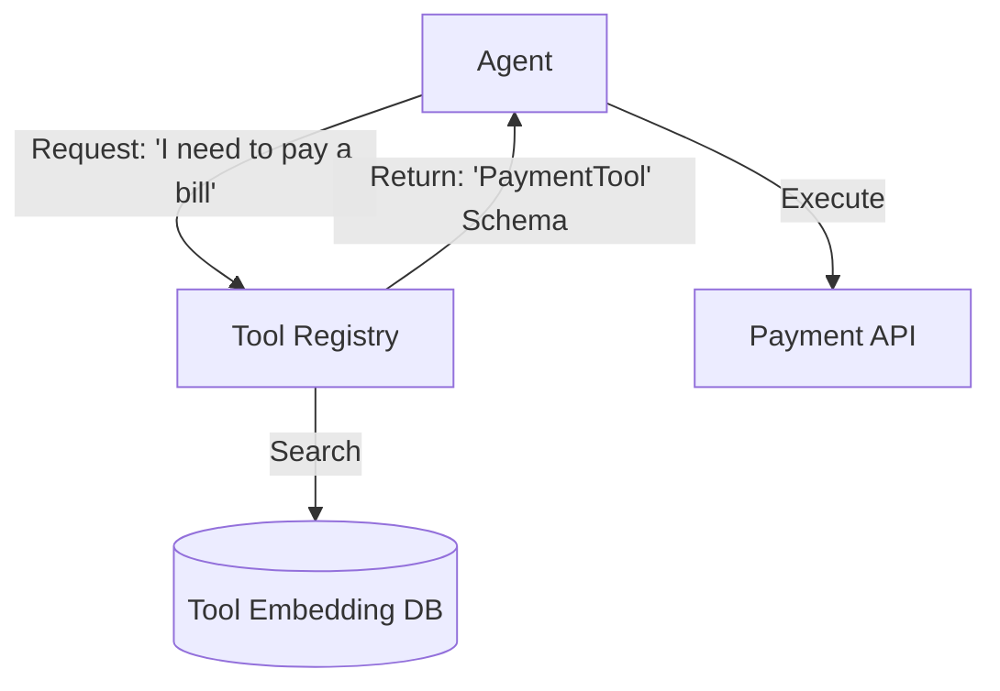

# 🛠️ Tool Registry Systems — The Agent's App Store
> **Level:** Advanced | **Language:** Hinglish | **Goal:** Master the architecture of centralized tool registries where agents can discover, fetch, and execute tools dynamically.

---

## 🧭 1. Beginner-Friendly Hinglish Explanation
Tool Registry ka matlab hai **"AI ke liye Play Store"**. 

Ab tak hum kya karte hain? Agent ke code mein hi saare tools (Calculator, Search, etc.) hardcode kar dete hain. 
Lekin agar aapke paas 1000 tools hain, toh aap unhe ek hi agent ko nahi de sakte (Context limit ki wajah se). 
**Tool Registry** ise solve karti hai:
1. Saare tools ek central "Library" mein hote hain.
2. Agent bolta hai: "Mujhe flight book karni hai."
3. Registry use wahi tool deti hai jo flight booking ke liye sahi hai.

Isse agent hamesha "Halka" (lightweight) rehta hai aur sirf wahi tool load karta hai jo zaruri ho.

---

## 🧠 2. Deep Technical Explanation
A tool registry system manages the lifecycle of tools: **Registration**, **Discovery**, and **Execution**.
1. **Metadata Storage:** Storing tool names, descriptions, and JSON schemas for arguments (Pydantic models).
2. **Semantic Search:** Using Vector Embeddings to find the right tool. 
    - Input: "Update my CRM". 
    - Registry finds: `update_salesforce_lead` tool.
3. **Dynamic Loading:** The agent receives the tool definition at runtime and adds it to its capabilities.
4. **Access Control:** Ensuring only authorized agents can access sensitive tools (e.g. `delete_db`).
5. **Version Control:** Managing multiple versions of the same tool (v1 vs v2).

---

## 🏗️ 3. Architecture Diagrams



---

## 💻 4. Production-Ready Code Example (Semantic Discovery)

```python
# Hinglish Logic: Tool ki description se sahi tool dhoondho
from sentence_transformers import SentenceTransformer, util

tools = [
    {"name": "get_weather", "desc": "Check temperature in a city"},
    {"name": "send_email", "desc": "Send a message via Gmail"}
]

def find_tool(query):
    # 1. Embeddings logic here (Simplified)
    if "mail" in query.lower() or "message" in query.lower():
        return tools[1]
    return tools[0]

# agent_needs = find_tool("Please message my boss")
```

---

## 🌍 5. Real-World Use Cases
- **Enterprise Platforms:** A company-wide registry where different teams "Publish" their APIs for AI to use.
- **Open Source Agent Frameworks:** Platforms like **Composio** or **CrewAI** that have thousands of pre-built tool integrations.
- **Dynamic Workflows:** Agents that "Learn" to use new tools as they are added to the system.

---

## ❌ 6. Failure Cases
- **Ambiguous Descriptions:** Do tools hain `pay_bill` aur `settle_invoice`. AI confuse ho gaya kise use karein.
- **Outdated Schemas:** Registry mein purana tool definition hai, par API badal chuki hai.
- **Registry Downtime:** Agar registry band hui, toh agent "Andha" ho jayega.

---

## 🛠️ 7. Debugging Guide
- **Tool Usage Logs:** Monitor karein ki kaunse tools sabse zyada use ho rahe hain.
- **Discovery Accuracy:** Test karein ki kya registry hamesha "Relevant" tool return kar rahi hai?

---

## ⚖️ 8. Tradeoffs
- **Centralized Registry:** High organization and discoverability but creates a single point of failure.
- **Hardcoded Tools:** Fast and simple but impossible to manage more than 10-15 tools.

---

## ✅ 9. Best Practices
- **Auto-Documentation:** Tools ki documentation code se hi generate karein (Docstrings).
- **Tool Sandboxing:** Har tool ko isolated environment mein test karein registration ke waqt.

---

## 🛡️ 10. Security Concerns
- **Tool Injection:** Attacker registry mein apna "Malicious Tool" register kar deta hai.
- **Permission Scoping:** Tools ko strictly "Read-only" ya "Read-write" labels dein.

---

## 📈 11. Scaling Challenges
- **Latency:** Thousands of tools mein se search karne mein milliseconds add hote hain. Use **Vector Indices** (FAISS/Pinecone).

---

## 💰 12. Cost Considerations
- **Context Saving:** Sirf relevant tools bhejkar aap LLM ke hazaron tokens bacha sakte hain.

---

## 📝 13. Interview Questions
1. **"Dynamic Tool Discovery kya hota hai?"**
2. **"Tool descriptions AI performance ko kaise affect karti hain?"**
3. **"1000 tools ko ek agent ke saath kaise handle karenge?"**

---

## 🚀 15. Latest 2026 Industry Patterns
- **AI-Managed Registries:** AI itself categorizes and tags new tools as they are added.
- **Inter-Cloud Registry:** A standard protocol that lets an AWS agent use a tool registered on Azure.

---

> **Expert Tip:** In 2026, **Descriptions are Code**. If your tool description is poor, the best AI in the world won't be able to use it.
