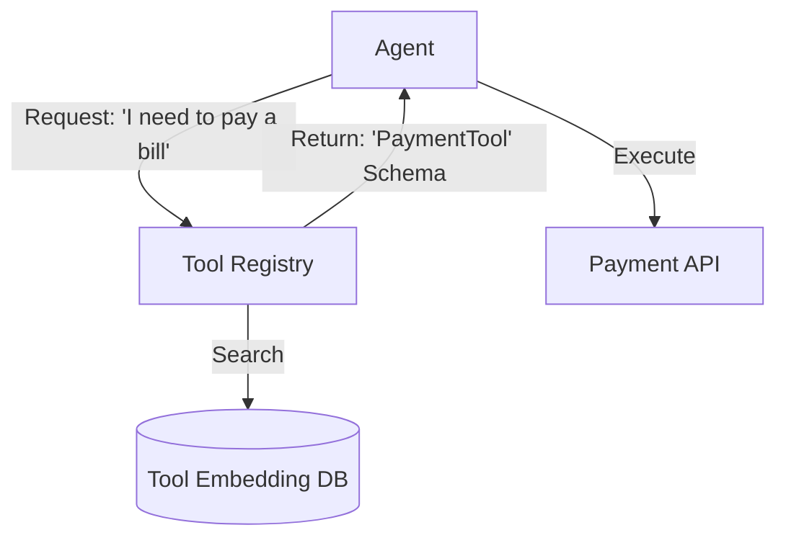

# 🛠️ Tool Registry Systems — The Agent's App Store
> **Level:** Advanced | **Language:** Hinglish | **Goal:** Centralized tool registries ke architecture ko master karein jahan agents tools ko dynamically discover, fetch, aur execute kar sakte hain.

---

## 🧭 1. Beginner-Friendly Hinglish Explanation
Tool Registry ka matlab hai **"AI ke liye Play Store"**. 

Ab tak hum kya karte hain? Agent ke code mein hi saare tools (Calculator, Search, etc.) hardcode kar dete hain. 
Lekin agar aapke paas 1000 tools hain, toh aap unhe ek hi agent ko nahi de sakte (Context limit ki wajah se). 
**Tool Registry** ise solve karti hai:
1. Saare tools ek central "Library" mein hote hain.
2. Agent bolta hai: "Mujhe flight book karni hai."
3. Registry use wahi tool deti hai jo flight booking ke liye sahi hai.

Isse agent hamesha "Halka" (lightweight) rehta hai aur sirf wahi tool load karta hai jo zaruri ho.

---

## 🧠 2. Deep Technical Explanation
Ek tool registry system tools ki lifecycle ko manage karta hai: **Registration**, **Discovery**, aur **Execution**.
1. **Metadata Storage:** Tool names, descriptions, aur arguments ke liye JSON schemas (Pydantic models) store karna.
2. **Semantic Search:** Right tool dhoondhne ke liye Vector Embeddings ka use karna. 
    - Input: "Update my CRM". 
    - Registry finds: `update_salesforce_lead` tool.
3. **Dynamic Loading:** Agent runtime par tool definition receive karta hai aur use apni capabilities mein add karta hai.
4. **Access Control:** Ensure karna ki sirf authorized agents hi sensitive tools (e.g. `delete_db`) ko access kar sakein.
5. **Version Control:** Same tool ke multiple versions (v1 vs v2) manage karna.

---

## 🏗️ 3. Architecture Diagrams


```mermaid
graph TD
    A[Agent] -->|Request: 'I need to pay a bill'| R[Tool Registry]
    R -->|Search| DB[(Tool Embedding DB)]
    R -->|Return: 'PaymentTool' Schema| A
    A -->|Execute| P[Payment API]
```

---

## 💻 4. Production-Ready Code Example (Semantic Discovery)

```python
# Hinglish Logic: Tool ki description se sahi tool dhoondho
from sentence_transformers import SentenceTransformer, util

tools = [
    {"name": "get_weather", "desc": "Check temperature in a city"},
    {"name": "send_email", "desc": "Send a message via Gmail"}
]

def find_tool(query):
    # 1. Embeddings logic here (Simplified)
    if "mail" in query.lower() or "message" in query.lower():
        return tools[1]
    return tools[0]

# agent_needs = find_tool("Please message my boss")
```

---

## 🌍 5. Real-World Use Cases
- **Enterprise Platforms:** Ek company-wide registry jahan different teams AI ke use ke liye apne APIs "Publish" karti hain.
- **Open Source Agent Frameworks:** **Composio** ya **CrewAI** jaise platforms jinme thousands of pre-built tool integrations hain.
- **Dynamic Workflows:** Aise agents jo new tools ke system mein add hote hi unhe use karna "Seekhte" hain.

---

## ❌ 6. Failure Cases
- **Ambiguous Descriptions:** Do tools hain `pay_bill` aur `settle_invoice`. AI confuse ho gaya kise use karein.
- **Outdated Schemas:** Registry mein purana tool definition hai, par API badal chuki hai.
- **Registry Downtime:** Agar registry band hui, toh agent "Andha" ho jayega.

---

## 🛠️ 7. Debugging Guide
- **Tool Usage Logs:** Monitor karein ki kaunse tools sabse zyada use ho rahe hain.
- **Discovery Accuracy:** Test karein ki kya registry hamesha "Relevant" tool return kar rahi hai?

---

## ⚖️ 8. Tradeoffs
- **Centralized Registry:** High organization aur discoverability par ek single point of failure create karta hai.
- **Hardcoded Tools:** Fast aur simple hai par 10-15 tools se zyada manage karna impossible hai.

---

## ✅ 9. Best Practices
- **Auto-Documentation:** Tools ki documentation code se hi generate karein (Docstrings).
- **Tool Sandboxing:** Har tool ko isolated environment mein test karein registration ke waqt.

---

## 🛡️ 10. Security Concerns
- **Tool Injection:** Attacker registry mein apna "Malicious Tool" register kar deta hai.
- **Permission Scoping:** Tools ko strictly "Read-only" ya "Read-write" labels dein.

---

## 📈 11. Scaling Challenges
- **Latency:** Thousands of tools mein se search karne mein milliseconds add hote hain. Use **Vector Indices** (FAISS/Pinecone).

---

## 💰 12. Cost Considerations
- **Context Saving:** Sirf relevant tools bhejkar aap LLM ke hazaron tokens bacha sakte hain.

---

## 📝 13. Interview Questions
1. **"Dynamic Tool Discovery kya hota hai?"**
2. **"Tool descriptions AI performance ko kaise affect karti hain?"**
3. **"1000 tools ko ek agent ke saath kaise handle karenge?"**

---

## 🚀 15. Latest 2026 Industry Patterns
- **AI-Managed Registries:** AI khud new tools ko categorize aur tag karta hai jaise hi wo add hote hain.
- **Inter-Cloud Registry:** Ek standard protocol jo AWS agent ko Azure par registered tool use karne deta hai.

---

> **Expert Tip:** In 2026, **Descriptions are Code**. If your tool description is poor, the best AI in the world won't be able to use it.
