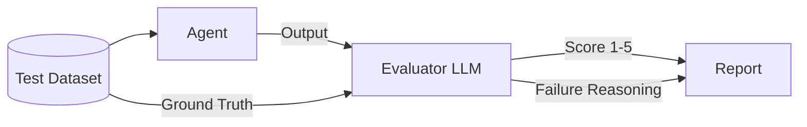

# 📊 Agent Evaluation — Measuring Reliability & Success
> **Level:** Core Engineering | **Language:** Hinglish | **Goal:** Master the metrics and frameworks used to evaluate agentic systems, focusing on reliability, hallucination detection, and success rates.

---

## 🧭 1. Beginner-Friendly Hinglish Explanation
Agent Evaluation ka matlab hai **"AI ka final result"**. 

Jab aap ek agent banate ho, toh sirf "Vibe check" (kuch sawal puch kar dekhna) kafi nahi hai. Aapko ye "Numbers" mein pata hona chahiye ki agent kitna acha hai. 
- **Reliability:** Kya agent har baar sahi jawab deta hai?
- **Hallucination Detection:** Kya agent apni taraf se "Jhoot" bol raha hai?
- **Success Metrics:** Kya usne wo task (e.g. Flight book karna) pura kiya ya beech mein hi ruk gaya?

Evaluation humein confidence deta hai ki humara AI production mein "Dhamaka" nahi karega.

---

## 🧠 2. Deep Technical Explanation
Evaluation in agentic systems is divided into **Output metrics** and **Process metrics**.
1. **Output Metrics:**
    - **Exact Match / F1:** For deterministic answers.
    - **Semantic Similarity:** Using embeddings (Cosine similarity) to check if the meaning matches.
    - **LLM-as-a-Judge:** Using a stronger model (GPT-4) to grade the response on a scale of 1-5.
2. **Process Metrics (Agentic specific):**
    - **Pass@k:** Probability that at least one of top $k$ generated responses is correct.
    - **Success Rate:** % of times the final state matches the goal.
    - **Avg Steps per Task:** Efficiency metric. Lower is usually better.
3. **Hallucination Detection:**
    - **Self-Consistency:** Running the same prompt 3 times and checking if the answer is the same.
    - **NLI (Natural Language Inference):** Checking if the answer is logically supported by the retrieved context.

---

## 🏗️ 3. Architecture Diagrams



---

## 💻 4. Production-Ready Code Example (Success Rate Calculation)

```python
# Hinglish Logic: 100 tasks chalao aur dekho kitne 'Success' hue
def calculate_success_rate(test_results):
    total = len(test_results)
    successes = sum(1 for res in test_results if res['status'] == 'SUCCESS')
    
    rate = (successes / total) * 100
    print(f"Agent Success Rate: {rate}%")
    return rate

# Example: [{'status': 'SUCCESS'}, {'status': 'FAILED'}] -> 50%
```

---

## 🌍 5. Real-World Use Cases
- **Customer Support:** Ensuring the bot doesn't give wrong refund information.
- **E-commerce:** Verifying that the agent adds the *correct* items to the cart every time.
- **Coding Assistants:** Checking if the generated code actually runs and passes unit tests.

---

## ❌ 6. Failure Cases
- **Metric Gaming:** Agent hamesha "I don't know" bol deta hai taaki wo kabhi "Wrong" na ho (High accuracy, but zero utility).
- **Biased Judges:** LLM-Judge hamesha "Lambi" answers ko high score deta hai.
- **Data Contamination:** Test set ke sawal galti se model ki training data mein chale gaye.

---

## 🛠️ 7. Debugging Guide
- **Error Clustering:** Failed cases ko group karein: "Kya ye hamesha 'Math' queries par fail hota hai?"
- **Trace Audit:** Trace dhoondhein jahan agent ne "Wrong Turn" liya.

---

## ⚖️ 8. Tradeoffs
- **Human Eval:** 100% Accurate but slow and expensive.
- **AI Eval:** 90% Accurate, fast, and cheap.
- **Deterministic Eval:** 100% Fast but can't handle creative answers.

---

## ✅ 9. Best Practices
- **Golden Dataset:** Humesha ek "Master List" rakhein 100-200 expert-verified sawalon ki.
- **A/B Testing:** Purane agent vs Naye agent ke success rates compare karein.

---

## 🛡️ 10. Security Concerns
- **Eval Injection:** Attacker response mein aisi instructions dalta hai jo Evaluator ko "Force" karti hain high score dene ke liye.

---

## 📈 11. Scaling Challenges
- **Large Scale Evals:** 10,000 queries ko evaluate karne ka API bill $500+ ho sakta hai. Use **Sampling**.

---

## 💰 12. Cost Considerations
- **Judge Model:** Use `gpt-4o-mini` as a judge for cost-effectiveness instead of full `gpt-4o`.

---

## 📝 13. Interview Questions
1. **"Success Rate aur Accuracy mein kya fark hai agents ke liye?"**
2. **"LLM-as-a-judge ke bias ko kaise handle karenge?"**
3. **"Hallucination detection ke 2 methods batao?"**

---

## 🚀 15. Latest 2026 Industry Patterns
- **Continuous Evaluation:** Evals running in the background of production 24/7.
- **Simulation-based Evals:** Putting the agent in a virtual "Sandbox" and watching it solve tasks.

---

> **Expert Tip:** In 2026, **Eval is the new Training**. If you can't measure it, you can't ship it.
