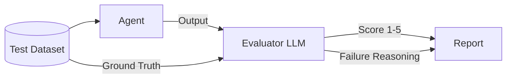

# 📊 Agent Evaluation — Measuring Reliability & Success
> **Level:** Core Engineering | **Language:** Hinglish | **Goal:** Reliability, hallucination detection, aur success rates par focus karte hue agentic systems ke evaluation ke metrics aur frameworks ko master karein.

---

## 🧭 1. Beginner-Friendly Hinglish Explanation
Agent Evaluation ka matlab hai **"AI ka final result"**. 

Jab aap ek agent banate ho, toh sirf "Vibe check" (kuch sawal puch kar dekhna) kafi nahi hai. Aapko ye "Numbers" mein pata hona chahiye ki agent kitna acha hai. 
- **Reliability:** Kya agent har baar sahi jawab deta hai?
- **Hallucination Detection:** Kya agent apni taraf se "Jhoot" bol raha hai?
- **Success Metrics:** Kya usne wo task (e.g. Flight book karna) pura kiya ya beech mein hi ruk gaya?

Evaluation humein confidence deta hai ki humara AI production mein "Dhamaka" nahi karega.

---

## 🧠 2. Deep Technical Explanation
Agentic systems mein evaluation ko **Output metrics** aur **Process metrics** mein divide kiya jata hai.
1. **Output Metrics:**
    - **Exact Match / F1:** Deterministic answers ke liye.
    - **Semantic Similarity:** Meaning match karta hai ya nahi ye check karne ke liye embeddings (Cosine similarity) ka use karna.
    - **LLM-as-a-Judge:** Response ko 1-5 ke scale par grade karne ke liye ek stronger model (GPT-4) ka use karna.
2. **Process Metrics (Agentic specific):**
    - **Pass@k:** Probability ki top $k$ generated responses mein se kam se kam ek correct ho.
    - **Success Rate:** % of times jab final state goal se match karti hai.
    - **Avg Steps per Task:** Efficiency metric. Lower aamtaur par better hota hai.
3. **Hallucination Detection:**
    - **Self-Consistency:** Same prompt ko 3 times run karna aur check karna ki kya answer same hai.
    - **NLI (Natural Language Inference):** Check karna ki kya answer retrieved context dwara logically supported hai.

---

## 🏗️ 3. Architecture Diagrams


```mermaid
graph LR
    D[(Test Dataset)] --> A[Agent]
    A -->|Output| E[Evaluator LLM]
    D -->|Ground Truth| E
    E -->|Score 1-5| R[Report]
    E -->|Failure Reasoning| R
```

---

## 💻 4. Production-Ready Code Example (Success Rate Calculation)

```python
# Hinglish Logic: 100 tasks chalao aur dekho kitne 'Success' hue
def calculate_success_rate(test_results):
    total = len(test_results)
    successes = sum(1 for res in test_results if res['status'] == 'SUCCESS')
    
    rate = (successes / total) * 100
    print(f"Agent Success Rate: {rate}%")
    return rate

# Example: [{'status': 'SUCCESS'}, {'status': 'FAILED'}] -> 50%
```

---

## 🌍 5. Real-World Use Cases
- **Customer Support:** Ensure karna ki bot wrong refund information na de.
- **E-commerce:** Verify karna ki agent har baar cart mein *correct* items add kare.
- **Coding Assistants:** Check karna ki kya generated code actually run hota hai aur unit tests pass karta hai.

---

## ❌ 6. Failure Cases
- **Metric Gaming:** Agent hamesha "I don't know" bol deta hai taaki wo kabhi "Wrong" na ho (High accuracy, but zero utility).
- **Biased Judges:** LLM-Judge hamesha "Lambi" answers ko high score deta hai.
- **Data Contamination:** Test set ke sawal galti se model ki training data mein chale gaye.

---

## 🛠️ 7. Debugging Guide
- **Error Clustering:** Failed cases ko group karein: "Kya ye hamesha 'Math' queries par fail hota hai?"
- **Trace Audit:** Trace dhoondhein jahan agent ne "Wrong Turn" liya.

---

## ⚖️ 8. Tradeoffs
- **Human Eval:** 100% Accurate par slow aur expensive.
- **AI Eval:** 90% Accurate, fast, aur cheap.
- **Deterministic Eval:** 100% Fast par creative answers ko handle nahi kar sakta.

---

## ✅ 9. Best Practices
- **Golden Dataset:** Humesha ek "Master List" rakhein 100-200 expert-verified sawalon ki.
- **A/B Testing:** Purane agent vs Naye agent ke success rates compare karein.

---

## 🛡️ 10. Security Concerns
- **Eval Injection:** Attacker response mein aisi instructions dalta hai jo Evaluator ko "Force" karti hain high score dene ke liye.

---

## 📈 11. Scaling Challenges
- **Large Scale Evals:** 10,000 queries ko evaluate karne ka API bill $500+ ho sakta hai. Use **Sampling**.

---

## 💰 12. Cost Considerations
- **Judge Model:** Full `gpt-4o` ke bajaye cost-effectiveness ke liye `gpt-4o-mini` ko judge ke roop mein use karein.

---

## 📝 13. Interview Questions
1. **"Success Rate aur Accuracy mein kya fark hai agents ke liye?"**
2. **"LLM-as-a-judge ke bias ko kaise handle karenge?"**
3. **"Hallucination detection ke 2 methods batao?"**

---

## 🚀 15. Latest 2026 Industry Patterns
- **Continuous Evaluation:** Production ke background mein 24/7 chalne wale evals.
- **Simulation-based Evals:** Agent ko ek virtual "Sandbox" mein rakhna aur use tasks solve karte hue dekhna.

---

> **Expert Tip:** In 2026, **Eval is the new Training**. If you can't measure it, you can't ship it.
