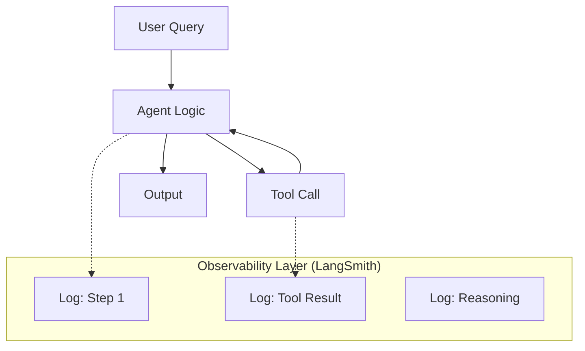

# 🔍 Agent Evaluation & Observability — Monitoring the Mind
> **Level:** Advanced | **Language:** Hinglish | **Goal:** Master the art of measuring agent "Intelligence" and "Reliability" while monitoring their internal reasoning in production.

---

## 🧭 1. Beginner-Friendly Hinglish Explanation
Evaluation aur Observability ka matlab hai **"AI ka Report Card + CCTV Camera"**. 

- **Evaluation:** Ye exam jaisa hai. Agent ko 100 sawal do aur dekho kitne sahi hue (**Accuracy**). 
- **Observability:** Ye AI ke dimaag ke andar jhaankna hai. Jab agent galti karta hai, toh humein pata hona chahiye ki:
    - Kya usne galat tool chuna?
    - Kya wo loop mein phasa tha?
    - Kya LLM ne hallucinate kiya?

Sirf output dekhna kafi nahi hai, humein "Andar ki baat" (Traces) dekhni hoti hai.

---

## 🧠 2. Deep Technical Explanation
Monitoring an agent requires moving from simple logs to **Structured Traces**.
1. **The RAG Triad (Faithfulness, Relevance, Precision):** Using frameworks like **RAGAS** to score how well the agent retrieves and uses data.
2. **LLM-as-a-Judge (G-Eval):** Using a stronger model (e.g., GPT-4o) to grade the performance of a smaller model.
3. **Tracing (LangSmith / Arize Phoenix):** Every step of the agent's thought process is assigned a `trace_id`. This allows you to visualize the graph execution.
4. **Agentic Metrics:**
    - **Steps-to-Goal:** How many tool calls did it take?
    - **Tool Success Rate:** % of tools that returned valid data.
    - **Cost-per-Task:** Token usage monitoring in real-time.
5. **Observability Pillars:** Logs, Metrics, and Traces (The "Golden Signals" of AI).

---

## 🏗️ 3. Architecture Diagrams



---

## 💻 4. Production-Ready Code Example (Tracing Integration)

```python
import os
# Hinglish Logic: Sirf env vars set karo, trace apne aap save ho jayega
os.environ["LANGCHAIN_TRACING_V2"] = "true"
os.environ["LANGCHAIN_API_KEY"] = "ls__your_key"
os.environ["LANGCHAIN_PROJECT"] = "Support_Agent_V1"

# Jab aap graph.invoke() karenge, pura trace LangSmith dashboard par dikhega.
# Isse aap "Hallucination" ko visual format mein pakad sakte hain.
```

---

## 🌍 5. Real-World Use Cases
- **Enterprise Helpdesks:** Tracking why a bot gave a wrong refund to a customer.
- **R&D Pipelines:** Comparing different "Prompt Versions" to see which one has higher accuracy.
- **Legal Agents:** Auditing the reasoning steps to ensure no laws were violated in the answer.

---

## ❌ 6. Failure Cases
- **Trace Overload:** Har choti cheez trace karne se database full ho jana aur performance slow hona.
- **Blind Spots:** Tool crash hua par agent ne use "Safe" message dikha diya (Implicit failure).
- **Metric Gaming:** Agent hamesha "Yes" bolta hai taaki accuracy score high rahe (False success).

---

## 🛠️ 7. Debugging Guide
- **Follow the Trace ID:** User ne report kiya galti, Trace ID uthao aur graph ka "Wrong Turn" dhoondho.
- **Latency Heatmaps:** Check karein ki kaunsa specific tool (API) sabse zyada time le raha hai.

---

## ⚖️ 8. Tradeoffs
- **Deep Observability:** High visibility but adds to the token cost and storage.
- **Simple Logging:** Free and fast but "Impossible" to debug complex reasoning errors.

---

## ✅ 9. Best Practices
- **Golden Dataset:** Humesha ek 100-sawalon ki "Master List" rakhein benchmark ke liye.
- **Threshold Alerts:** Agar average success rate 80% se neeche jaye, toh developers ko alert bhejien.

---

## 🛡️ 10. Security Concerns
- **PII Leakage in Traces:** User ka private data (Passwords/Emails) galti se traces mein save ho jana. Use **Masking**.

---

## 📈 11. Scaling Challenges
- **Real-time Evaluation:** Lakhon users ke answers ko live evaluate karna is very compute-intensive. Use **Sampling**.

---

## 💰 12. Cost Considerations
- **Storage Cost:** Traces 7 din ke baad delete karein to save money.

---

## 📝 13. Interview Questions
1. **"Unit tests aur Agent Evals mein kya fark hai?"**
2. **"LangSmith 'Tracing' debug karne mein kaise help karti hai?"**
3. **"Hallucination ko measure kaise karenge (Faithfulness score)?"**

---

## ⚠️ 14. Common Mistakes
- **Vibe-checking:** "Mujhe lagta hai agent theek hai" (Never trust feelings, trust metrics).
- **Ignoring Tool Latency:** Sirf LLM ki speed dekhna aur tool delays ko ignore karna.

---

## 🚀 15. Latest 2026 Industry Patterns
- **Autonomous Evals:** Ek AI dusre AI ki galti dhoond kar khud hi prompt theek kar deta hai.
- **Semantic Monitoring:** Monitoring not just tokens, but the "Intent" and "Sentiment" of the agent's work.

---

> **Expert Tip:** You cannot improve what you cannot **Measure**. Observability turns a "Black Box" into a "Glass Box".
