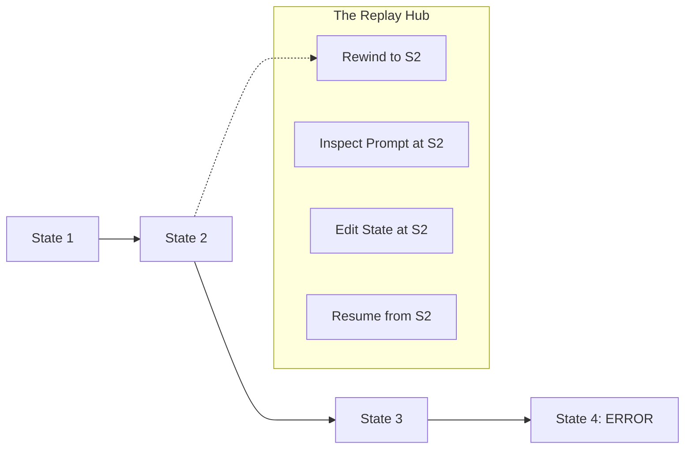

# 📽️ Agent Replay & Inspection — Time-Travel Debugging
> **Level:** Advanced | **Language:** Hinglish | **Goal:** Master the techniques of recording agent sessions and "Replaying" them step-by-step to understand failures and optimize performance.

---

## 🧭 1. Beginner-Friendly Hinglish Explanation
Agent Replay ka matlab hai **"AI ki video recording dekhna"**. 

Socho ek agent ne ek lamba task kiya (e.g. 1 ghante ka research). Akhir mein usne galti kar di. 
- **Bina Replay:** Aapko samajh nahi aayega ki "Kahan galti hui".
- **Saath mein Replay:** Aap pura session "Rewind" kar sakte ho. Aap ek specific step par ja sakte ho aur dekh sakte ho ki "Uss waqt agent ke dimaag (State) mein kya tha?"

Isse hum "Time Travel" debugging kehte hain kyunki hum past mein ja kar agent ke faislon ko "Inspect" kar sakte hain.

---

## 🧠 2. Deep Technical Explanation
Agent Replay is built on **State Checkpointing**.
1. **Snapshots:** Every time the agent moves from one node to another, the entire state (Variables, Messages, Tool results) is saved.
2. **Replay Engine:** A system that can load a specific snapshot and "Resume" execution from that exact point.
3. **Inspector UI:** A dashboard where you can see:
    - **Prompt at Step X:** What was the instructions?
    - **Tokens at Step X:** How much cost?
    - **Reasoning at Step X:** What was the 'Thought'?
4. **Time-Travel:** You can modify the state at Step 5 and "Rerun" the agent to see if it fixes the final output at Step 10.
5. **Session ID:** All snapshots are linked via a unique session identifier.

---

## 🏗️ 3. Architecture Diagrams



---

## 💻 4. Production-Ready Code Example (Loading a Checkpoint)

```python
# Hinglish Logic: Purani 'Thread ID' aur 'Step ID' se session load karo
def replay_session(thread_id, checkpoint_id):
    # state = checkpointer.get_state(thread_id, checkpoint_id)
    # print(f"Agent state at step {checkpoint_id}: {state}")
    
    # Optional: Resume execution
    # agent.run(state)
    return "Inspection Ready"

# This is a core feature of LangGraph's checkpointer system.
```

---

## 🌍 5. Real-World Use Cases
- **Customer Dispute:** Replaying a conversation to see if the AI promised a refund it shouldn't have.
- **Workflow Optimization:** Identifying why an agent takes 5 unnecessary steps in its research loop.
- **User Experience:** Rewatching how a user interacted with the agent to improve the UI/UX.

---

## ❌ 6. Failure Cases
- **Massive Storage:** Har step ka snapshot save karne se DB size bahut tezi se badhta hai.
- **Broken References:** Agar aapne code badal diya, toh purana "Replay" naye code par nahi chalega (Logic mismatch).
- **Security:** Replays contain sensitive user data. Access must be strictly controlled.

---

## 🛠️ 7. Debugging Guide
- **Side-by-Side Comparison:** Run the original trace and the "Fixed" replay side-by-side to verify the improvement.
- **State Diff:** Check karein ki Step A aur Step B mein "State" mein kya "Extra" data add hua?

---

## ⚖️ 8. Tradeoffs
- **Full Checkpointing:** Perfect debugging but very expensive storage.
- **Light Checkpointing:** Saves only key milestones but harder to debug exact failures.

---

## ✅ 9. Best Practices
- **Persistence Policy:** Replays ko sirf 30 din tak rakhein.
- **Anonymization:** Traces ko view karne se pehle sensitive fields mask karein.

---

## 🛡️ 10. Security Concerns
- **Unauthorized Replay:** Someone with access to the DB could watch entire private user sessions. Encrypt your snapshots!

---

## 📈 11. Scaling Challenges
- **Concurrent Writes:** Lakhon users ke snapshots save karne ke liye high-speed database (Postgres/Redis) chahiye.

---

## 💰 12. Cost Considerations
- **DB Costs:** Amazon RDS or Managed Postgres cost increases with storage. Use **Compression** for snapshot JSONs.

---

## 📝 13. Interview Questions
1. **"State Checkpointing kya hota hai?"**
2. **"Time-travel debugging agent development mein kaise help karta hai?"**
3. **"Replay data ki security kaise handle karenge?"**

---

## 🚀 15. Latest 2026 Industry Patterns
- **Interactive Replays:** Users can "Rewind" their own conversation and edit their previous prompt to see a different outcome.
- **AI-Summarized Replays:** Instead of watching a 50-step trace, an AI summarizes the "Key failure points" for the developer.

---

> **Expert Tip:** A replay is worth a thousand logs. If you can **See** the failure, you can **Fix** the failure.
