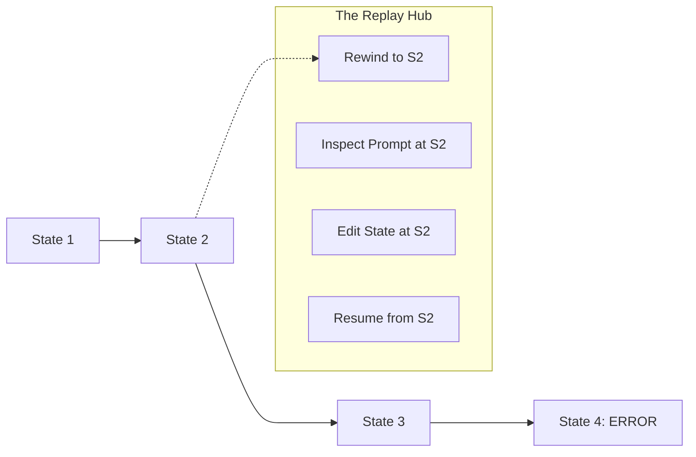

# 📽️ Agent Replay & Inspection — Time-Travel Debugging
> **Level:** Advanced | **Language:** Hinglish | **Goal:** Failures ko samajhne aur performance optimize karne ke liye agent sessions record karne aur unhe step-by-step "Replay" karne ki techniques ko master karein.

---

## 🧭 1. Beginner-Friendly Hinglish Explanation
Agent Replay ka matlab hai **"AI ki video recording dekhna"**. 

Socho ek agent ne ek lamba task kiya (e.g. 1 ghante ka research). Akhir mein usne galti kar di. 
- **Bina Replay:** Aapko samajh nahi aayega ki "Kahan galti hui".
- **Saath mein Replay:** Aap pura session "Rewind" kar sakte ho. Aap ek specific step par ja sakte ho aur dekh sakte ho ki "Uss waqt agent ke dimaag (State) mein kya tha?"

Isse hum "Time Travel" debugging kehte hain kyunki hum past mein ja kar agent ke faislon ko "Inspect" kar sakte hain.

---

## 🧠 2. Deep Technical Explanation
Agent Replay **State Checkpointing** par built hai.
1. **Snapshots:** Har baar jab agent ek node se doosre node par jata hai, toh poora state (Variables, Messages, Tool results) save ho jata hai.
2. **Replay Engine:** Ek aisa system jo specific snapshot ko load kar sake aur us exact point se execution ko "Resume" kar sake.
3. **Inspector UI:** Ek dashboard jahan aap dekh sakte hain:
    - **Prompt at Step X:** Instructions kya the?
    - **Tokens at Step X:** Kitna cost laga?
    - **Reasoning at Step X:** 'Thought' kya tha?
4. **Time-Travel:** Aap Step 5 par state ko modify kar sakte hain aur agent ko "Rerun" karke dekh sakte hain ki kya ye Step 10 par final output ko fix karta hai.
5. **Session ID:** Saare snapshots ek unique session identifier ke through linked hote hain.

---

## 🏗️ 3. Architecture Diagrams


```mermaid
graph LR
    S1[State 1] --> S2[State 2]
    S2 --> S3[State 3]
    S3 --> S4[State 4: ERROR]
    
    subgraph "The Replay Hub"
    R[Rewind to S2]
    I[Inspect Prompt at S2]
    E[Edit State at S2]
    RUN[Resume from S2]
    end
    
    S2 -.-> R
```

---

## 💻 4. Production-Ready Code Example (Loading a Checkpoint)

```python
# Hinglish Logic: Purani 'Thread ID' aur 'Step ID' se session load karo
def replay_session(thread_id, checkpoint_id):
    # state = checkpointer.get_state(thread_id, checkpoint_id)
    # print(f"Agent state at step {checkpoint_id}: {state}")
    
    # Optional: Resume execution
    # agent.run(state)
    return "Inspection Ready"

# This is a core feature of LangGraph's checkpointer system.
```

---

## 🌍 5. Real-World Use Cases
- **Customer Dispute:** Conversation ko replay karke dekhna ki kya AI ne kisi refund ka promise kiya tha jo use nahi karna chahiye tha.
- **Workflow Optimization:** Identify karna ki agent apne research loop mein 5 unnecessary steps kyu le raha hai.
- **User Experience:** UI/UX improve karne ke liye user ne agent ke sath kaise interact kiya use fir se dekhna.

---

## ❌ 6. Failure Cases
- **Massive Storage:** Har step ka snapshot save karne se DB size bahut tezi se badhta hai.
- **Broken References:** Agar aapne code badal diya, toh purana "Replay" naye code par nahi chalega (Logic mismatch).
- **Security:** Replays mein sensitive user data hota hai. Access strictly controlled hona chahiye.

---

## 🛠️ 7. Debugging Guide
- **Side-by-Side Comparison:** Improvement ko verify karne ke liye original trace aur "Fixed" replay ko side-by-side run karein.
- **State Diff:** Check karein ki Step A aur Step B mein "State" mein kya "Extra" data add hua?

---

## ⚖️ 8. Tradeoffs
- **Full Checkpointing:** Perfect debugging hai par storage bahut expensive hai.
- **Light Checkpointing:** Sirf key milestones ko save karta hai par exact failures ko debug karna harder hai.

---

## ✅ 9. Best Practices
- **Persistence Policy:** Replays ko sirf 30 din tak rakhein.
- **Anonymization:** Traces ko view karne se pehle sensitive fields mask karein.

---

## 🛡️ 10. Security Concerns
- **Unauthorized Replay:** DB access rakhne wala koi bhi person pure private user sessions dekh sakta hai. Apne snapshots encrypt karein!

---

## 📈 11. Scaling Challenges
- **Concurrent Writes:** Lakhon users ke snapshots save karne ke liye high-speed database (Postgres/Redis) chahiye.

---

## 💰 12. Cost Considerations
- **DB Costs:** Amazon RDS ya Managed Postgres ki cost storage ke sath badhti hai. Snapshot JSONs ke liye **Compression** ka use karein.

---

## 📝 13. Interview Questions
1. **"State Checkpointing kya hota hai?"**
2. **"Time-travel debugging agent development mein kaise help karta hai?"**
3. **"Replay data ki security kaise handle karenge?"**

---

## 🚀 15. Latest 2026 Industry Patterns
- **Interactive Replays:** Users apni conversation ko "Rewind" kar sakte hain aur different outcome dekhne ke liye apne previous prompt ko edit kar sakte hain.
- **AI-Summarized Replays:** 50-step trace dekhne ke bajaye, AI developer ke liye "Key failure points" ko summarize karta hai.

---

> **Expert Tip:** A replay is worth a thousand logs. If you can **See** the failure, you can **Fix** the failure.
