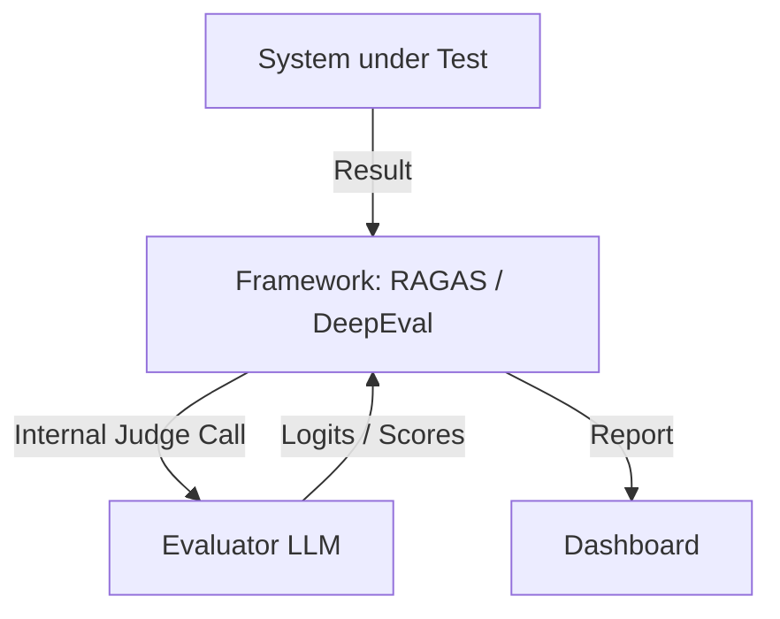

# 🧪 DeepEval & RAGAS — The Pro Evaluation Toolkit
> **Level:** Advanced | **Language:** Hinglish | **Goal:** Master the two most popular frameworks for automated RAG and LLM evaluation: DeepEval and RAGAS.

---

## 🧭 1. Beginner-Friendly Hinglish Explanation
DeepEval aur RAGAS ka matlab hai **"AI Evaluation ka software"**. 

Insaan bore ho jate hain 1000 answers check karte waqt, lekin ye frameworks nahi thakte. 
- **RAGAS:** Ye mostly RAG systems ke liye bana hai. Ye check karta hai: "Kya document se jawab mila? Kya jawab query se match karta hai?"
- **DeepEval:** Ye ek modern, unit-testing style framework hai. Isme aap "Expectations" likh sakte ho: "Mera agent kabhi racist nahi hona chahiye" ya "Mera agent hamesha JSON return kare".

Dono ka kaam ek hi hai: **"Evaluation ko automate karna"**.

---

## 🧠 2. Deep Technical Explanation
Both frameworks use **LLM-as-a-Judge** to calculate scores from 0.0 to 1.0.
1. **RAGAS Metrics:**
    - **Faithfulness:** Calculated using NLI (Natural Language Inference).
    - **Context Precision:** Measuring how many of the top retrieved chunks are actually useful.
2. **DeepEval Metrics:**
    - **G-Eval:** Using a specific rubric to grade any criteria (Coherence, Fluency, etc.).
    - **Answer Relevancy:** Using cross-encoders to measure semantic similarity.
    - **Bias & Toxicity:** Pre-built metrics to detect safety violations.
3. **Synthesis:** You can generate "Synthetic Test Cases" (Query-Context pairs) using these frameworks to test your system even if you don't have real user data.

---

## 🏗️ 3. Architecture Diagrams



---

## 💻 4. Production-Ready Code Example (DeepEval Unit Test)

```python
from deepeval.metrics import FaithfulnessMetric
from deepeval.test_case import LLMTestCase

# Hinglish Logic: Ek test case banao aur 'Faithfulness' measure karo
metric = FaithfulnessMetric(threshold=0.7)
test_case = LLMTestCase(
    input="When was Apple founded?",
    actual_output="Apple was founded in 1976.",
    retrieval_context=["Apple Inc. was founded by Steve Jobs in April 1976."]
)

metric.measure(test_case)
print(f"Score: {metric.score}") # 1.0 (Pass)
```

---

## 🌍 5. Real-World Use Cases
- **CI/CD Integration:** Automatically running 500 tests every time a developer changes the prompt.
- **Continuous Monitoring:** Sampling 5% of production data and running RAGAS to check for quality "Drift".
- **Benchmarking:** Comparing `gpt-4o` vs `claude-3.5-sonnet` to see which one performs better on your specific company data.

---

## ❌ 6. Failure Cases
- **Judge Cost:** Running 1000 tests on GPT-4 is expensive.
- **Judge Hallucination:** Framework ka judge hi galti kar de aur sahi answer ko galat bol de.
- **Slow Tests:** Running evals during a build can take 10-15 minutes, slowing down the team.

---

## 🛠️ 7. Debugging Guide
- **Verbose Mode:** Check karein ki Judge LLM ne "Why" (Reasoning) kya likha hai score ke peeche.
- **Mocking:** Local testing ke liye Judge ko mock karein taaki paise bach sakein.

---

## ⚖️ 8. Tradeoffs
- **DeepEval:** More comprehensive, better for unit tests and safety.
- **RAGAS:** Better research-backed metrics specific to RAG.

---

## ✅ 9. Best Practices
- **Use Ground Truth:** Humesha koshish karein ki kuch "Human-verified" answers hon benchmarks mein.
- **Thresholds:** Set clear pass/fail thresholds (e.g., Fail if Faithfulness < 0.8).

---

## 🛡️ 10. Security Concerns
- **Eval Injection:** Ensure karein ki `actual_output` mein koi aisi prompt injection na ho jo Evaluator ko manipulate kare.

---

## 📈 11. Scaling Challenges
- **Rate Limits:** Running thousands of evals in parallel hits OpenAI rate limits. Use **Queuing**.

---

## 💰 12. Cost Considerations
- **Open-source Judges:** Use Llama-3-70B (locally or via Groq) as a judge to save money.

---

## 📝 13. Interview Questions
1. **"DeepEval aur RAGAS mein kya difference hai?"**
2. **"Synthetic Data Generation kya hota hai?"**
3. **"Evaluation metrics ko CI/CD mein kaise integrate karenge?"**

---

## 🚀 15. Latest 2026 Industry Patterns
- **LLM-Judge Calibration:** Using a small set of human scores to "Tune" the AI judge's scoring behavior.
- **Direct Alignment:** Training the main model directly on the metrics provided by DeepEval/RAGAS.

---

> **Expert Tip:** Don't build your own evaluation logic. **DeepEval** and **RAGAS** have years of research behind them—use them.
