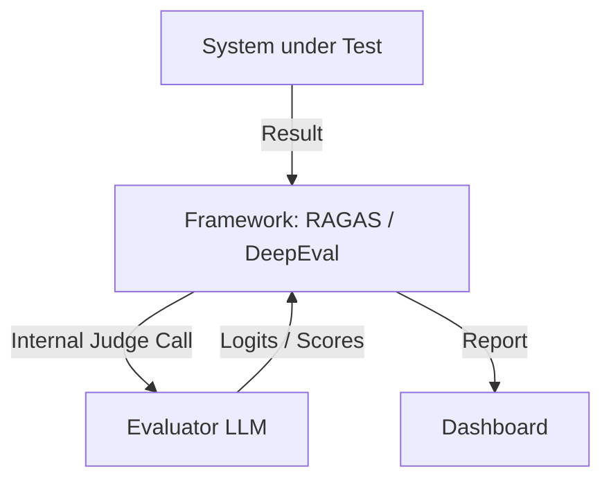

# 🧪 DeepEval & RAGAS — The Pro Evaluation Toolkit
> **Level:** Advanced | **Language:** Hinglish | **Goal:** Automated RAG aur LLM evaluation ke do sabse popular frameworks: DeepEval aur RAGAS ko master karein.

---

## 🧭 1. Beginner-Friendly Hinglish Explanation
DeepEval aur RAGAS ka matlab hai **"AI Evaluation ka software"**. 

Insaan bore ho jate hain 1000 answers check karte waqt, lekin ye frameworks nahi thakte. 
- **RAGAS:** Ye mostly RAG systems ke liye bana hai. Ye check karta hai: "Kya document se jawab mila? Kya jawab query se match karta hai?"
- **DeepEval:** Ye ek modern, unit-testing style framework hai. Isme aap "Expectations" likh sakte ho: "Mera agent kabhi racist nahi hona chahiye" ya "Mera agent hamesha JSON return kare".

Dono ka kaam ek hi hai: **"Evaluation ko automate karna"**.

---

## 🧠 2. Deep Technical Explanation
Dono frameworks scores 0.0 se 1.0 calculate karne ke liye **LLM-as-a-Judge** ka use karte hain.
1. **RAGAS Metrics:**
    - **Faithfulness:** NLI (Natural Language Inference) ka use karke calculate kiya jata hai.
    - **Context Precision:** Ye measure karna ki top retrieved chunks mein se kitne actually useful hain.
2. **DeepEval Metrics:**
    - **G-Eval:** Kisi bhi criteria (Coherence, Fluency, etc.) ko grade karne ke liye ek specific rubric ka use karna.
    - **Answer Relevancy:** Semantic similarity measure karne ke liye cross-encoders ka use karna.
    - **Bias & Toxicity:** Safety violations ko detect karne ke liye pre-built metrics.
3. **Synthesis:** Agar aapke paas real user data na bhi ho, toh bhi aap apne system ko test karne ke liye in frameworks ka use karke "Synthetic Test Cases" (Query-Context pairs) generate kar sakte hain.

---

## 🏗️ 3. Architecture Diagrams


```mermaid
graph TD
    S[System under Test] -->|Result| F[Framework: RAGAS / DeepEval]
    F -->|Internal Judge Call| J[Evaluator LLM]
    J -->|Logits / Scores| F
    F -->|Report| D[Dashboard]
```

---

## 💻 4. Production-Ready Code Example (DeepEval Unit Test)

```python
from deepeval.metrics import FaithfulnessMetric
from deepeval.test_case import LLMTestCase

# Hinglish Logic: Ek test case banao aur 'Faithfulness' measure karo
metric = FaithfulnessMetric(threshold=0.7)
test_case = LLMTestCase(
    input="When was Apple founded?",
    actual_output="Apple was founded in 1976.",
    retrieval_context=["Apple Inc. was founded by Steve Jobs in April 1976."]
)

metric.measure(test_case)
print(f"Score: {metric.score}") # 1.0 (Pass)
```

---

## 🌍 5. Real-World Use Cases
- **CI/CD Integration:** Har baar jab developer prompt change karta hai, toh automatically 500 tests run karna.
- **Continuous Monitoring:** Production data ka 5% sample lena aur quality "Drift" check karne ke liye RAGAS run karna.
- **Benchmarking:** `gpt-4o` vs `claude-3.5-sonnet` ko compare karna ye dekhne ke liye ki kaunsa aapki specific company data par better perform karta hai.

---

## ❌ 6. Failure Cases
- **Judge Cost:** GPT-4 par 1000 tests run karna expensive hai.
- **Judge Hallucination:** Framework ka judge hi galti kar de aur sahi answer ko galat bol de.
- **Slow Tests:** Build ke dauran evals run karne mein 10-15 minutes lag sakte hain, jisse team slow ho jati hai.

---

## 🛠️ 7. Debugging Guide
- **Verbose Mode:** Check karein ki Judge LLM ne "Why" (Reasoning) kya likha hai score ke peeche.
- **Mocking:** Local testing ke liye Judge ko mock karein taaki paise bach sakein.

---

## ⚖️ 8. Tradeoffs
- **DeepEval:** Zyada comprehensive hai, unit tests aur safety ke liye better hai.
- **RAGAS:** RAG ke liye specific, better research-backed metrics.

---

## ✅ 9. Best Practices
- **Use Ground Truth:** Humesha koshish karein ki kuch "Human-verified" answers hon benchmarks mein.
- **Thresholds:** Clear pass/fail thresholds set karein (e.g., Fail if Faithfulness < 0.8).

---

## 🛡️ 10. Security Concerns
- **Eval Injection:** Ensure karein ki `actual_output` mein koi aisi prompt injection na ho jo Evaluator ko manipulate kare.

---

## 📈 11. Scaling Challenges
- **Rate Limits:** Parallel mein thousands of evals run karne se OpenAI rate limits hit ho sakti hain. **Queuing** ka use karein.

---

## 💰 12. Cost Considerations
- **Open-source Judges:** Paise bachane ke liye Llama-3-70B (locally ya Groq ke throw) ko judge ki tarah use karein.

---

## 📝 13. Interview Questions
1. **"DeepEval aur RAGAS mein kya difference hai?"**
2. **"Synthetic Data Generation kya hota hai?"**
3. **"Evaluation metrics ko CI/CD mein kaise integrate karenge?"**

---

## 🚀 15. Latest 2026 Industry Patterns
- **LLM-Judge Calibration:** AI judge ke scoring behavior ko "Tune" karne ke liye human scores ke ek small set ka use karna.
- **Direct Alignment:** Main model ko directly DeepEval/RAGAS dwara provided metrics par train karna.

---

> **Expert Tip:** Don't build your own evaluation logic. **DeepEval** and **RAGAS** have years of research behind them—use them.
