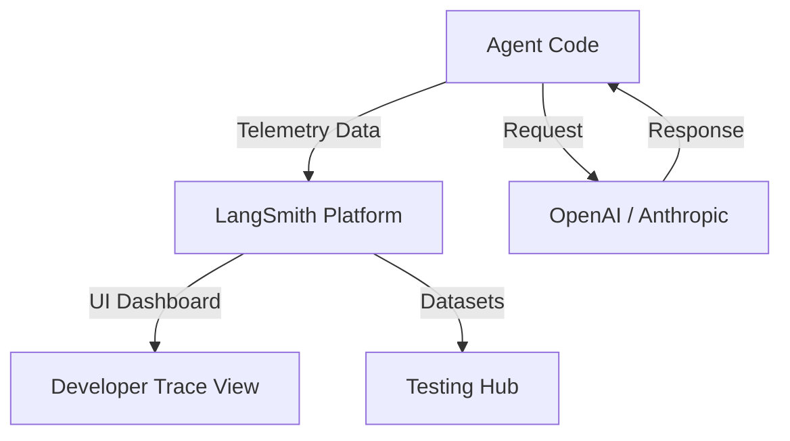

# 🛠️ LangSmith Observability — The Agent's X-Ray
> **Level:** Advanced | **Language:** Hinglish | **Goal:** Master the use of LangSmith for tracing, debugging, and monitoring complex agentic workflows in real-time.

---

## 🧭 1. Beginner-Friendly Hinglish Explanation
LangSmith ka matlab hai **"AI ka CCTV camera"**. 

Jab aap ek complex agent (LangGraph) banate ho, toh wo andar hi andar bahut saari API calls karta hai: 
- "Pehle Google Search kiya" 
- "Phir result ko clean kiya" 
- "Phir ek tool chalaya"
- "Phir final answer likha"

Agar beech mein kahin galti hui, toh aapko kaise pata chalega? **LangSmith** har ek step ka "Trace" (record) rakhta hai. Aap website par ja kar dekh sakte ho ki "Step 3" mein kya input gaya aur kya output aaya. 

Isse "Debugging" 100x fast ho jati hai.

---

## 🧠 2. Deep Technical Explanation
LangSmith is an **Observability Platform** built specifically for LLM workflows.
1. **Tracing:** Every call to an LLM, Tool, or Chain is wrapped in a `trace`. You can see the full hierarchy of nested calls.
2. **Datasets:** You can save "Good" or "Bad" outputs from your traces directly into a dataset for future evaluation.
3. **Feedback Loops:** Users can give "Thumbs up/down" on the UI, and that feedback is attached to the specific trace ID.
4. **Unit Testing:** Running a list of inputs (Dataset) against your agent and seeing the results in a table.
5. **Cost & Latency Tracking:** Monitor exactly how many tokens were used in each step and where the delay (bottleneck) is.

---

## 🏗️ 3. Architecture Diagrams



---

## 💻 4. Production-Ready Code Example (Enabling Tracing)

```python
import os
# Hinglish Logic: Sirf environment variables set karo, 
# LangChain khud saara data trace kar lega.

os.environ["LANGCHAIN_TRACING_V2"] = "true"
os.environ["LANGCHAIN_API_KEY"] = "ls__your_key"
os.environ["LANGCHAIN_PROJECT"] = "Customer-Support-V1"

# Now, any call to a LangChain tool or model will be visible in the dashboard.
# No code changes needed in the logic!
```

---

## 🌍 5. Real-World Use Cases
- **Root Cause Analysis:** Investigating why a specific user got a "Hallucinated" answer by looking at the exact context retrieved.
- **Performance Tuning:** Finding out that 80% of your latency is coming from a slow "Web Scraping" tool, not the LLM.
- **Collaborative Debugging:** Sharing a "Trace URL" with a teammate: "Hey, check this error on step 5".

---

## ❌ 6. Failure Cases
- **Sensitive Data Leak:** Agar aapne PII (Emails/Passwords) mask nahi kiye, toh wo LangSmith ke dashboard par dikhenge.
- **Latency Impact:** Traces bhejte waqt minimal latency add hoti hai (usually async hoti hai, par heavy traffic mein check karein).
- **Free Tier Limits:** LangSmith ka free tier jaldi khatam ho sakta hai agar aap production traffic bhej rahe hain.

---

## 🛠️ 7. Debugging Guide
- **The "Playground" Button:** LangSmith UI mein ek button hota hai jahan aap failed input ko wapas "Tweaking" karke test kar sakte ho bina code change kiye.
- **Filtering:** Use filters to find only "Failed" traces or traces where "Cost > $0.10".

---

## ⚖️ 8. Tradeoffs
- **LangSmith:** Best-in-class UI, deep LangChain integration, but it's a paid SaaS product.
- **Arize Phoenix:** Open source, can be self-hosted, but setup is more complex.

---

## ✅ 9. Best Practices
- **Custom Metadata:** Har trace ke saath `user_id` ya `session_id` tag karein taaki aap search kar sakein.
- **Sampling:** Production mein sirf 5-10% traces bhejien to save costs.

---

## 🛡️ 10. Security Concerns
- **Masking:** Humesha ensure karein ki traces bhejne se pehle sensitive data anonymize ho jaye.

---

## 📈 11. Scaling Challenges
- **High Throughput:** Massive traffic handle karne ke liye "Log aggregation" servers ki zarurat pad sakti hai.

---

## 💰 12. Cost Considerations
- **Managed SaaS:** LangSmith tracks millions of steps, and the bill grows with your traffic. Use it strategically for debugging, not just raw logging.

---

## 📝 13. Interview Questions
1. **"Observability aur Logging mein kya fark hai agents ke liye?"**
2. **"LangSmith mein 'Dataset' kaise create karenge production logs se?"**
3. **"Latency bottlenecks ko LangSmith se kaise identify karenge?"**

---

## 🚀 15. Latest 2026 Industry Patterns
- **Trace-to-FineTune:** Automatically selecting the "Best" 100 traces from production to fine-tune a smaller, cheaper model.
- **Real-time Alerting:** Alerts that trigger if the "Hallucination score" in production crosses a threshold.

---

> **Expert Tip:** LangSmith is your **Black Box Flight Recorder**. In production, it's the only thing that stands between you and "I don't know why it failed".
