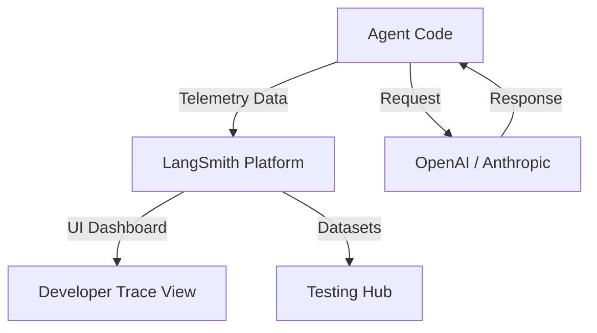

# 🛠️ LangSmith Observability — The Agent's X-Ray
> **Level:** Advanced | **Language:** Hinglish | **Goal:** Real-time mein complex agentic workflows ko trace, debug, aur monitor karne ke liye LangSmith ke use ko master karein.

---

## 🧭 1. Beginner-Friendly Hinglish Explanation
LangSmith ka matlab hai **"AI ka CCTV camera"**. 

Jab aap ek complex agent (LangGraph) banate ho, toh wo andar hi andar bahut saari API calls karta hai: 
- "Pehle Google Search kiya" 
- "Phir result ko clean kiya" 
- "Phir ek tool chalaya"
- "Phir final answer likha"

Agar beech mein kahin galti hui, toh aapko kaise pata chalega? **LangSmith** har ek step ka "Trace" (record) rakhta hai. Aap website par ja kar dekh sakte ho ki "Step 3" mein kya input gaya aur kya output aaya. 

Isse "Debugging" 100x fast ho jati hai.

---

## 🧠 2. Deep Technical Explanation
LangSmith ek **Observability Platform** hai jo specifically LLM workflows ke liye built hai.
1. **Tracing:** LLM, Tool ya Chain ki har call ek `trace` mein wrap hoti hai. Aap nested calls ki full hierarchy dekh sakte hain.
2. **Datasets:** Aap future evaluation ke liye apne traces se "Good" ya "Bad" outputs ko directly dataset mein save kar sakte hain.
3. **Feedback Loops:** Users UI par "Thumbs up/down" de sakte hain, aur wo feedback specific trace ID ke sath attach ho jata hai.
4. **Unit Testing:** Apne agent ke against inputs ki list (Dataset) run karna aur results ko ek table mein dekhna.
5. **Cost & Latency Tracking:** Monitor karein ki har step mein exactly kitne tokens use hue aur delay (bottleneck) kahan hai.

---

## 🏗️ 3. Architecture Diagrams


```mermaid
graph TD
    A[Agent Code] -->|Telemetry Data| LS[LangSmith Platform]
    A -->|Request| LLM[OpenAI / Anthropic]
    LLM -->|Response| A
    LS -->|UI Dashboard| D[Developer Trace View]
    LS -->|Datasets| T[Testing Hub]
```

---

## 💻 4. Production-Ready Code Example (Enabling Tracing)

```python
import os
# Hinglish Logic: Sirf environment variables set karo, 
# LangChain khud saara data trace kar lega.

os.environ["LANGCHAIN_TRACING_V2"] = "true"
os.environ["LANGCHAIN_API_KEY"] = "ls__your_key"
os.environ["LANGCHAIN_PROJECT"] = "Customer-Support-V1"

# Now, any call to a LangChain tool or model will be visible in the dashboard.
# No code changes needed in the logic!
```

---

## 🌍 5. Real-World Use Cases
- **Root Cause Analysis:** Extract kiye gaye exact context ko dekh kar investigate karna ki kisi specific user ko "Hallucinated" answer kyu mila.
- **Performance Tuning:** Ye pata lagana ki aapki latency ka 80% slow "Web Scraping" tool se aa raha hai, na ki LLM se.
- **Collaborative Debugging:** Kisi teammate ke sath "Trace URL" share karna: "Hey, check this error on step 5".

---

## ❌ 6. Failure Cases
- **Sensitive Data Leak:** Agar aapne PII (Emails/Passwords) mask nahi kiye, toh wo LangSmith ke dashboard par dikhenge.
- **Latency Impact:** Traces bhejte waqt minimal latency add hoti hai (usually async hoti hai, par heavy traffic mein check karein).
- **Free Tier Limits:** LangSmith ka free tier jaldi khatam ho sakta hai agar aap production traffic bhej rahe hain.

---

## 🛠️ 7. Debugging Guide
- **The "Playground" Button:** LangSmith UI mein ek button hota hai jahan aap failed input ko wapas "Tweaking" karke test kar sakte ho bina code change kiye.
- **Filtering:** Sirf "Failed" traces ya aise traces jahan "Cost > $0.10" ho dhoondhne ke liye filters use karein.

---

## ⚖️ 8. Tradeoffs
- **LangSmith:** Best-in-class UI, deep LangChain integration, par ye ek paid SaaS product hai.
- **Arize Phoenix:** Open source hai, self-host kiya ja sakta hai, par setup zyada complex hai.

---

## ✅ 9. Best Practices
- **Custom Metadata:** Har trace ke saath `user_id` ya `session_id` tag karein taaki aap search kar sakein.
- **Sampling:** Production mein sirf 5-10% traces bhejien to save costs.

---

## 🛡️ 10. Security Concerns
- **Masking:** Humesha ensure karein ki traces bhejne se pehle sensitive data anonymize ho jaye.

---

## 📈 11. Scaling Challenges
- **High Throughput:** Massive traffic handle karne ke liye "Log aggregation" servers ki zarurat pad sakti hai.

---

## 💰 12. Cost Considerations
- **Managed SaaS:** LangSmith millions of steps ko track karta hai, aur bill aapke traffic ke sath badhta hai. Ise debug karne ke liye strategically use karein, na ki sirf raw logging ke liye.

---

## 📝 13. Interview Questions
1. **"Observability aur Logging mein kya fark hai agents ke liye?"**
2. **"LangSmith mein 'Dataset' kaise create karenge production logs se?"**
3. **"Latency bottlenecks ko LangSmith se kaise identify karenge?"**

---

## 🚀 15. Latest 2026 Industry Patterns
- **Trace-to-FineTune:** Ek chote aur saste model ko fine-tune karne ke liye production se automatically "Best" 100 traces ko select karna.
- **Real-time Alerting:** Production mein "Hallucination score" threshold cross karne par trigger hone wale alerts.

---

> **Expert Tip:** LangSmith is your **Black Box Flight Recorder**. In production, it's the only thing that stands between you and "I don't know why it failed".
