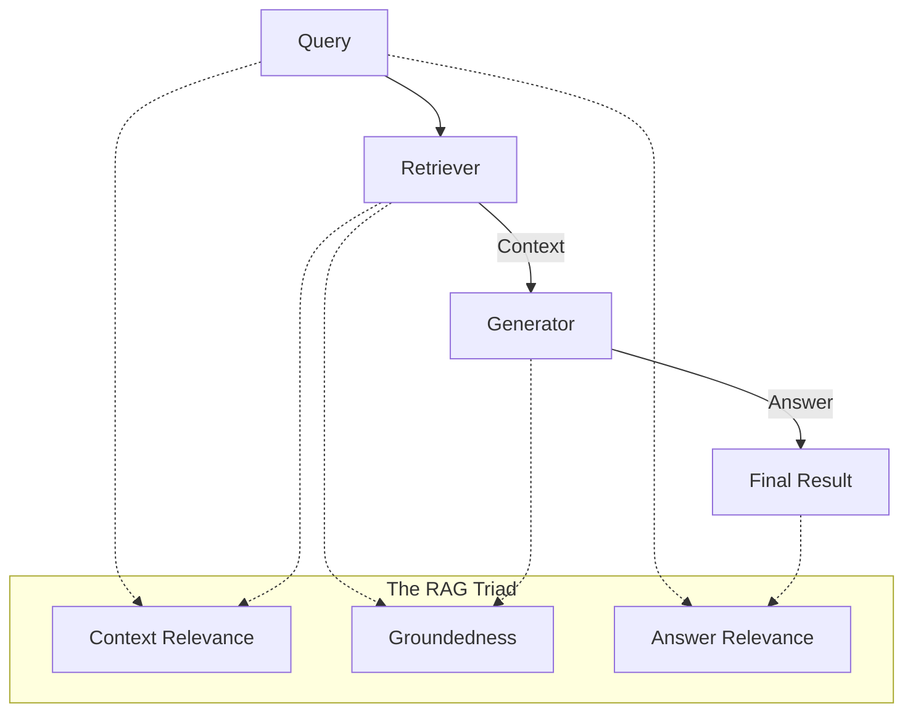

# 📚 RAG Evaluation — Scoring the Knowledge Engine
> **Level:** Core Engineering | **Language:** Hinglish | **Goal:** Master the specific metrics and techniques used to evaluate Retrieval-Augmented Generation (RAG) systems.

---

## 🧭 1. Beginner-Friendly Hinglish Explanation
RAG Evaluation ka matlab hai **"RAG ka X-ray"**. 

RAG system mein do bade parts hote hain:
1. **Retriever:** Kya humne sahi document dhoondha? (**Search Accuracy**)
2. **Generator:** Kya AI ne us document se sahi jawab banaya? (**Writing Accuracy**)

Agar humara search galat hai, toh answer kabhi sahi nahi hoga. Agar search sahi hai par AI confuse hai, toh wo halluncinate karega. RAG Evaluation humein batata hai ki problem "Search" mein hai ya "Writing" mein.

---

## 🧠 2. Deep Technical Explanation
RAG evaluation is centered around the **RAG Triad**:
1. **Context Relevance:** Does the retrieved document actually contain the answer to the query? (Retriever's job).
2. **Groundedness / Faithfulness:** Is the answer derived *only* from the retrieved context? (No hallucinations).
3. **Answer Relevance:** Does the final answer actually address the user's question?
4. **Context Precision:** Are the most relevant documents ranked at the top of the search results?
5. **Context Recall:** Did we find *all* the information needed to answer the query?

---

## 🏗️ 3. Architecture Diagrams



---

## 💻 4. Production-Ready Code Example (Simple Groundedness Check)

```python
# Hinglish Logic: AI se pucho kya jawab 'Document' mein hai?
JUDGE_PROMPT = """
Context: {context}
Answer: {answer}

Is the Answer 100% supported by the Context? Answer YES or NO.
"""

def check_groundedness(context, answer):
    # response = model.invoke(JUDGE_PROMPT.format(context=context, answer=answer))
    # return "YES" in response
    return True
```

---

## 🌍 5. Real-World Use Cases
- **Medical RAG:** Ensuring the AI only provides advice based on the medical textbook, not its own training.
- **Enterprise Search:** Checking if the internal HR bot is correctly quoting the 2026 policy.
- **Legal Tech:** Verifying that a contract summary only includes terms actually present in the contract.

---

## ❌ 6. Failure Cases
- **Missing Link:** Document sahi hai, par AI ne galti se purani information (training data) use kar li.
- **Semantic Overlap:** Multiple documents mein contradictory info hai, AI confuse ho gaya.
- **Top-K failure:** Sahi document 5th position par tha, par humne sirf Top-3 uthaye.

---

## 🛠️ 7. Debugging Guide
- **Analyze Failures:** Agar Groundedness low hai -> Improve System Prompt. Agar Relevance low hai -> Improve Embeddings/Search logic.
- **Retrieval Logs:** Save karein ki har query ke liye kaunse `chunk_ids` retrieve hue the.

---

## ⚖️ 8. Tradeoffs
- **High Recall:** Sahi info mil jayegi, par context "Noisy" (faltu data) ho jayega.
- **High Precision:** Context "Clean" hoga, par ho sakta hai important info miss ho jaye.

---

## ✅ 9. Best Practices
- **Chunk Size Tuning:** Test karein ki 500 characters better hain ya 1000.
- **Hybrid Search:** Mix Keyword (BM25) and Vector Search for best retrieval scores.

---

## 🛡️ 10. Security Concerns
- **Context Injection:** Malicious data inside a PDF that tricks the RAG into giving wrong answers.

---

## 📈 11. Scaling Challenges
- **Large Contexts:** Evaluation on 100,000 documents needs a specialized testing pipeline.

---

## 💰 12. Cost Considerations
- **LLM-as-a-Judge tokens:** RAG evaluation typically needs 2-3 LLM calls per test case.

---

## 📝 13. Interview Questions
1. **"RAG Triad kya hota hai?"**
2. **"Faithfulness aur Answer Relevance mein kya fark hai?"**
3. **"Retriever performance measure karne ke liye metrics batao (NDCG, MRR)?"**

---

## 🚀 15. Latest 2026 Industry Patterns
- **Active RAG:** Agents that "Self-evaluate" their retrieval and decide to "Search Again" if the score is low.
- **Graph-RAG Evals:** Specialized metrics for Knowledge Graphs that measure relationship accuracy.

---

> **Expert Tip:** RAG is only as good as its **Data**. If your evaluation says retrieval is weak, no amount of prompt engineering will fix the answer.
