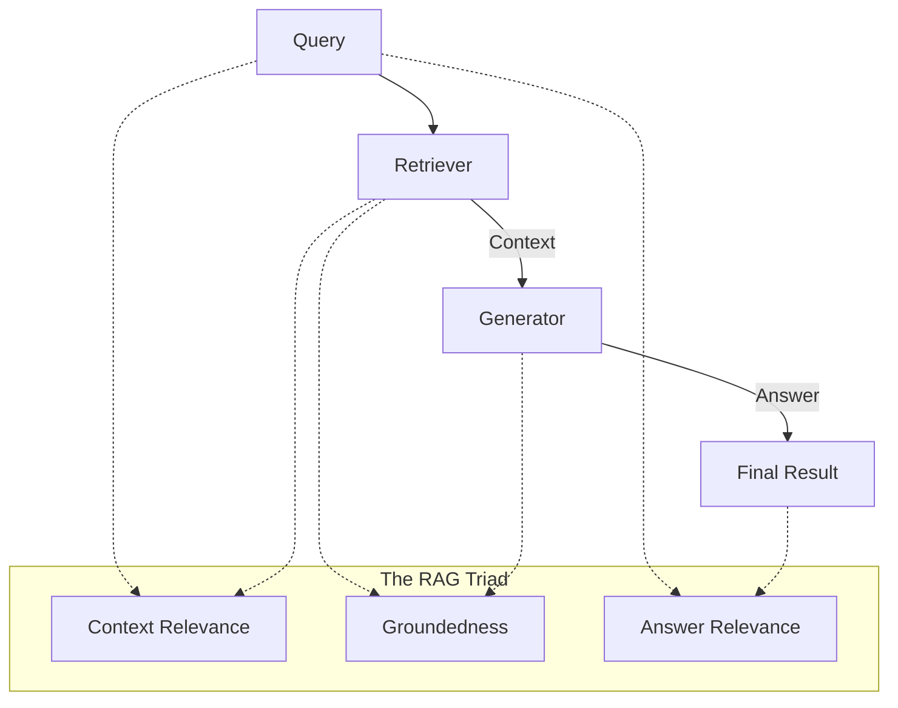

# 📚 RAG Evaluation — Scoring the Knowledge Engine
> **Level:** Core Engineering | **Language:** Hinglish | **Goal:** Retrieval-Augmented Generation (RAG) systems ke evaluation ke liye use hone wale specific metrics aur techniques ko master karein.

---

## 🧭 1. Beginner-Friendly Hinglish Explanation
RAG Evaluation ka matlab hai **"RAG ka X-ray"**. 

RAG system mein do bade parts hote hain:
1. **Retriever:** Kya humne sahi document dhoondha? (**Search Accuracy**)
2. **Generator:** Kya AI ne us document se sahi jawab banaya? (**Writing Accuracy**)

Agar humara search galat hai, toh answer kabhi sahi nahi hoga. Agar search sahi hai par AI confuse hai, toh wo halluncinate karega. RAG Evaluation humein batata hai ki problem "Search" mein hai ya "Writing" mein.

---

## 🧠 2. Deep Technical Explanation
RAG evaluation **RAG Triad** ke around centered hoti hai:
1. **Context Relevance:** Kya retrieved document mein actually query ka answer hai? (Retriever ka job).
2. **Groundedness / Faithfulness:** Kya answer *only* retrieved context se derived hai? (No hallucinations).
3. **Answer Relevance:** Kya final answer actually user ke question ko address karta hai?
4. **Context Precision:** Kya sabse relevant documents search results ke top par ranked hain?
5. **Context Recall:** Kya humne query ka answer dene ke liye zaroorat ki *saari* information dhoondh li?

---

## 🏗️ 3. Architecture Diagrams


```mermaid
graph TD
    Q[Query] --> R[Retriever]
    R -->|Context| G[Generator]
    G -->|Answer| A[Final Result]
    
    subgraph "The RAG Triad"
    CR[Context Relevance]
    GF[Groundedness]
    AR[Answer Relevance]
    end
    
    Q & R -.-> CR
    R & G -.-> GF
    Q & A -.-> AR
```

---

## 💻 4. Production-Ready Code Example (Simple Groundedness Check)

```python
# Hinglish Logic: AI se pucho kya jawab 'Document' mein hai?
JUDGE_PROMPT = """
Context: {context}
Answer: {answer}

Is the Answer 100% supported by the Context? Answer YES or NO.
"""

def check_groundedness(context, answer):
    # response = model.invoke(JUDGE_PROMPT.format(context=context, answer=answer))
    # return "YES" in response
    return True
```

---

## 🌍 5. Real-World Use Cases
- **Medical RAG:** Ensure karna ki AI sirf medical textbook ke basis par hi advice de, apne khud ke training data par nahi.
- **Enterprise Search:** Check karna ki internal HR bot 2026 policy ko correctly quote kar raha hai ya nahi.
- **Legal Tech:** Verify karna ki contract summary mein sirf wahi terms include ho jo actually contract mein present hain.

---

## ❌ 6. Failure Cases
- **Missing Link:** Document sahi hai, par AI ne galti se purani information (training data) use kar li.
- **Semantic Overlap:** Multiple documents mein contradictory info hai, AI confuse ho gaya.
- **Top-K failure:** Sahi document 5th position par tha, par humne sirf Top-3 uthaye.

---

## 🛠️ 7. Debugging Guide
- **Analyze Failures:** Agar Groundedness low hai -> Improve System Prompt. Agar Relevance low hai -> Improve Embeddings/Search logic.
- **Retrieval Logs:** Save karein ki har query ke liye kaunse `chunk_ids` retrieve hue the.

---

## ⚖️ 8. Tradeoffs
- **High Recall:** Sahi info mil jayegi, par context "Noisy" (faltu data) ho jayega.
- **High Precision:** Context "Clean" hoga, par ho sakta hai important info miss ho jaye.

---

## ✅ 9. Best Practices
- **Chunk Size Tuning:** Test karein ki 500 characters better hain ya 1000.
- **Hybrid Search:** Best retrieval scores ke liye Keyword (BM25) aur Vector Search mix karein.

---

## 🛡️ 10. Security Concerns
- **Context Injection:** PDF ke andar malicious data jo RAG ko wrong answers dene ke liye trick karta hai.

---

## 📈 11. Scaling Challenges
- **Large Contexts:** 100,000 documents par evaluation ke liye ek specialized testing pipeline ki zaroorat hoti hai.

---

## 💰 12. Cost Considerations
- **LLM-as-a-Judge tokens:** RAG evaluation ke liye typically per test case 2-3 LLM calls ki zaroorat hoti hai.

---

## 📝 13. Interview Questions
1. **"RAG Triad kya hota hai?"**
2. **"Faithfulness aur Answer Relevance mein kya fark hai?"**
3. **"Retriever performance measure karne ke liye metrics batao (NDCG, MRR)?"**

---

## 🚀 15. Latest 2026 Industry Patterns
- **Active RAG:** Aise agents jo apni retrieval ko "Self-evaluate" karte hain aur score low hone par "Search Again" ka decision lete hain.
- **Graph-RAG Evals:** Knowledge Graphs ke liye specialized metrics jo relationship accuracy measure karte hain.

---

> **Expert Tip:** RAG is only as good as its **Data**. If your evaluation says retrieval is weak, no amount of prompt engineering will fix the answer.
