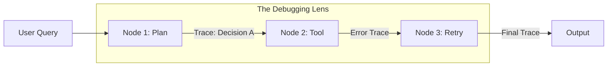

# 🕵️ Tracing & Debugging — Hunting the Bugs in Reasoning
> **Level:** Advanced | **Language:** Hinglish | **Goal:** Master the techniques of structured tracing and logical debugging for complex multi-agent systems.

---

## 🧭 1. Beginner-Friendly Hinglish Explanation
Tracing aur Debugging ka matlab hai **"AI ki galti dhoondhna"**. 

Agentic AI normal code jaisa nahi hota jahan `error: line 45` dikh jaye. Yahan galti "Reasoning" mein hoti hai: 
- "Agent ko lag raha hai ki use Flight book karni chahiye, par use actually Train dhoondhni thi."
- "Agent ek infinite loop mein phasa hai."

**Tracing** humein batata hai ki agent ne "Kahan se kahan" tak travel kiya. 
**Debugging** humein us travel ke beech ke "Galat faislon" (Wrong decisions) ko theek karna sikhata hai.

---

## 🧠 2. Deep Technical Explanation
Debugging agents requires looking at **State Transitions** and **Tool Calls**.
1. **Trace IDs:** Every request gets a unique ID. All logs (LLM calls, database queries, tool outputs) are linked to this ID.
2. **Span Analysis:** Measuring how much time was spent in a specific "Span" (e.g. searching the database).
3. **Prompt Debugging:** Testing if a small change in the system prompt fixes the logic.
4. **Conditional Edge Debugging:** In LangGraph, checking why the graph took `Edge A` instead of `Edge B`.
5. **Human-in-the-loop (HITL) Debugging:** Intercepting the agent's plan, correcting it manually, and letting the agent continue to see if it fixes the final output.

---

## 🏗️ 3. Architecture Diagrams



---

## 💻 4. Production-Ready Code Example (Manual Tracing)

```python
# Hinglish Logic: Har step par logs save karo taaki galti pakdi ja sake
def debug_wrapper(node_func):
    def wrapper(state):
        print(f"DEBUG: Entering {node_func.__name__}")
        print(f"STATE BEFORE: {state}")
        
        result = node_func(state)
        
        print(f"STATE AFTER: {result}")
        return result
    return wrapper

# Use @debug_wrapper on your LangGraph nodes.
```

---

## 🌍 5. Real-World Use Cases
- **Support Bots:** Finding out why a bot offered a discount to someone who wasn't eligible.
- **Data Scraping:** Debugging why the agent is failing to parse a specific website's HTML.
- **Workflow Automation:** Fixing a logic error where the agent sends an email *before* the document is ready.

---

## ❌ 6. Failure Cases
- **Silent Failures:** AI "Hallucinates" a success message, but the action actually failed in the background.
- **Feedback Loops:** Debugging info is so large that the LLM gets confused by its own logs.
- **Log Bloat:** Millions of lines of traces making it impossible to find the one "True" error.

---

## 🛠️ 7. Debugging Guide
- **Step-by-Step Execution:** Execute the graph node-by-node in a Jupyter notebook.
- **Comparison Testing:** Run the same query with different models (GPT-4 vs Claude) to see if it's a model issue or a prompt issue.

---

## ⚖️ 8. Tradeoffs
- **Deep Tracing:** Easy debugging but slow and expensive.
- **Minimal Logging:** Fast and cheap but "Impossible" to fix complex logic bugs.

---

## ✅ 9. Best Practices
- **Standardized Formats:** Use JSON for logs so you can query them easily (e.g. via ELK stack or Datadog).
- **Correlation IDs:** Link your frontend request ID to your agent's trace ID.

---

## 🛡️ 10. Security Concerns
- **Leaking Internal Thought:** Sometimes "Internal Reasoning" (Chain of Thought) contains sensitive data. Don't show traces to the end user.

---

## 📈 11. Scaling Challenges
- **Distributed Tracing:** If your agent calls 5 different microservices, you need **OpenTelemetry** to link all those traces together.

---

## 💰 12. Cost Considerations
- **Storage:** Traces can take GBs of space. Set a retention policy (e.g. Delete after 14 days).

---

## 📝 13. Interview Questions
1. **"Non-deterministic systems ko debug kaise karenge?"**
2. **"Trace ID aur Span ID mein kya fark hai?"**
3. **"Hallucination detection during debugging?"**

---

## 🚀 15. Latest 2026 Industry Patterns
- **AI-Debugger Agents:** An agent that watches another agent's traces and automatically suggests "Prompt Fixes".
- **Visual Debugging:** 3D graph visualizations of agent reasoning paths to see "Dead ends" and "Loops".

---

> **Expert Tip:** Debugging is an **Art of Logic**. Don't just look at the final answer; look at the **Path of Least Resistance** the agent took.
