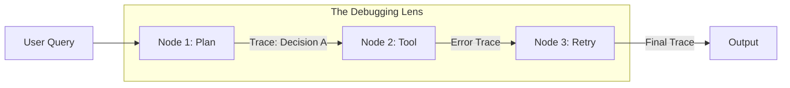

# 🕵️ Tracing & Debugging — Hunting the Bugs in Reasoning
> **Level:** Advanced | **Language:** Hinglish | **Goal:** Complex multi-agent systems ke liye structured tracing aur logical debugging ki techniques ko master karein.

---

## 🧭 1. Beginner-Friendly Hinglish Explanation
Tracing aur Debugging ka matlab hai **"AI ki galti dhoondhna"**. 

Agentic AI normal code jaisa nahi hota jahan `error: line 45` dikh jaye. Yahan galti "Reasoning" mein hoti hai: 
- "Agent ko lag raha hai ki use Flight book karni chahiye, par use actually Train dhoondhni thi."
- "Agent ek infinite loop mein phasa hai."

**Tracing** humein batata hai ki agent ne "Kahan se kahan" tak travel kiya. 
**Debugging** humein us travel ke beech ke "Galat faislon" (Wrong decisions) ko theek karna sikhata hai.

---

## 🧠 2. Deep Technical Explanation
Agents ko debug karne ke liye **State Transitions** aur **Tool Calls** dekhne ki zaroorat hoti hai.
1. **Trace IDs:** Har request ko ek unique ID milti hai. Saare logs (LLM calls, database queries, tool outputs) is ID se linked hote hain.
2. **Span Analysis:** Kisi specific "Span" (e.g. database search karne) mein kitna time spend hua use measure karna.
3. **Prompt Debugging:** Test karna ki kya system prompt mein ek small change logic ko fix karta hai.
4. **Conditional Edge Debugging:** LangGraph mein check karna ki graph ne `Edge B` ke bajaye `Edge A` kyu liya.
5. **Human-in-the-loop (HITL) Debugging:** Agent ke plan ko intercept karna, use manually correct karna, aur agent ko continue karne dena ye dekhne ke liye ki kya ye final output ko fix karta hai.

---

## 🏗️ 3. Architecture Diagrams


```mermaid
graph LR
    U[User Query] --> N1[Node 1: Plan]
    N1 -->|Trace: Decision A| N2[Node 2: Tool]
    N2 -->|Error Trace| N3[Node 3: Retry]
    N3 -->|Final Trace| O[Output]
    
    subgraph "The Debugging Lens"
    N1
    N2
    N3
    end
```

---

## 💻 4. Production-Ready Code Example (Manual Tracing)

```python
# Hinglish Logic: Har step par logs save karo taaki galti pakdi ja sake
def debug_wrapper(node_func):
    def wrapper(state):
        print(f"DEBUG: Entering {node_func.__name__}")
        print(f"STATE BEFORE: {state}")
        
        result = node_func(state)
        
        print(f"STATE AFTER: {result}")
        return result
    return wrapper

# Use @debug_wrapper on your LangGraph nodes.
```

---

## 🌍 5. Real-World Use Cases
- **Support Bots:** Ye pata lagana ki bot ne kisi ko discount kyu offer kiya jo eligible nahi tha.
- **Data Scraping:** Debugging ki agent kisi specific website ki HTML ko parse karne mein fail kyu ho raha hai.
- **Workflow Automation:** Ek logic error fix karna jahan agent document ready hone se *pehle* email send kar deta hai.

---

## ❌ 6. Failure Cases
- **Silent Failures:** AI ek success message "Hallucinate" karta hai, par background mein action actually fail ho gaya hota hai.
- **Feedback Loops:** Debugging info itni large hoti hai ki LLM apne hi logs se confuse ho jata hai.
- **Log Bloat:** Millions of lines of traces jo single "True" error dhoondhna impossible bana deti hain.

---

## 🛠️ 7. Debugging Guide
- **Step-by-Step Execution:** Graph ko Jupyter notebook mein node-by-node execute karein.
- **Comparison Testing:** Same query ko different models (GPT-4 vs Claude) ke sath run karke dekhein ki kya ye model issue hai ya prompt issue.

---

## ⚖️ 8. Tradeoffs
- **Deep Tracing:** Debugging easy hai par slow aur expensive hai.
- **Minimal Logging:** Fast aur cheap hai par complex logic bugs fix karna "Impossible" hai.

---

## ✅ 9. Best Practices
- **Standardized Formats:** Logs ke liye JSON use karein taaki aap unhe easily query kar sakein (e.g. via ELK stack ya Datadog).
- **Correlation IDs:** Apne frontend request ID ko apne agent ke trace ID ke sath link karein.

---

## 🛡️ 10. Security Concerns
- **Leaking Internal Thought:** Kabhi-kabhi "Internal Reasoning" (Chain of Thought) mein sensitive data hota hai. Traces end user ko na dikhayein.

---

## 📈 11. Scaling Challenges
- **Distributed Tracing:** Agar aapka agent 5 different microservices ko call karta hai, toh un saare traces ko ek sath link karne ke liye aapko **OpenTelemetry** ki zaroorat hogi.

---

## 💰 12. Cost Considerations
- **Storage:** Traces GBs of space le sakte hain. Ek retention policy set karein (e.g. Delete after 14 days).

---

## 📝 13. Interview Questions
1. **"Non-deterministic systems ko debug kaise karenge?"**
2. **"Trace ID aur Span ID mein kya fark hai?"**
3. **"Hallucination detection during debugging?"**

---

## 🚀 15. Latest 2026 Industry Patterns
- **AI-Debugger Agents:** Ek agent jo doosre agent ke traces ko watch karta hai aur automatically "Prompt Fixes" suggest karta hai.
- **Visual Debugging:** "Dead ends" aur "Loops" dekhne ke liye agent reasoning paths ki 3D graph visualizations.

---

> **Expert Tip:** Debugging is an **Art of Logic**. Don't just look at the final answer; look at the **Path of Least Resistance** the agent took.
