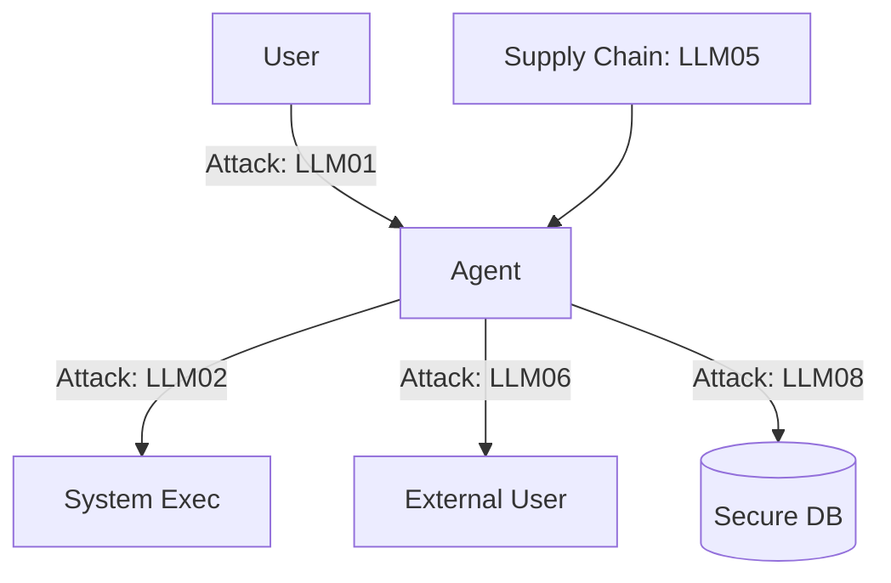

# 🕷️ OWASP Top 10 for LLM Agents — The Security Checklist
> **Level:** Advanced | **Language:** Hinglish | **Goal:** Master the OWASP (Open Web Application Security Project) top vulnerabilities specifically tailored for Large Language Models and AI Agents.

---

## 🧭 1. Beginner-Friendly Hinglish Explanation
OWASP ka matlab hai **"Security ki Bible"**. 

Jaise normal websites ke liye OWASP Top 10 vulnerabilities hoti hain, waise hi LLMs ke liye bhi naye khatre dhoondhe gaye hain. 
- **LLM01: Prompt Injection:** Agent ko behkana (Sabse bada khatra).
- **LLM02: Insecure Output Handling:** Agent ne jo galat output diya, use bina check kiye execute kar dena.
- **LLM06: Sensitive Information Disclosure:** Agent galti se private data leak kar deta hai.

Agar aap ye Top 10 checklist follow karte hain, toh aapka agent production mein "Hacker-proof" ban jayega.

---

## 🧠 2. Deep Technical Explanation
The OWASP Top 10 for LLM Applications (v1.0+) defines the most critical security risks.
1. **LLM01: Prompt Injection:** Manipulating the model's behavior via malicious inputs.
2. **LLM02: Insecure Output Handling:** Accepting LLM output without validation (e.g. executing a shell command generated by LLM).
3. **LLM03: Training Data Poisoning:** Maliciously influencing the base model or fine-tuning dataset.
4. **LLM04: Model Denial of Service:** Bombarding the model with heavy queries to drain resources/money.
5. **LLM05: Supply Chain Vulnerabilities:** Using unverified plugins, libraries, or base models.
6. **LLM06: Sensitive Information Disclosure:** Model revealing training data or private user context.
7. **LLM07: Insecure Plugin Design:** Plugins/Tools that don't have enough authorization checks.
8. **LLM08: Excessive Agency:** Giving the agent more power (tools/access) than it actually needs.
9. **LLM09: Overreliance:** Users trusting the model blindly without verification.
10. **LLM10: Model Theft:** Unauthorized access to the proprietary model weights.

---

## 🏗️ 3. Architecture Diagrams



---

## 💻 4. Production-Ready Code Example (Addressing LLM02)

```python
# Hinglish Logic: LLM ne jo output diya, use 'Purely' mat mano. Execute karne se pehle whitelist check karo.
def safe_tool_executor(llm_output):
    # LLM02 Defense: Whitelist allowed commands
    ALLOWED_COMMANDS = ["ls", "pwd", "whoami"]
    
    command = llm_output.get("command")
    if command not in ALLOWED_COMMANDS:
        # Prevent Remote Code Execution (RCE)
        raise SecurityException(f"UNAUTHORIZED COMMAND: {command}")
    
    # Execute safely...
```

---

## 🌍 5. Real-World Use Cases
- **Enterprise Chatbots:** Using OWASP guidelines to pass a security audit before launching.
- **FinTech Agents:** Protecting against "Model Poisoning" where someone tries to manipulate the agent's stock market logic.
- **HealthCare:** Preventing "Sensitive Info Disclosure" during patient-agent interaction.

---

## ❌ 6. Failure Cases
- **Ignoring LLM08 (Excessive Agency):** Giving the agent `sudo` access because "It's easier for development".
- **Blind Trust (LLM09):** Letting the agent write and push code to production without human review.
- **Leaked Context (LLM06):** Agent quoting a private email of one user to another.

---

## 🛠️ 7. Debugging Guide
- **OWASP Scan:** Use automated tools (like Giskard) to scan your agent for these 10 vulnerabilities.
- **Red Teaming:** Specifically try to trigger each of the 10 vulnerabilities in your dev environment.

---

## ⚖️ 8. Tradeoffs
- **Full OWASP Compliance:** Very secure but makes the development cycle slower and adds latency.
- **Ignoring Security:** Fast to market but high risk of catastrophic failure and lawsuits.

---

## ✅ 9. Best Practices
- **Sanitize Everything:** Inputs, retrieved context, and outputs.
- **Least Privilege:** Default "Deny" for all tools.

---

## 🛡️ 10. Security Concerns
- **Zero-Day Injections:** New patterns are discovered every day that the OWASP list might not yet cover.

---

## 📈 11. Scaling Challenges
- **Monitoring at Scale:** Detecting DoS (LLM04) attacks across millions of requests in real-time.

---

## 💰 12. Cost Considerations
- **Security Infrastructure:** Running dedicated "Safety Check" models adds to the token budget.

---

## 📝 13. Interview Questions
1. **"OWASP Top 10 for LLMs mein 'Excessive Agency' kya hota hai?"**
2. **"Insecure Output Handling se kaise bachenge?"**
3. **"Prompt Injection (LLM01) aur normal SQL Injection mein kya similarity hai?"**

---

## 🚀 15. Latest 2026 Industry Patterns
- **AI-Native Firewalls:** Specialized firewalls that sit in front of agents and use AI to block the OWASP Top 10 attacks.
- **Certified Safe Models:** Models that come with a "Safety Guarantee" from the provider against specific OWASP risks.

---

> **Expert Tip:** Security is a **Process**, not a product. OWASP is your roadmap, but constant testing is your vehicle.
