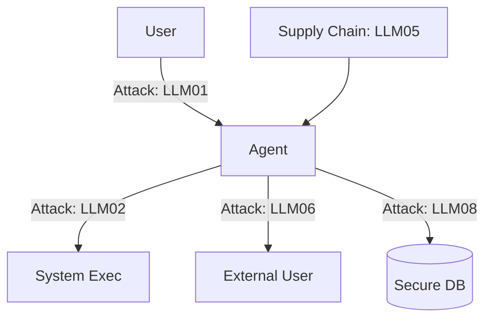

# 🕷️ OWASP Top 10 for LLM Agents — The Security Checklist
> **Level:** Advanced | **Language:** Hinglish | **Goal:** Large Language Models aur AI Agents ke liye specifically tailored OWASP top vulnerabilities ko master karein.

---

## 🧭 1. Beginner-Friendly Hinglish Explanation
OWASP ka matlab hai **"Security ki Bible"**. 

Jaise normal websites ke liye OWASP Top 10 vulnerabilities hoti hain, waise hi LLMs ke liye bhi naye khatre dhoondhe gaye hain. 
- **LLM01: Prompt Injection:** Agent ko behkana (Sabse bada khatra).
- **LLM02: Insecure Output Handling:** Agent ne jo galat output diya, use bina check kiye execute kar dena.
- **LLM06: Sensitive Information Disclosure:** Agent galti se private data leak kar deta hai.

Agar aap ye Top 10 checklist follow karte hain, toh aapka agent production mein "Hacker-proof" ban jayega.

---

## 🧠 2. Deep Technical Explanation
LLM Applications (v1.0+) ke liye OWASP Top 10 sabse critical security risks ko define karta hai.
1. **LLM01: Prompt Injection:** Malicious inputs ke through model ke behavior ko manipulate karna.
2. **LLM02: Insecure Output Handling:** LLM output ko bina validation ke accept karna (e.g. LLM dwara generated shell command execute karna).
3. **LLM03: Training Data Poisoning:** Base model ya fine-tuning dataset ko maliciously influence karna.
4. **LLM04: Model Denial of Service:** Resources/money drain karne ke liye model par heavy queries ki bauchhar karna.
5. **LLM05: Supply Chain Vulnerabilities:** Unverified plugins, libraries, ya base models ka use karna.
6. **LLM06: Sensitive Information Disclosure:** Model ka training data ya private user context reveal karna.
7. **LLM07: Insecure Plugin Design:** Aise plugins/tools jinme enough authorization checks nahi hote.
8. **LLM08: Excessive Agency:** Agent ko uski actual zaroorat se zyada power (tools/access) dena.
9. **LLM09: Overreliance:** Users ka bina verification ke model par blindly trust karna.
10. **LLM10: Model Theft:** Proprietary model weights tak unauthorized access.

---

## 🏗️ 3. Architecture Diagrams


```mermaid
graph TD
    U[User] -->|Attack: LLM01| A[Agent]
    A -->|Attack: LLM02| S[System Exec]
    A -->|Attack: LLM06| U2[External User]
    D[Supply Chain: LLM05] --> A
    A -->|Attack: LLM08| DB[(Secure DB)]
```

---

## 💻 4. Production-Ready Code Example (Addressing LLM02)

```python
# Hinglish Logic: LLM ne jo output diya, use 'Purely' mat mano. Execute karne se pehle whitelist check karo.
def safe_tool_executor(llm_output):
    # LLM02 Defense: Whitelist allowed commands
    ALLOWED_COMMANDS = ["ls", "pwd", "whoami"]
    
    command = llm_output.get("command")
    if command not in ALLOWED_COMMANDS:
        # Prevent Remote Code Execution (RCE)
        raise SecurityException(f"UNAUTHORIZED COMMAND: {command}")
    
    # Execute safely...
```

---

## 🌍 5. Real-World Use Cases
- **Enterprise Chatbots:** Launch karne se pehle security audit pass karne ke liye OWASP guidelines ka use karna.
- **FinTech Agents:** "Model Poisoning" se protect karna jahan koi agent ki stock market logic ko manipulate karne ki koshish karta hai.
- **HealthCare:** Patient-agent interaction ke dauran "Sensitive Info Disclosure" ko rokna.

---

## ❌ 6. Failure Cases
- **Ignoring LLM08 (Excessive Agency):** Agent ko `sudo` access dena kyunki "It's easier for development".
- **Blind Trust (LLM09):** Agent ko bina human review ke production par code likhne aur push karne dena.
- **Leaked Context (LLM06):** Agent ka ek user ka private email kisi doosre user ko quote karna.

---

## 🛠️ 7. Debugging Guide
- **OWASP Scan:** Apne agent ko in 10 vulnerabilities ke liye scan karne ke liye automated tools (jaise Giskard) ka use karein.
- **Red Teaming:** Apne dev environment mein specifically in 10 vulnerabilities mein se har ek ko trigger karne ki koshish karein.

---

## ⚖️ 8. Tradeoffs
- **Full OWASP Compliance:** Bahut secure hai par development cycle ko slower banata hai aur latency add karta hai.
- **Ignoring Security:** Market ke liye fast hai par catastrophic failure aur lawsuits ka high risk.

---

## ✅ 9. Best Practices
- **Sanitize Everything:** Inputs, retrieved context, aur outputs.
- **Least Privilege:** Sabhi tools ke liye default "Deny".

---

## 🛡️ 10. Security Concerns
- **Zero-Day Injections:** Har din naye patterns discover hote hain jo ho sakta hai OWASP list mein abhi tak cover na hon.

---

## 📈 11. Scaling Challenges
- **Monitoring at Scale:** Millions of requests ke across real-time mein DoS (LLM04) attacks ko detect karna.

---

## 💰 12. Cost Considerations
- **Security Infrastructure:** Dedicated "Safety Check" models run karne se token budget badhta hai.

---

## 📝 13. Interview Questions
1. **"OWASP Top 10 for LLMs mein 'Excessive Agency' kya hota hai?"**
2. **"Insecure Output Handling se kaise bachenge?"**
3. **"Prompt Injection (LLM01) aur normal SQL Injection mein kya similarity hai?"**

---

## 🚀 15. Latest 2026 Industry Patterns
- **AI-Native Firewalls:** Specialized firewalls jo agents ke aage baithte hain aur OWASP Top 10 attacks ko block karne ke liye AI ka use karte hain.
- **Certified Safe Models:** Aise models jo provider se specific OWASP risks ke against "Safety Guarantee" ke sath aate hain.

---

> **Expert Tip:** Security is a **Process**, not a product. OWASP is your roadmap, but constant testing is your vehicle.
