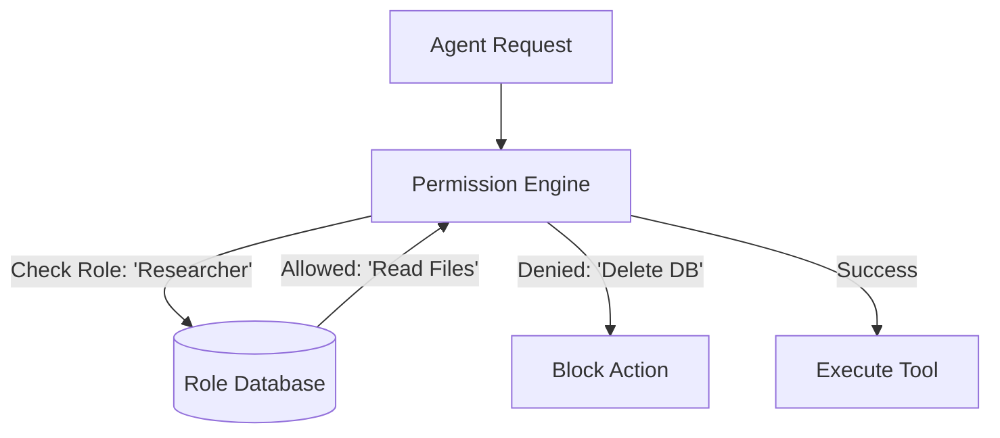

# 🔐 Permission & Role Systems — RBAC for Agents
> **Level:** Advanced | **Language:** Hinglish | **Goal:** Ensure karne ke liye ki AI agents sirf usi ko access karein jiske liye wo allowed hain, Role-Based Access Control (RBAC) aur attribute-based permissions ke implementation ko master karein.

---

## 🧭 1. Beginner-Friendly Hinglish Explanation
Permission aur Role Systems ka matlab hai **"AI ko uski aukat (Limits) dikhana"**. 

Socho aapka ek office hai. 
- **Employee Agent:** Sirf apni chutti (Leaves) apply kar sakta hai.
- **HR Agent:** Sabki salary dekh sakta hai par badal nahi sakta.
- **Admin Agent:** Sab kuch kar sakta hai.

Agar aap ek hi agent ko saari power de denge, toh wo galti se kisi ki salary delete kar sakta hai. **RBAC (Role-Based Access Control)** humein ye power deta hai ki hum define karein ki kaunsa agent kaunsa tool chala sakta hai aur kaunsa data dekh sakta hai.

---

## 🧠 2. Deep Technical Explanation
Agents ke liye permission systems ek **Policy Engine** ka use karke build kiye jate hain.
1. **RBAC (Role-Based Access Control):** Agents ko roles (e.g., `viewer`, `editor`, `admin`) assign karna.
2. **ABAC (Attribute-Based Access Control):** "Time of day", "Location", ya "Project ID" jaise attributes ke basis par permissions. 
    - *Example:* "Agent sirf tabhi files edit kar sakta hai jab office hours chal rahe hon."
3. **Scoping Tools:** Agent ke role ke basis par tool ke parameters ko restrict karna.
    - *Example:* `Finance Agent` ke liye ek `search` tool sirf `/finance` folder hi search kar sakta hai.
4. **Token-based Authorization:** Har agent ko ek unique JWT (JSON Web Token) dena jisme uski permissions encoded hon.
5. **Human-in-the-loop (HITL) Triggers:** Agar agent apne role ke bahar koi "High-Risk" action karne ki koshish karta hai, toh automatically human ke paas escalate karna.

---

## 🏗️ 3. Architecture Diagrams


```mermaid
graph TD
    A[Agent Request] --> P[Permission Engine]
    P -->|Check Role: 'Researcher'| R[(Role Database)]
    R -->|Allowed: 'Read Files'| P
    P -->|Denied: 'Delete DB'| B[Block Action]
    P -->|Success| T[Execute Tool]
```

---

## 💻 4. Production-Ready Code Example (Simple Role Check)

```python
# Hinglish Logic: Tool chalane se pehle 'Role' verify karo
ALLOWED_ROLES = {
    "delete_user": ["admin"],
    "send_email": ["admin", "support"],
    "read_docs": ["admin", "support", "viewer"]
}

def execute_agent_tool(agent_role, tool_name):
    if agent_role in ALLOWED_ROLES.get(tool_name, []):
        print(f"Action {tool_name} approved for {agent_role}")
        # run_tool()
    else:
        print(f"SECURITY ALERT: {agent_role} tried to access {tool_name}")
        # raise PermissionError
```

---

## 🌍 5. Real-World Use Cases
- **Multi-tenant SaaS:** Ensure karna ki Agent 1 (Client A) Agent 2 (Client B) ka data na dekh sake.
- **Internal Tools:** Support agent customer history read kar sakta hai par CEO ke private messages nahi dekh sakta.
- **Healthcare:** Agents patient vitals access kar sakte hain par psychiatric history dekhne ke liye extra permission ki zaroorat hoti hai.

---

## ❌ 6. Failure Cases
- **Privilege Escalation:** Agent prompt mein ek bug ke through system ko trick karke "Admin" rights le leta hai.
- **Confused Deputy Problem:** Agent A (low priv) Agent B (high priv) ko trick karke apne liye task karwa leta hai.
- **Stale Permissions:** Agent ke paas abhi bhi purani roles hain jo use ab nahi chahiye.

---

## 🛠️ 7. Debugging Guide
- **Permission Logs:** Har denied request ko log karein: "Why was this blocked?"
- **Role Mocking:** Test karein ki kya "Viewer" agent sach mein "Delete" nahi kar pa raha?

---

## ⚖️ 8. Tradeoffs
- **Granular Permissions (ABAC):** Bahut secure hai par manage karna bahut hard hai aur system ko slow karta hai.
- **Simple Roles (RBAC):** Manage karna easy hai par complex apps ke liye bahut broad ho sakta hai.

---

## ✅ 9. Best Practices
- **Least Privilege:** Default state hamesha "Denied" honi chahiye.
- **Audit Trails:** Record karein "Kaunse agent ne kaunsi permission use ki aur kab".

---

## 🛡️ 10. Security Concerns
- **Direct Database Access:** Humesha agent ko API ke through access dein, seedha Database ka connection na dein.

---

## 📈 11. Scaling Challenges
- **Dynamic Roles:** Thousands of agents ke liye roles manage karne ke liye specialized tools like **Opa (Open Policy Agent)** ki zarurat hoti hai.

---

## 💰 12. Cost Considerations
- **Metadata Overhead:** Permissions check karne se ek small computation cost add hoti hai par potential data breach fines mein millions bacha sakti hai.

---

## 📝 13. Interview Questions
1. **"RBAC vs ABAC mein kya fark hai agents ke liye?"**
2. **"Confused Deputy problem AI agents mein kaise hota hai?"**
3. **"Least Privilege principle kaise apply karenge?"**

---

## 🚀 15. Latest 2026 Industry Patterns
- **ZTA (Zero Trust Architecture):** Har ek tool call par naya authentication token mangna.
- **AI-Managed Permissions:** Ek "Admin AI" jo agent behavior ko monitor karta hai aur suspicious activity detect hone par permissions "Revoke" kar deta hai.

---

> **Expert Tip:** Permissions are the **Brakes of the AI**. Without them, you're just waiting for a crash.
