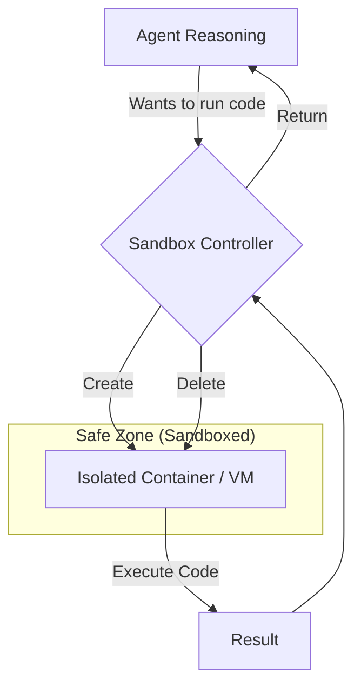

# 📦 Tool Execution Security — Sandboxing the Agent's Power
> **Level:** Advanced | **Language:** Hinglish | **Goal:** Master the techniques of isolating agentic tool execution using Docker, E2B, and restricted environments to prevent local system compromise.

---

## 🧭 1. Beginner-Friendly Hinglish Explanation
Tool Execution Security ka matlab hai **"Agent ko ek pinjre (Cage) mein rakhna"**. 

Aapne agent ko "Python Code chalane" ki power di. 
- **Bina Sandbox:** Agent aapke computer ki saari files delete kar sakta hai ya aapka webcam on kar sakta hai.
- **Saath mein Sandbox:** Agent ko ek virtual box (Sandbox) mein rakha jata hai. Wo box ke andar kuch bhi kare—file banaye, code chalaye—wo aapke main computer ko touch nahi kar sakta.

Isse kehte hain **Sandboxing**. Jaise hi agent ka kaam khatam hota hai, hum pura "Box" delete kar dete hain. Isse aapka main system humesha safe rehta hai.

---

## 🧠 2. Deep Technical Explanation
Sandboxing is the process of creating an isolated runtime for potentially dangerous operations like code execution or shell commands.
1. **Container Isolation (Docker):** Running each tool call in a fresh Docker container with no access to the host network or filesystem.
2. **Specialized Runtimes (E2B / Piston):** Services like **E2B (Engine for 2-way Bonding)** provide cloud-hosted sandboxes where agents can run code, edit files, and start servers in a secure, ephemeral environment.
3. **Resource Limits (cgroups):** Restricting the amount of CPU, RAM, and Disk space the agent can use to prevent "Denial of Service" attacks via infinite loops.
4. **Network Gapping:** Disabling internet access inside the sandbox so the agent cannot send your data to an external server.
5. **Read-only Filesystems:** Making the system files immutable so the agent can only write to a specific `/tmp` directory.

---

## 🏗️ 3. Architecture Diagrams



---

## 💻 4. Production-Ready Code Example (Using E2B)

```python
from e2b import Sandbox

# Hinglish Logic: Ek naya sandbox banao, code chalao, aur result lo
def run_secure_code(code):
    # 1. Start a fresh sandbox
    with Sandbox() as sandbox:
        print("Sandbox started. Running code...")
        
        # 2. Run the agent's code inside the sandbox
        result = sandbox.process.start(f"python3 -c '{code}'")
        
        # 3. Get output (Hinglish: Ye code mere server par nahi chal raha)
        return result.stdout
```

---

## 🌍 5. Real-World Use Cases
- **AI Coding Assistants:** Like OpenDevin or Aider, where the AI needs to run and test code safely.
- **Data Analysis Agents:** Running complex SQL or Python Pandas operations on user data.
- **Automated Pentesting:** Letting an agent run security tools without risk of hitting the wrong target.

---

## ❌ 6. Failure Cases
- **Sandbox Escape:** A highly sophisticated exploit where the agent finds a bug in the VM/Docker itself to reach the host.
- **High Latency:** Har tool call ke liye naya container start karna slow ho sakta hai (1-2 seconds delay).
- **Incomplete Isolation:** Galti se environment variables (API keys) sandbox mein pass kar dena.

---

## 🛠️ 7. Debugging Guide
- **Audit Logs:** Check karein ki sandbox ke andar kaunsi system calls (syscalls) chal rahi hain.
- **Timeouts:** Ensure karein ki koi bhi sandboxed process 30 second se zyada na chale.

---

## ⚖️ 8. Tradeoffs
- **Full Isolation (E2B/VM):** Safest but adds cost and latency.
- **Process Isolation (Subprocess):** Fast and free but very easy to hack.

---

## ✅ 9. Best Practices
- **Ephemeral Environments:** Har task ke baad sandbox ko delete (destroy) karein.
- **Restricted Network:** Sirf wahi URLs allow karein jo tools ke liye zaruri hon.

---

## 🛡️ 10. Security Concerns
- **Fork Bombs:** Agent ko aisi script likhne se rokna jo itne processes banaye ki sandbox crash ho jaye.

---

## 📈 11. Scaling Challenges
- **Cold Starts:** Multiple sandboxes ko ready rakhna (pre-warming) taaki user ko wait na karna pade.

---

## 💰 12. Cost Considerations
- **Managed Sandboxes:** E2B jaisi services per-second billing karti hain. Millions of runs ke liye apna Kubernetes-based sandbox banana sasta ho sakta hai.

---

## 📝 13. Interview Questions
1. **"Agentic tool calling mein sandboxing kyu mandatory hai?"**
2. **"Docker vs Firecracker (VM) for AI sandboxing?"**
3. **"Network-gapped sandboxes ke fayde aur nuksaan?"**

---

## 🚀 15. Latest 2026 Industry Patterns
- **Wasm Sandboxing:** Using WebAssembly to run agent code in the browser or on the edge with near-zero latency and high security.
- **AI-Managed Sandboxes:** An AI that configures the sandbox security rules dynamically based on the "Risk Level" of the code it's about to run.

---

> **Expert Tip:** Power without control is **Danger**. Sandboxing is the "Control" that lets your agent be powerful without being a threat.
