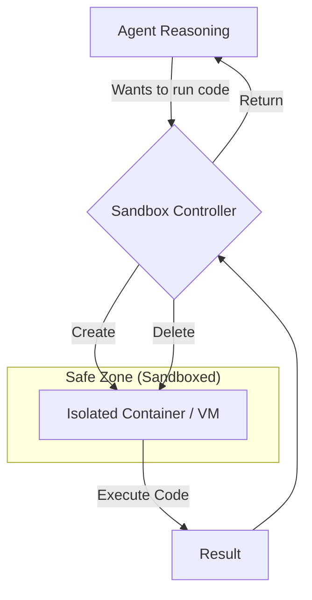

# 📦 Tool Execution Security — Sandboxing the Agent's Power
> **Level:** Advanced | **Language:** Hinglish | **Goal:** Local system compromise ko rokne ke liye Docker, E2B, aur restricted environments ka use karke agentic tool execution ko isolate karne ki techniques ko master karein.

---

## 🧭 1. Beginner-Friendly Hinglish Explanation
Tool Execution Security ka matlab hai **"Agent ko ek pinjre (Cage) mein rakhna"**. 

Aapne agent ko "Python Code chalane" ki power di. 
- **Bina Sandbox:** Agent aapke computer ki saari files delete kar sakta hai ya aapka webcam on kar sakta hai.
- **Saath mein Sandbox:** Agent ko ek virtual box (Sandbox) mein rakha jata hai. Wo box ke andar kuch bhi kare—file banaye, code chalaye—wo aapke main computer ko touch nahi kar sakta.

Isse kehte hain **Sandboxing**. Jaise hi agent ka kaam khatam hota hai, hum pura "Box" delete kar dete hain. Isse aapka main system humesha safe rehta hai.

---

## 🧠 2. Deep Technical Explanation
Sandboxing code execution ya shell commands jaise potentially dangerous operations ke liye ek isolated runtime create karne ki process hai.
1. **Container Isolation (Docker):** Host network ya filesystem tak no access ke sath har tool call ko ek fresh Docker container mein run karna.
2. **Specialized Runtimes (E2B / Piston):** **E2B (Engine for 2-way Bonding)** jaise services cloud-hosted sandboxes provide karte hain jahan agents secure, ephemeral environment mein code run kar sakte hain, files edit kar sakte hain, aur servers start kar sakte hain.
3. **Resource Limits (cgroups):** Infinite loops ke throw "Denial of Service" attacks ko rokne ke liye agent dwara use kiye jane wale CPU, RAM, aur Disk space ko restrict karna.
4. **Network Gapping:** Sandbox ke andar internet access ko disable karna taaki agent aapka data kisi external server ko na bhej sake.
5. **Read-only Filesystems:** System files ko immutable banana taaki agent sirf specific `/tmp` directory mein hi write kar sake.

---

## 🏗️ 3. Architecture Diagrams


```mermaid
graph TD
    A[Agent Reasoning] -->|Wants to run code| S{Sandbox Controller}
    S -->|Create| C[Isolated Container / VM]
    C -->|Execute Code| R[Result]
    R --> S
    S -->|Delete| C
    S -->|Return| A
    
    subgraph "Safe Zone (Sandboxed)"
    C
    end
```

---

## 💻 4. Production-Ready Code Example (Using E2B)

```python
from e2b import Sandbox

# Hinglish Logic: Ek naya sandbox banao, code chalao, aur result lo
def run_secure_code(code):
    # 1. Start a fresh sandbox
    with Sandbox() as sandbox:
        print("Sandbox started. Running code...")
        
        # 2. Run the agent's code inside the sandbox
        result = sandbox.process.start(f"python3 -c '{code}'")
        
        # 3. Get output (Hinglish: Ye code mere server par nahi chal raha)
        return result.stdout
```

---

## 🌍 5. Real-World Use Cases
- **AI Coding Assistants:** OpenDevin ya Aider ki tarah, jahan AI ko safely code run aur test karne ki zaroorat hoti hai.
- **Data Analysis Agents:** User data par complex SQL ya Python Pandas operations run karna.
- **Automated Pentesting:** Wrong target ko hit karne ke risk ke bina agent ko security tools run karne dena.

---

## ❌ 6. Failure Cases
- **Sandbox Escape:** Ek highly sophisticated exploit jahan agent host tak pahunchne ke liye VM/Docker mein hi bug dhoondh leta hai.
- **High Latency:** Har tool call ke liye naya container start karna slow ho sakta hai (1-2 seconds delay).
- **Incomplete Isolation:** Galti se environment variables (API keys) sandbox mein pass kar dena.

---

## 🛠️ 7. Debugging Guide
- **Audit Logs:** Check karein ki sandbox ke andar kaunsi system calls (syscalls) chal rahi hain.
- **Timeouts:** Ensure karein ki koi bhi sandboxed process 30 second se zyada na chale.

---

## ⚖️ 8. Tradeoffs
- **Full Isolation (E2B/VM):** Safest hai par cost aur latency add karta hai.
- **Process Isolation (Subprocess):** Fast aur free hai par hack karna bahut easy hai.

---

## ✅ 9. Best Practices
- **Ephemeral Environments:** Har task ke baad sandbox ko delete (destroy) karein.
- **Restricted Network:** Sirf wahi URLs allow karein jo tools ke liye zaruri hon.

---

## 🛡️ 10. Security Concerns
- **Fork Bombs:** Agent ko aisi script likhne se rokna jo itne processes banaye ki sandbox crash ho jaye.

---

## 📈 11. Scaling Challenges
- **Cold Starts:** Multiple sandboxes ko ready rakhna (pre-warming) taaki user ko wait na karna pade.

---

## 💰 12. Cost Considerations
- **Managed Sandboxes:** E2B jaisi services per-second billing karti hain. Millions of runs ke liye apna Kubernetes-based sandbox banana sasta ho sakta hai.

---

## 📝 13. Interview Questions
1. **"Agentic tool calling mein sandboxing kyu mandatory hai?"**
2. **"Docker vs Firecracker (VM) for AI sandboxing?"**
3. **"Network-gapped sandboxes ke fayde aur nuksaan?"**

---

## 🚀 15. Latest 2026 Industry Patterns
- **Wasm Sandboxing:** Browser ya edge par near-zero latency aur high security ke sath agent code run karne ke liye WebAssembly ka use karna.
- **AI-Managed Sandboxes:** Ek AI jo sandbox security rules ko dynamically configure karta hai based on the "Risk Level" of code jo wo run karne wala hai.

---

> **Expert Tip:** Power without control is **Danger**. Sandboxing is the "Control" that lets your agent be powerful without being a threat.
