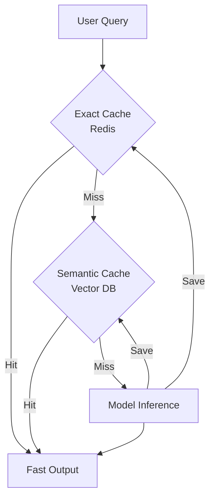

# 📦 Caching Strategies — Boosting Speed & Efficiency
> **Level:** Advanced | **Language:** Hinglish | **Goal:** Master the use of Exact and Semantic caching to reduce latency and API costs in agentic systems.

---

## 🧭 1. Beginner-Friendly Hinglish Explanation
Caching ka matlab hai **"Purane jawab yaad rakhna"**. 

Socho aapka agent ek teacher hai. 
- **Bina Cache:** Har bar jab koi bacha puchta hai "2+2 kya hai?", teacher dimaag lagata hai aur bolta hai "4". 
- **Saath mein Cache:** Teacher ek notebook mein likh leta hai: `2+2 = 4`. Agli baar koi puchta hai, toh teacher bina soche notebook se dekh kar bol deta hai.

AI mein caching do tarah ki hoti hai:
1. **Exact Match:** Agar sawal word-to-word same hai.
2. **Semantic Match:** Agar sawal ka "Matlab" (Meaning) same hai. (e.g., "Apple ka founder kaun hai?" aur "Who started Apple?").

Caching se aapka agent "Fast" ho jata hai aur aapke "Tokens" (Paise) bachte hain.

---

## 🧠 2. Deep Technical Explanation
Effective caching in agents requires a combination of **Exact** and **Semantic** layers.
1. **Exact Match Caching (KV Store):** Using Redis to store hash-keys of prompts. 
    - Key: `hash(prompt + parameters)`
    - Value: `LLM Response`
2. **Semantic Caching (Vector Store):** Using embeddings to find similar previous queries.
    - Process: `Query -> Embedding -> Vector Search -> If similarity > threshold (0.95) -> Return Cached Response`.
3. **Prompt Caching (API level):** Anthropic and OpenAI (2026) support caching the "System Prompt" part. You only pay for it once, and subsequent calls use the "Cached" version of the instructions.
4. **Context Window Caching:** Saving the intermediate states of a long conversation so you don't re-process the first 50 messages every time.

---

## 🏗️ 3. Architecture Diagrams



---

## 💻 4. Production-Ready Code Example (Semantic Cache Concept)

```python
# Hinglish Logic: Vector DB se milte-julte sawal dhoondho
def get_semantic_cache(query):
    # 1. Convert query to vector
    # query_vector = embedding_model.encode(query)
    
    # 2. Search in Pinecone/Milvus
    # result = vector_db.search(query_vector, threshold=0.98)
    
    # 3. If found, return
    # if result: return result[0].metadata['answer']
    return None
```

---

## 🌍 5. Real-World Use Cases
- **Public FAQ Bots:** Where 90% of users ask the same questions about pricing or hours.
- **Data Scraping Agents:** Preventing re-scraping the same URL if the agent was there 1 hour ago.
- **Educational Apps:** Reusing standard explanations for common math or science topics.

---

## ❌ 6. Failure Cases
- **Stale Data:** Information badal gayi (e.g., Stock price) par agent purana cached jawab de raha hai.
- **Over-Generalization:** AI ne "Who is the President?" ka cached jawab de diya, chahe user ne "Who is the President of India?" pucha tha.
- **Cache Poisoning:** Attacker ne aisi queries bhejin jo galat jawab cache mein bhar dein.

---

## 🛠️ 7. Debugging Guide
- **Cache Hit/Miss Logs:** Measure karein: "Kya 30% se zyada queries cache se aa rahi hain?"
- **TTL (Time to Live):** Humesha cache par expiry set karein (e.g. 24 hours).

---

## ⚖️ 8. Tradeoffs
- **High Threshold (0.99):** Safer but fewer cache hits (High cost).
- **Low Threshold (0.85):** More cache hits but high risk of giving the wrong answer (Hallucination).

---

## ✅ 9. Best Practices
- **Never Cache PII:** User ka private data kabhi cache mein na rakhein jahan doosre users use dekh sakein.
- **Cache Invalidation:** Jab aapka system prompt badle, toh pura purana cache clear kar dein.

---

## 🛡️ 10. Security Concerns
- **Cross-user Leakage:** User A ka cached answer User B ko dikh jana. Use **Namespace/User-ID** in cache keys.

---

## 📈 11. Scaling Challenges
- **Latency of Vector Search:** Large caches mein semantic search khud slow ho sakta hai (Use HNSW indices).

---

## 💰 12. Cost Considerations
- **Vector DB cost:** Pinecone/Milvus ki cost LLM cost se kam honi chahiye, warna caching ka fayda nahi.

---

## 📝 13. Interview Questions
1. **"Semantic caching aur Exact caching mein kya fark hai?"**
2. **"Cache hit rate ko kaise optimize karenge?"**
3. **"Stale cache data ko kaise handle karenge?"**

---

## 🚀 15. Latest 2026 Industry Patterns
- **LLM-native Prompt Caching:** Models that automatically "Remember" the context of the last 10 minutes for a specific session ID, charging 0 tokens for it.
- **Global Federated Cache:** Multiple companies sharing a "Generic Cache" for common facts to reduce global AI power consumption.

---

> **Expert Tip:** Caching is **Invisible Intelligence**. It makes your agent feel instant while keeping your bank account full.
