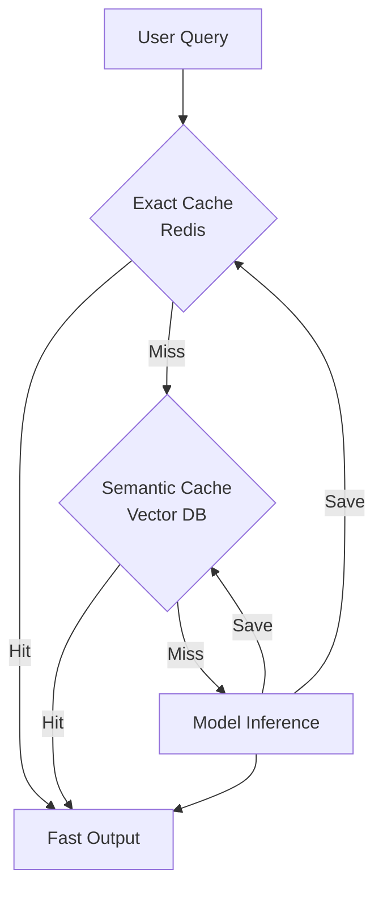

# 📦 Caching Strategies — Boosting Speed & Efficiency
> **Level:** Advanced | **Language:** Hinglish | **Goal:** Agentic systems mein latency aur API costs ko kam karne ke liye Exact aur Semantic caching ke use ko master karein.

---

## 🧭 1. Beginner-Friendly Hinglish Explanation
Caching ka matlab hai **"Purane jawab yaad rakhna"**. 

Socho aapka agent ek teacher hai. 
- **Bina Cache:** Har bar jab koi bacha puchta hai "2+2 kya hai?", teacher dimaag lagata hai aur bolta hai "4". 
- **Saath mein Cache:** Teacher ek notebook mein likh leta hai: `2+2 = 4`. Agli baar koi puchta hai, toh teacher bina soche notebook se dekh kar bol deta hai.

AI mein caching do tarah ki hoti hai:
1. **Exact Match:** Agar sawal word-to-word same hai.
2. **Semantic Match:** Agar sawal ka "Matlab" (Meaning) same hai. (e.g., "Apple ka founder kaun hai?" aur "Who started Apple?").

Caching se aapka agent "Fast" ho jata hai aur aapke "Tokens" (Paise) bachte hain.

---

## 🧠 2. Deep Technical Explanation
Agents mein effective caching ke liye **Exact** aur **Semantic** layers ka combination zaroorat hota hai.
1. **Exact Match Caching (KV Store):** Prompts ke hash-keys ko store karne ke liye Redis ka use karna. 
    - Key: `hash(prompt + parameters)`
    - Value: `LLM Response`
2. **Semantic Caching (Vector Store):** Similar previous queries dhoondhne ke liye embeddings ka use karna.
    - Process: `Query -> Embedding -> Vector Search -> If similarity > threshold (0.95) -> Return Cached Response`.
3. **Prompt Caching (API level):** Anthropic aur OpenAI (2026) "System Prompt" part ko cache karna support karte hain. Aap iske liye sirf ek baar pay karte hain, aur subsequent calls instructions ke "Cached" version ka use karti hain.
4. **Context Window Caching:** Ek lambi conversation ke intermediate states ko save karna taaki aapko har baar pehle 50 messages ko re-process na karna pade.

---

## 🏗️ 3. Architecture Diagrams


```mermaid
graph TD
    U[User Query] --> E{Exact Cache\nRedis}
    E -->|Hit| O[Fast Output]
    E -->|Miss| S{Semantic Cache\nVector DB}
    S -->|Hit| O
    S -->|Miss| LLM[Model Inference]
    LLM -->|Save| E
    LLM -->|Save| S
    LLM --> O
```

---

## 💻 4. Production-Ready Code Example (Semantic Cache Concept)

```python
# Hinglish Logic: Vector DB se milte-julte sawal dhoondho
def get_semantic_cache(query):
    # 1. Convert query to vector
    # query_vector = embedding_model.encode(query)
    
    # 2. Search in Pinecone/Milvus
    # result = vector_db.search(query_vector, threshold=0.98)
    
    # 3. If found, return
    # if result: return result[0].metadata['answer']
    return None
```

---

## 🌍 5. Real-World Use Cases
- **Public FAQ Bots:** Jahan 90% users pricing ya hours ke baare mein same questions poochte hain.
- **Data Scraping Agents:** Agar agent 1 ghante pehle wahan tha, toh same URL ko re-scrape karne se rokna.
- **Educational Apps:** Common math ya science topics ke liye standard explanations ko reuse karna.

---

## ❌ 6. Failure Cases
- **Stale Data:** Information badal gayi (e.g., Stock price) par agent purana cached jawab de raha hai.
- **Over-Generalization:** AI ne "Who is the President?" ka cached jawab de diya, chahe user ne "Who is the President of India?" pucha tha.
- **Cache Poisoning:** Attacker ne aisi queries bhejin jo galat jawab cache mein bhar dein.

---

## 🛠️ 7. Debugging Guide
- **Cache Hit/Miss Logs:** Measure karein: "Kya 30% se zyada queries cache se aa rahi hain?"
- **TTL (Time to Live):** Humesha cache par expiry set karein (e.g. 24 hours).

---

## ⚖️ 8. Tradeoffs
- **High Threshold (0.99):** Safer hai par cache hits kam hote hain (High cost).
- **Low Threshold (0.85):** Cache hits zyada hote hain par wrong answer dene ka high risk hota hai (Hallucination).

---

## ✅ 9. Best Practices
- **Never Cache PII:** User ka private data kabhi cache mein na rakhein jahan doosre users use dekh sakein.
- **Cache Invalidation:** Jab aapka system prompt badle, toh pura purana cache clear kar dein.

---

## 🛡️ 10. Security Concerns
- **Cross-user Leakage:** User A ka cached answer User B ko dikh jana. Use **Namespace/User-ID** in cache keys.

---

## 📈 11. Scaling Challenges
- **Latency of Vector Search:** Large caches mein semantic search khud slow ho sakta hai (Use HNSW indices).

---

## 💰 12. Cost Considerations
- **Vector DB cost:** Pinecone/Milvus ki cost LLM cost se kam honi chahiye, warna caching ka fayda nahi.

---

## 📝 13. Interview Questions
1. **"Semantic caching aur Exact caching mein kya fark hai?"**
2. **"Cache hit rate ko kaise optimize karenge?"**
3. **"Stale cache data ko kaise handle karenge?"**

---

## 🚀 15. Latest 2026 Industry Patterns
- **LLM-native Prompt Caching:** Aise models jo specific session ID ke liye automatically pichle 10 minutes ke context ko "Yaad" rakhte hain, aur iske liye 0 tokens charge karte hain.
- **Global Federated Cache:** Global AI power consumption ko reduce karne ke liye common facts ke liye multiple companies ka "Generic Cache" share karna.

---

> **Expert Tip:** Caching is **Invisible Intelligence**. It makes your agent feel instant while keeping your bank account full.
