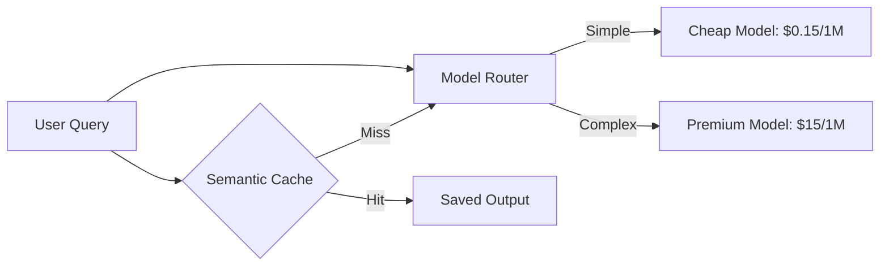

# 💰 Cost Optimization — Saving Tokens, Saving Dollars
> **Level:** Advanced | **Language:** Hinglish | **Goal:** Master the techniques to reduce LLM API costs by 50-80% without sacrificing agent intelligence.

---

## 🧭 1. Beginner-Friendly Hinglish Explanation
Cost Optimization ka matlab hai **"AI ki chadar dekh kar pair pasarna"**. 

LLM APIs (OpenAI/Anthropic) bahut mehngi ho sakti hain. Agar aapne ek agent banaya jo har sawal par 10,000 tokens use karta hai, toh aapka business kabhi "Profitable" nahi hoga.
- **Caching:** Wahi sawal dobara pucha? Purana jawab de do, paise bachao.
- **Model Tiering:** Chote sawal ke liye sasta model (GPT-4o-mini), bade sawal ke liye mehnga model (GPT-4o).
- **Prompt Pruning:** Faltu ki history aur instructions ko delete karna.

Cost control sirf "Saving" nahi hai, ye "Sustainability" hai.

---

## 🧠 2. Deep Technical Explanation
Optimizing agent costs involves attacking **Token Density** and **Inference Frequency**.
1. **Semantic Caching:** Using **GPTCache** or Redis to store `{Query: Response}` pairs. If a new query is 95% similar to an old one, return the cached result.
2. **Model Router:** A logic layer that decides which model to use.
    - *Example:* "Classification" task? Use Llama-3-8B. "Code Generation"? Use Claude-3.5-Sonnet.
3. **Context Pruning:** Instead of sending the full conversation, send only the last 5 turns or a **Summary** of the history.
4. **Token Budgeting:** Setting a hard limit on `max_tokens` per request.
5. **Batch Processing:** Using OpenAI's **Batch API** (50% discount) for non-realtime tasks like "Processing 1000 reviews".

---

## 🏗️ 3. Architecture Diagrams



---

## 💻 4. Production-Ready Code Example (Semantic Caching)

```python
# Hinglish Logic: Agar same sawal pehle pucha gaya hai, toh cache se uthao
import redis
from sentence_transformers import SentenceTransformer

# 1. Check similarity in Redis
# 2. If Similarity > 0.95 -> Return stored answer
# 3. Else -> Call LLM and save result
```

---

## 🌍 5. Real-World Use Cases
- **Public Chatbots:** Where 80% of users ask the same 50 questions (e.g. "What is your pricing?").
- **Enterprise Automation:** Processing millions of invoices daily where every cent saved counts.
- **Startup MVPs:** Keeping the burn rate low while searching for product-market fit.

---

## ❌ 6. Failure Cases
- **Stale Cache:** System badal gaya par cache purana jawab de raha hai.
- **Router Logic Fail:** Ek complex sawal saste model ko bhej diya, jisse result "Garbage" aaya.
- **Aggressive Pruning:** Itna context delete kar diya ki AI ko "Context" hi samajh nahi aaya.

---

## 🛠️ 7. Debugging Guide
- **Cost Dashboard:** Track "Cost per 1000 requests" daily.
- **Cache Hit Rate:** Measure karein ki kitne percent queries cache se fulfill ho rahi hain.

---

## ⚖️ 8. Tradeoffs
- **Aggressive Optimization:** Very cheap but higher risk of hallucinations or "Dumb" answers.
- **No Optimization:** High quality but you will go broke very quickly.

---

## ✅ 9. Best Practices
- **Compress Context:** Use specialized prompts to "Summarize" long histories into 20% of their size.
- **Hard Caps:** Humesha OpenAI dashboard par "Hard Limit" set karein (e.g. $50/month).

---

## 🛡️ 10. Security Concerns
- **Cache Poisoning:** Attacker aisi query bhejta hai jo "Cache" mein galat jawab save karwa deti hai for everyone else.

---

## 📈 11. Scaling Challenges
- **Global Cache:** Handling cache across multiple server regions (US vs India) requires distributed Redis clusters.

---

## 💰 12. Cost Considerations
- **Output vs Input:** Output tokens are usually 3x more expensive. Force agents to be "Concise" (chota jawab).

---

## 📝 13. Interview Questions
1. **"Semantic caching kaise kaam karti hai?"**
2. **"Model routing se cost kaise kam hoti hai?"**
3. **"Token usage monitor karne ke liye metrics batao?"**

---

## 🚀 15. Latest 2026 Industry Patterns
- **Small Language Models (SLMs):** Using 1B - 3B models (like Phi-3 or Gemma) locally to handle 90% of basic tasks for FREE.
- **Predictive Prefetching:** Predicting what the user will ask next and fetching it during idle time.

---

> **Expert Tip:** The cheapest token is the one you **Never Send**. Spend time on your context logic, not just your prompt.
