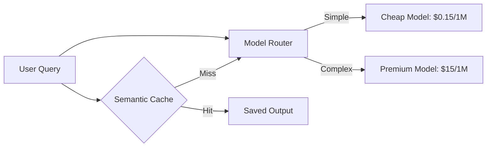

# 💰 Cost Optimization — Saving Tokens, Saving Dollars
> **Level:** Advanced | **Language:** Hinglish | **Goal:** Agent intelligence ko compromise kiye bina LLM API costs ko 50-80% tak kam karne ki techniques ko master karein.

---

## 🧭 1. Beginner-Friendly Hinglish Explanation
Cost Optimization ka matlab hai **"AI ki chadar dekh kar pair pasarna"**. 

LLM APIs (OpenAI/Anthropic) bahut mehngi ho sakti hain. Agar aapne ek agent banaya jo har sawal par 10,000 tokens use karta hai, toh aapka business kabhi "Profitable" nahi hoga.
- **Caching:** Wahi sawal dobara pucha? Purana jawab de do, paise bachao.
- **Model Tiering:** Chote sawal ke liye sasta model (GPT-4o-mini), bade sawal ke liye mehnga model (GPT-4o).
- **Prompt Pruning:** Faltu ki history aur instructions ko delete karna.

Cost control sirf "Saving" nahi hai, ye "Sustainability" hai.

---

## 🧠 2. Deep Technical Explanation
Agent costs ko optimize karne mein **Token Density** aur **Inference Frequency** par attack karna shamil hai.
1. **Semantic Caching:** Using **GPTCache** or Redis to store `{Query: Response}` pairs. If a new query is 95% similar to an old one, return the cached result.
2. **Model Router:** Ek logic layer jo decide karti hai ki kaunsa model use karna hai.
    - *Example:* "Classification" task? Llama-3-8B use karein. "Code Generation"? Claude-3.5-Sonnet use karein.
3. **Context Pruning:** Poori conversation bhejne ke bajaye, sirf last 5 turns ya history ki ek **Summary** bhejein.
4. **Token Budgeting:** Per request `max_tokens` par ek hard limit set karna.
5. **Batch Processing:** Non-realtime tasks jaise "1000 reviews process karna" ke liye OpenAI ke **Batch API** (50% discount) ka use karna.

---

## 🏗️ 3. Architecture Diagrams


```mermaid
graph LR
    U[User Query] --> R[Model Router]
    R -->|Simple| M1[Cheap Model: $0.15/1M]
    R -->|Complex| M2[Premium Model: $15/1M]
    
    U --> C{Semantic Cache}
    C -->|Hit| O[Saved Output]
    C -->|Miss| R
```

---

## 💻 4. Production-Ready Code Example (Semantic Caching)

```python
# Hinglish Logic: Agar same sawal pehle pucha gaya hai, toh cache se uthao
import redis
from sentence_transformers import SentenceTransformer

# 1. Check similarity in Redis
# 2. If Similarity > 0.95 -> Return stored answer
# 3. Else -> Call LLM and save result
```

---

## 🌍 5. Real-World Use Cases
- **Public Chatbots:** Jahan 80% users same 50 questions poochte hain (e.g. "What is your pricing?").
- **Enterprise Automation:** Daily millions of invoices process karna jahan bacha hua har ek paisa count hota hai.
- **Startup MVPs:** Product-market fit search karte waqt burn rate ko low rakhna.

---

## ❌ 6. Failure Cases
- **Stale Cache:** System badal gaya par cache purana jawab de raha hai.
- **Router Logic Fail:** Ek complex sawal saste model ko bhej diya, jisse result "Garbage" aaya.
- **Aggressive Pruning:** Itna context delete kar diya ki AI ko "Context" hi samajh nahi aaya.

---

## 🛠️ 7. Debugging Guide
- **Cost Dashboard:** Daily "Cost per 1000 requests" ko track karein.
- **Cache Hit Rate:** Measure karein ki kitne percent queries cache se fulfill ho rahi hain.

---

## ⚖️ 8. Tradeoffs
- **Aggressive Optimization:** Bahut sasta hai par hallucinations ya "Dumb" answers ka high risk hai.
- **No Optimization:** High quality hai par aap bahut jaldi kangaal ho jayenge.

---

## ✅ 9. Best Practices
- **Compress Context:** Long histories ko unke size ke 20% mein "Summarize" karne ke liye specialized prompts use karein.
- **Hard Caps:** Humesha OpenAI dashboard par "Hard Limit" set karein (e.g. $50/month).

---

## 🛡️ 10. Security Concerns
- **Cache Poisoning:** Attacker aisi query bhejta hai jo "Cache" mein galat jawab save karwa deti hai for everyone else.

---

## 📈 11. Scaling Challenges
- **Global Cache:** Multiple server regions (US vs India) ke across cache handle karne ke liye distributed Redis clusters ki zaroorat hoti hai.

---

## 💰 12. Cost Considerations
- **Output vs Input:** Output tokens aamtaur par 3x zyada expensive hote hain. Agents ko "Concise" (chota jawab) dene ke liye force karein.

---

## 📝 13. Interview Questions
1. **"Semantic caching kaise kaam karti hai?"**
2. **"Model routing se cost kaise kam hoti hai?"**
3. **"Token usage monitor karne ke liye metrics batao?"**

---

## 🚀 15. Latest 2026 Industry Patterns
- **Small Language Models (SLMs):** Basic tasks ke 90% ko FREE mein handle karne ke liye locally 1B - 3B models (jaise Phi-3 ya Gemma) ka use karna.
- **Predictive Prefetching:** User aage kya poochega ise predict karna aur idle time ke dauran use fetch kar lena.

---

> **Expert Tip:** The cheapest token is the one you **Never Send**. Spend time on your context logic, not just your prompt.
