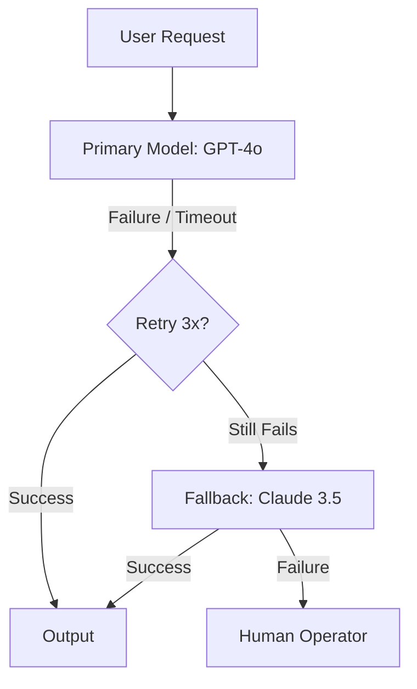

# 🔄 Fallback & Retry Strategies — Building Unstoppable Agents
> **Level:** Advanced | **Language:** Hinglish | **Goal:** Master the techniques of handling model failures, rate limits, and network errors using exponential backoff, secondary models, and human fail-safes.

---

## 🧭 1. Beginner-Friendly Hinglish Explanation
Fallback aur Retry ka matlab hai **"Plan B aur Dobara Koshish"**. 

Agentic systems "Brittle" (nazuk) hote hain. 
- Kya hoga agar OpenAI ka server down ho jaye? 
- Kya hoga agar internet chala jaye? 
- Kya hoga agar AI "Hosh kho baithe" (Hallucinate kare)?

**Retry:** Agar fail hua, toh 1 second ruko aur dobara pucho.
**Fallback:** Agar OpenAI fail hua, toh turant Claude ya Anthropic se pucho (**Plan B**).

In strategies ke bina aapka agent "Reliable" nahi ban sakta.

---

## 🧠 2. Deep Technical Explanation
Handling failures requires a multi-layer strategy:
1. **Exponential Backoff:** Retrying the request after $1, 2, 4, 8...$ seconds to avoid overloading the API provider during a rate-limit event.
2. **Model Cascading (Fallback):**
    - Attempt 1: `gpt-4o` (Premium)
    - Fallback: `claude-3.5-sonnet` (Secondary)
    - Final Fallback: `gpt-4o-mini` (Cheapest/Fastest)
3. **Logic Retry:** If the LLM returns an invalid JSON, send the error back to the LLM: "Your JSON was invalid, please fix it." (Self-Correction).
4. **Circuit Breaker:** If the API fails 5 times in 1 minute, "Trip" the circuit and stop all requests for 5 minutes to allow the provider to recover.
5. **Human-in-the-loop (HITL) Fallback:** If all models fail, escalate the task to a human operator.

---

## 🏗️ 3. Architecture Diagrams



---

## 💻 4. Production-Ready Code Example (Using Tenacity)

```python
from tenacity import retry, stop_after_attempt, wait_exponential

# Hinglish Logic: Agar fail ho, toh exponential backoff ke saath 3 baar try karo
@retry(stop=stop_after_attempt(3), wait=wait_exponential(multiplier=1, min=4, max=10))
def call_llm_safely(prompt):
    print("Calling LLM...")
    # response = client.invoke(prompt)
    # return response
    raise Exception("API Timeout!") # Simulated failure
```

---

## 🌍 5. Real-World Use Cases
- **Payment Processing:** Ensuring an agent doesn't "Double charge" a user by retrying correctly.
- **Enterprise Search:** Falling back to a local model if the cloud model is blocked by a corporate firewall.
- **Support Bots:** Transferring to a human agent immediately if the AI's "Confidence Score" is too low.

---

## ❌ 6. Failure Cases
- **Retry Storm:** 1000 agents ek saath retry kar rahe hain, jisse API provider unhe "Permanent Block" kar deta hai.
- **State Confusion:** Retry karte waqt purana "Context" bhool jana.
- **Infinite Fallback:** Agent A calls B, B calls C, C calls A (Looping failures).

---

## 🛠️ 7. Debugging Guide
- **Error Tags:** Har trace mein tag karein: `was_retried=True`, `fallback_used=Claude`.
- **Latency Monitoring:** Check karein ki fallback ki wajah se user ko 10 second ka wait toh nahi karna pad raha?

---

## ⚖️ 8. Tradeoffs
- **Aggressive Retries:** High reliability but higher token cost and latency.
- **Immediate Fallback:** Faster response but might use a "Lower Quality" model too soon.

---

## ✅ 9. Best Practices
- **Max Retries:** Kabhi bhi unlimited retries na rakhein. Humesha cap karein (e.g. 3 attempts).
- **Graceful Error Messages:** User ko batayein: "I'm experiencing high traffic, one moment please."

---

## 🛡️ 10. Security Concerns
- **Denial of Wallet:** Attackers can force your system into expensive fallback loops.

---

## 📈 11. Scaling Challenges
- **Circuit Breaker Coordination:** Multiple servers ke beech circuit state share karna (use Redis).

---

## 💰 12. Cost Considerations
- **Fallback Costs:** Humesha check karein ki aapka fallback model mehnga toh nahi hai primary se.

---

## 📝 13. Interview Questions
1. **"Exponential backoff kyu use karte hain?"**
2. **"Circuit breaker pattern agents ke liye kaise kaam karta hai?"**
3. **"LLM JSON failure ko retry se kaise theek karenge?"**

---

## 🚀 15. Latest 2026 Industry Patterns
- **Semantic Fallbacks:** Routing to different models based on the "Topic" (e.g. Math goes to Model A, Creative goes to Model B).
- **Proactive Retries:** Starting two model calls in parallel and taking the one that finishes first (Hedging).

---

> **Expert Tip:** Expect failure. Design your agent as if the LLM is **Always** about to crash.
