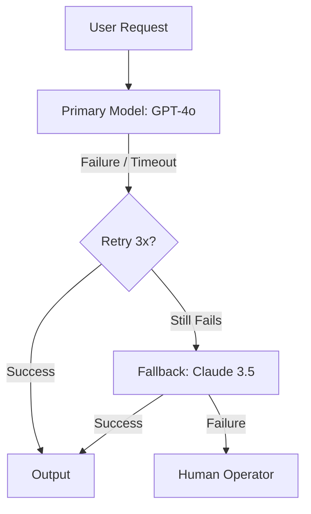

# 🔄 Fallback & Retry Strategies — Building Unstoppable Agents
> **Level:** Advanced | **Language:** Hinglish | **Goal:** Exponential backoff, secondary models, aur human fail-safes ka use karke model failures, rate limits, aur network errors ko handle karne ki techniques ko master karein.

---

## 🧭 1. Beginner-Friendly Hinglish Explanation
Fallback aur Retry ka matlab hai **"Plan B aur Dobara Koshish"**. 

Agentic systems "Brittle" (nazuk) hote hain. 
- Kya hoga agar OpenAI ka server down ho jaye? 
- Kya hoga agar internet chala jaye? 
- Kya hoga agar AI "Hosh kho baithe" (Hallucinate kare)?

**Retry:** Agar fail hua, toh 1 second ruko aur dobara pucho.
**Fallback:** Agar OpenAI fail hua, toh turant Claude ya Anthropic se pucho (**Plan B**).

In strategies ke bina aapka agent "Reliable" nahi ban sakta.

---

## 🧠 2. Deep Technical Explanation
Failures ko handle karne ke liye multi-layer strategy ki zaroorat hoti hai:
1. **Exponential Backoff:** Rate-limit event ke dauran API provider ko overload karne se bachne ke liye $1, 2, 4, 8...$ seconds ke baad request retry karna.
2. **Model Cascading (Fallback):**
    - Attempt 1: `gpt-4o` (Premium)
    - Fallback: `claude-3.5-sonnet` (Secondary)
    - Final Fallback: `gpt-4o-mini` (Cheapest/Fastest)
3. **Logic Retry:** Agar LLM invalid JSON return kare, toh error wapas LLM ko bhejein: "Your JSON was invalid, please fix it." (Self-Correction).
4. **Circuit Breaker:** Agar API 1 minute mein 5 baar fail ho jaye, toh circuit ko "Trip" karein aur provider ko recover hone dene ke liye 5 minutes tak sabhi requests ko rok dein.
5. **Human-in-the-loop (HITL) Fallback:** Agar saare models fail ho jayein, toh task ko human operator ke paas escalate karein.

---

## 🏗️ 3. Architecture Diagrams


```mermaid
graph TD
    U[User Request] --> A[Primary Model: GPT-4o]
    A -->|Failure / Timeout| R{Retry 3x?}
    R -->|Success| O[Output]
    R -->|Still Fails| F[Fallback: Claude 3.5]
    F -->|Failure| H[Human Operator]
    F -->|Success| O
```

---

## 💻 4. Production-Ready Code Example (Using Tenacity)

```python
from tenacity import retry, stop_after_attempt, wait_exponential

# Hinglish Logic: Agar fail ho, toh exponential backoff ke saath 3 baar try karo
@retry(stop=stop_after_attempt(3), wait=wait_exponential(multiplier=1, min=4, max=10))
def call_llm_safely(prompt):
    print("Calling LLM...")
    # response = client.invoke(prompt)
    # return response
    raise Exception("API Timeout!") # Simulated failure
```

---

## 🌍 5. Real-World Use Cases
- **Payment Processing:** Correctly retry karke ensure karna ki agent user ko "Double charge" na kare.
- **Enterprise Search:** Agar cloud model corporate firewall dwara blocked ho, toh local model par fallback karna.
- **Support Bots:** AI ka "Confidence Score" bahut low hone par immediately human agent ko transfer karna.

---

## ❌ 6. Failure Cases
- **Retry Storm:** 1000 agents ek saath retry kar rahe hain, jisse API provider unhe "Permanent Block" kar deta hai.
- **State Confusion:** Retry karte waqt purana "Context" bhool jana.
- **Infinite Fallback:** Agent A B ko call karta hai, B C ko, aur C A ko call karta hai (Looping failures).

---

## 🛠️ 7. Debugging Guide
- **Error Tags:** Har trace mein tag karein: `was_retried=True`, `fallback_used=Claude`.
- **Latency Monitoring:** Check karein ki fallback ki wajah se user ko 10 second ka wait toh nahi karna pad raha?

---

## ⚖️ 8. Tradeoffs
- **Aggressive Retries:** High reliability par higher token cost aur latency.
- **Immediate Fallback:** Faster response par ho sakta hai ki "Lower Quality" model ka use jaldi kar liya jaye.

---

## ✅ 9. Best Practices
- **Max Retries:** Kabhi bhi unlimited retries na rakhein. Humesha cap karein (e.g. 3 attempts).
- **Graceful Error Messages:** User ko batayein: "I'm experiencing high traffic, one moment please."

---

## 🛡️ 10. Security Concerns
- **Denial of Wallet:** Attackers aapke system ko expensive fallback loops mein force kar sakte hain.

---

## 📈 11. Scaling Challenges
- **Circuit Breaker Coordination:** Multiple servers ke beech circuit state share karna (use Redis).

---

## 💰 12. Cost Considerations
- **Fallback Costs:** Humesha check karein ki aapka fallback model mehnga toh nahi hai primary se.

---

## 📝 13. Interview Questions
1. **"Exponential backoff kyu use karte hain?"**
2. **"Circuit breaker pattern agents ke liye kaise kaam karta hai?"**
3. **"LLM JSON failure ko retry se kaise theek karenge?"**

---

## 🚀 15. Latest 2026 Industry Patterns
- **Semantic Fallbacks:** "Topic" ke basis par different models par route karna (e.g. Math Model A par jata hai, Creative Model B par jata hai).
- **Proactive Retries:** Parallel mein do model calls start karna aur pehle finish hone wale ko accept karna (Hedging).

---

> **Expert Tip:** Expect failure. Design your agent as if the LLM is **Always** about to crash.
