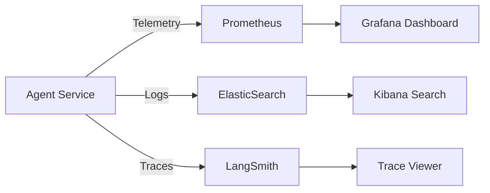

# 🔍 Observability in Production — The Real-Time Dashboard
> **Level:** Advanced | **Language:** Hinglish | **Goal:** Master the tools and metrics for monitoring agent health, performance, and accuracy in live production environments.

---

## 🧭 1. Beginner-Friendly Hinglish Explanation
Observability ka matlab hai **"AI ka live health checkup"**. 

Jab aapka agent production mein hai, toh aap use 24/7 check nahi kar sakte. 
- Kya wo sahi answer de raha hai?
- Kitni latency aa rahi hai?
- Kitne paise kharch ho rahe hain?

**Observability** humein "Traces" aur "Dashboards" deti hai. Jaise ek pilot cockpit mein saare meters dekhta hai, hum agent ke meters (Metrics) dekhte hain. Agar koi galti hoti hai, toh humein turant "Alert" mil jata hai.

---

## 🧠 2. Deep Technical Explanation
Monitoring agents requires a three-pillar approach: **Metrics**, **Logs**, and **Traces**.
1. **Metrics (Quantitative):**
    - **P99 Latency:** Time taken by the slowest 1% of requests.
    - **Token Burn Rate:** Cost monitoring in real-time.
    - **Success/Failure Rate:** % of tasks successfully completed.
2. **Logs (Qualitative):**
    - **Raw LLM Inputs/Outputs:** Saving exactly what was sent and received (Sanitized).
    - **System Events:** Worker starts, database timeouts, tool failures.
3. **Traces (Logical):**
    - **Chain-of-Thought Tracing:** visualizing every node jump in LangGraph.
    - **Tool Traces:** Measuring how much time was spent inside a specific tool API.
4. **Tools:** **Prometheus/Grafana** for metrics, **ELK Stack** for logs, and **LangSmith/Arize Phoenix** for agent-specific tracing.

---

## 🏗️ 3. Architecture Diagrams



---

## 💻 4. Production-Ready Code Example (Metric Tracking with Prometheus)

```python
from prometheus_client import Counter, Histogram

# Hinglish Logic: Har success aur failure ko count karo
REQUEST_COUNT = Counter('agent_requests_total', 'Total agent requests', ['status'])
LATENCY = Histogram('agent_request_duration_seconds', 'Latency of agent requests')

def run_agent(query):
    with LATENCY.time():
        try:
            # result = agent.invoke(query)
            REQUEST_COUNT.labels(status='success').inc()
        except:
            REQUEST_COUNT.labels(status='failed').inc()
```

---

## 🌍 5. Real-World Use Cases
- **Cost Alerting:** If the daily spend crosses $100, send a Slack alert immediately.
- **Accuracy Monitoring:** Automatically running RAGAS on a 1% sample of live traffic to check for quality "Drift".
- **Debugging Customer Reports:** If a user says "The bot is slow", checking the P99 latency charts to see if it's a systemic issue.

---

## ❌ 6. Failure Cases
- **Metric Explosion:** Creating too many custom labels in Prometheus, causing it to crash.
- **Log Overflow:** Millions of "Debug" logs filling up the disk in production.
- **Blind Spots:** Monitoring the LLM but forgetting to monitor the database or tool API health.

---

## 🛠️ 7. Debugging Guide
- **Correlation IDs:** Link your traces to your logs using a shared ID.
- **Alert Fatigue:** Set alerts only for "Actionable" issues. Don't alert for every small error.

---

## ⚖️ 8. Tradeoffs
- **Full Observability:** 100% visibility but high cost and slight performance hit.
- **Minimal Monitoring:** Fast and cheap but you are "Blind" when things fail.

---

## ✅ 9. Best Practices
- **Standardized Labels:** Use common labels like `model_name`, `user_id`, and `version` across all metrics.
- **Retention Policies:** Delete detailed traces after 14-30 days to save storage costs.

---

## 🛡️ 10. Security Concerns
- **PII in Traces:** Ensure that sensitive information is "Masked" before it's sent to the observability platform (LangSmith/Datadog).

---

## 📈 11. Scaling Challenges
- **Log Aggregation:** Millions of logs per second require specialized clusters like **Kafka** to handle the data stream.

---

## 💰 12. Cost Considerations
- **Datadog/SaaS Bills:** Observability services can sometimes cost more than the LLM itself! Use open-source self-hosted alternatives (Grafana/Mimir) for high traffic.

---

## 📝 13. Interview Questions
1. **"Monitoring aur Observability mein kya fark hai?"**
2. **"Agent latency ko improve karne ke liye dashboard kaise help karega?"**
3. **"Token cost monitoring kyu critical hai?"**

---

## 🚀 15. Latest 2026 Industry Patterns
- **LLM-Guided Observability:** An AI that watches your metrics and automatically suggests architectural changes to improve speed or cost.
- **Semantic Monitoring:** Alerts that trigger if the agent starts sounding "Rude" or "Confused" even if the technical metrics are green.

---

> **Expert Tip:** In production, **Data is the only Truth**. Without observability, you're just guessing.
