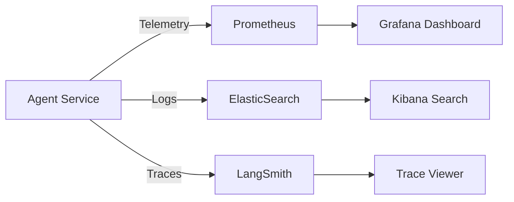

# 🔍 Observability in Production — The Real-Time Dashboard
> **Level:** Advanced | **Language:** Hinglish | **Goal:** Live production environments mein agent health, performance, aur accuracy ko monitor karne ke tools aur metrics ko master karein.

---

## 🧭 1. Beginner-Friendly Hinglish Explanation
Observability ka matlab hai **"AI ka live health checkup"**. 

Jab aapka agent production mein hai, toh aap use 24/7 check nahi kar sakte. 
- Kya wo sahi answer de raha hai?
- Kitni latency aa rahi hai?
- Kitne paise kharch ho rahe hain?

**Observability** humein "Traces" aur "Dashboards" deti hai. Jaise ek pilot cockpit mein saare meters dekhta hai, hum agent ke meters (Metrics) dekhte hain. Agar koi galti hoti hai, toh humein turant "Alert" mil jata hai.

---

## 🧠 2. Deep Technical Explanation
Agents ko monitor karne ke liye three-pillar approach ki zaroorat hoti hai: **Metrics**, **Logs**, aur **Traces**.
1. **Metrics (Quantitative):**
    - **P99 Latency:** Sabse slow 1% requests dwara liya gaya time.
    - **Token Burn Rate:** Real-time mein cost monitoring.
    - **Success/Failure Rate:** Successfully completed tasks ka %.
2. **Logs (Qualitative):**
    - **Raw LLM Inputs/Outputs:** Exactly jo sent aur received hua use save karna (Sanitized).
    - **System Events:** Worker starts, database timeouts, tool failures.
3. **Traces (Logical):**
    - **Chain-of-Thought Tracing:** LangGraph mein har node jump ko visualize karna.
    - **Tool Traces:** Specific tool API ke andar kitna time spend hua use measure karna.
4. **Tools:** Metrics ke liye **Prometheus/Grafana**, logs ke liye **ELK Stack**, aur agent-specific tracing ke liye **LangSmith/Arize Phoenix**.

---

## 🏗️ 3. Architecture Diagrams


```mermaid
graph LR
    A[Agent Service] -->|Telemetry| P[Prometheus]
    A -->|Logs| E[ElasticSearch]
    A -->|Traces| LS[LangSmith]
    
    P --> G[Grafana Dashboard]
    E --> K[Kibana Search]
    LS --> UI[Trace Viewer]
```

---

## 💻 4. Production-Ready Code Example (Metric Tracking with Prometheus)

```python
from prometheus_client import Counter, Histogram

# Hinglish Logic: Har success aur failure ko count karo
REQUEST_COUNT = Counter('agent_requests_total', 'Total agent requests', ['status'])
LATENCY = Histogram('agent_request_duration_seconds', 'Latency of agent requests')

def run_agent(query):
    with LATENCY.time():
        try:
            # result = agent.invoke(query)
            REQUEST_COUNT.labels(status='success').inc()
        except:
            REQUEST_COUNT.labels(status='failed').inc()
```

---

## 🌍 5. Real-World Use Cases
- **Cost Alerting:** Agar daily spend $100 cross kare, toh immediately Slack alert bhejein.
- **Accuracy Monitoring:** Quality "Drift" check karne ke liye live traffic ke 1% sample par automatically RAGAS run karna.
- **Debugging Customer Reports:** Agar user kahe "The bot is slow", toh check karein P99 latency charts taaki dekh sakein ki kya ye ek systemic issue hai.

---

## ❌ 6. Failure Cases
- **Metric Explosion:** Prometheus mein bahut saare custom labels create karna, jisse ye crash ho jaye.
- **Log Overflow:** Production mein disk ko fill karne wale millions of "Debug" logs.
- **Blind Spots:** LLM ko monitor karna par database ya tool API health ko monitor karna bhool jana.

---

## 🛠️ 7. Debugging Guide
- **Correlation IDs:** Ek shared ID ka use karke apne traces ko logs se link karein.
- **Alert Fatigue:** Alerts sirf "Actionable" issues ke liye hi set karein. Har small error par alert na karein.

---

## ⚖️ 8. Tradeoffs
- **Full Observability:** 100% visibility par high cost aur slight performance hit.
- **Minimal Monitoring:** Fast aur cheap hai par fail hone par aap "Blind" (andha) ho jate hain.

---

## ✅ 9. Best Practices
- **Standardized Labels:** Sabhi metrics ke across common labels jaise `model_name`, `user_id`, aur `version` ka use karein.
- **Retention Policies:** Storage costs bachane ke liye 14-30 days ke baad detailed traces delete karein.

---

## 🛡️ 10. Security Concerns
- **PII in Traces:** Observability platform (LangSmith/Datadog) par bhejne se pehle ensure karein ki sensitive information "Masked" ho.

---

## 📈 11. Scaling Challenges
- **Log Aggregation:** Per second millions of logs ko handle karne ke liye data stream ke liye **Kafka** jaise specialized clusters ki zaroorat hoti hai.

---

## 💰 12. Cost Considerations
- **Datadog/SaaS Bills:** Observability services kabhi-kabhi LLM se bhi zyada expensive ho sakti hain! High traffic ke liye open-source self-hosted alternatives (Grafana/Mimir) use karein.

---

## 📝 13. Interview Questions
1. **"Monitoring aur Observability mein kya fark hai?"**
2. **"Agent latency ko improve karne ke liye dashboard kaise help karega?"**
3. **"Token cost monitoring kyu critical hai?"**

---

## 🚀 15. Latest 2026 Industry Patterns
- **LLM-Guided Observability:** Ek AI jo aapke metrics ko watch karta hai aur speed ya cost ko improve karne ke liye automatically architectural changes suggest karta hai.
- **Semantic Monitoring:** Alerts jo tab trigger hote hain agar agent "Rude" ya "Confused" sound karne lage bhale hi technical metrics green hon.

---

> **Expert Tip:** In production, **Data is the only Truth**. Without observability, you're just guessing.
