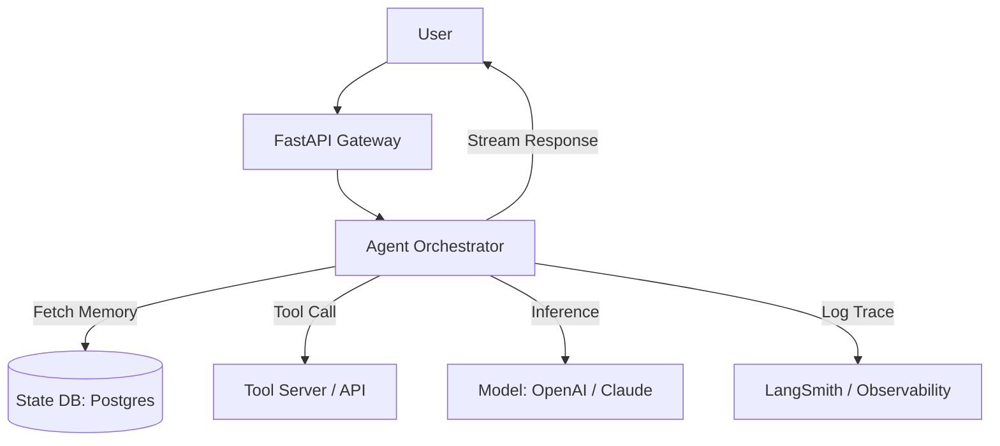

# 🏗️ Production Agent Architecture — The Enterprise Blueprint
> **Level:** Advanced | **Language:** Hinglish | **Goal:** Master the end-to-end architectural design for deploying AI agents in high-stakes production environments.

---

## 🧭 1. Beginner-Friendly Hinglish Explanation
Production Architecture ka matlab hai **"AI ko ek majboot ghar dena"**. 

Jab aap local mein agent chalate ho, toh wo sirf aapke liye hai. Lekin production mein:
- 10,000 log ek saath puchenge.
- Agent ko "Yaad" rakhna padega ki kisne kya bola (State).
- Agar Internet slow hai ya API fail hui, toh agent ko "Handle" karna aana chahiye.

Production architecture sikhata hai ki kaise hum **FastAPI, Redis, aur Docker** ka use karke ek aisa system banate hain jo kabhi crash nahi hota.

---

## 🧠 2. Deep Technical Explanation
A production agent system is built on **Asynchronous Event-Driven Design**.
1. **The Gateway (FastAPI):** Handles incoming requests, authentication, and rate limiting.
2. **Orchestrator (LangGraph/CrewAI):** Manages the logical flow and state transitions.
3. **State Store (Postgres/Redis):** Persists conversation history and agent internal state across sessions.
4. **Tool Layer:** A set of microservices or internal functions that the agent calls.
5. **Evaluation Layer:** Continuous monitoring and scoring of agent responses.
6. **Background Workers (Celery):** Handling long-running tasks like "Researching 100 PDFs" without blocking the user.

---

## 🏗️ 3. Architecture Diagrams



---

## 💻 4. Production-Ready Code Example (Basic API Wrapper)

```python
from fastapi import FastAPI, BackgroundTasks
# Hinglish Logic: API turant response degi, aur agent background mein kaam karega
app = FastAPI()

@app.post("/run-agent")
async def handle_request(query: str, background_tasks: BackgroundTasks):
    # 1. Store request in DB
    # 2. Kick off agent process asynchronously
    background_tasks.add_task(my_agent_logic, query)
    return {"status": "Processing", "task_id": "123"}
```

---

## 🌍 5. Real-World Use Cases
- **Customer Support Bots:** Handling 24/7 queries with 99.9% uptime.
- **Automated Trading:** Agents that monitor markets and execute trades with sub-second latency.
- **Enterprise ERP:** AI that interacts with multiple company databases to generate reports.

---

## ❌ 6. Failure Cases
- **Database Locks:** Too many agents writing to the same state row simultaneously.
- **Model Timeouts:** OpenAI API taking 60 seconds to respond, causing the API gateway to crash.
- **State Inconsistency:** Agent thinks it did Task A, but Task A actually failed in the background.

---

## 🛠️ 7. Debugging Guide
- **Correlation IDs:** Har request ko ek unique ID dein jo logs, traces, aur DB entries mein common ho.
- **Circuit Breakers:** Agar model API 3 baar fail ho, toh 5 minute ke liye requests "Pause" kar dein.

---

## ⚖️ 8. Tradeoffs
- **Stateful (Graph):** Very smart and can handle complex flows, but expensive to maintain and scale.
- **Stateless (Simple RAG):** Fast and cheap but lacks "Intelligence" for long-term tasks.

---

## ✅ 9. Best Practices
- **Use Checkpointers:** Humesha LangGraph checkpointers use karein state save karne ke liye.
- **Decouple Components:** API gateway aur Agent logic alag-alag servers par honi chahiye.

---

## 🛡️ 10. Security Concerns
- **Internal API Protection:** Tool server hamesha private network mein hona chahiye.

---

## 📈 11. Scaling Challenges
- **Concurrent Connections:** handling 100,000 active websockets for voice agents.

---

## 💰 12. Cost Considerations
- **Token Usage:** Cache common answers to save 40-50% on API costs.

---

## 📝 13. Interview Questions
1. **"Production architecture mein State persistence kyu zaruri hai?"**
2. **"Circuit breaker pattern agents ke liye kaise kaam karta hai?"**
3. **"Load balancer agentic traffic ko kaise handle karega?"**

---

## 🚀 15. Latest 2026 Industry Patterns
- **Serverless Agent Nodes:** Every node in the graph runs as a serverless function to minimize idle cost.
- **Mesh Orchestration:** Multiple orchestrators talking to each other to solve global-scale problems.

---

> **Expert Tip:** Production is about **Resilience**. A good architect plans for the 10% of cases where the LLM fails.
