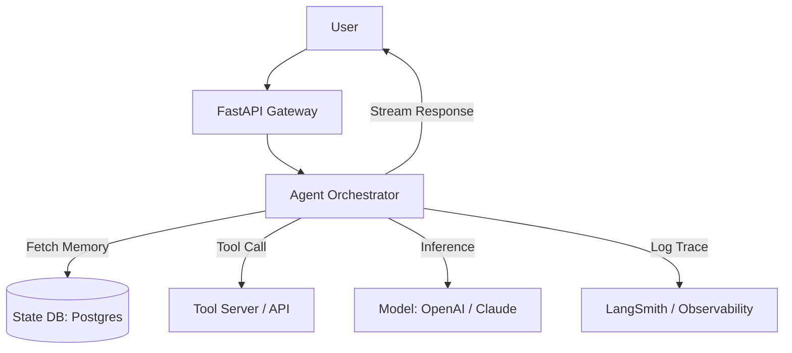

# 🏗️ Production Agent Architecture — The Enterprise Blueprint
> **Level:** Advanced | **Language:** Hinglish | **Goal:** High-stakes production environments mein AI agents ko deploy karne ke end-to-end architectural design ko master karein.

---

## 🧭 1. Beginner-Friendly Hinglish Explanation
Production Architecture ka matlab hai **"AI ko ek majboot ghar dena"**. 

Jab aap local mein agent chalate ho, toh wo sirf aapke liye hai. Lekin production mein:
- 10,000 log ek saath puchenge.
- Agent ko "Yaad" rakhna padega ki kisne kya bola (State).
- Agar Internet slow hai ya API fail hui, toh agent ko "Handle" karna aana chahiye.

Production architecture sikhata hai ki kaise hum **FastAPI, Redis, aur Docker** ka use karke ek aisa system banate hain jo kabhi crash nahi hota.

---

## 🧠 2. Deep Technical Explanation
Production agent system **Asynchronous Event-Driven Design** par built hota hai.
1. **The Gateway (FastAPI):** Incoming requests, authentication, aur rate limiting ko handle karta hai.
2. **Orchestrator (LangGraph/CrewAI):** Logical flow aur state transitions ko manage karta hai.
3. **State Store (Postgres/Redis):** Sessions ke across conversation history aur agent internal state ko persist karta hai.
4. **Tool Layer:** Microservices ya internal functions ka ek set jise agent call karta hai.
5. **Evaluation Layer:** Agent responses ki continuous monitoring aur scoring.
6. **Background Workers (Celery):** User ko block kiye bina "Researching 100 PDFs" jaise long-running tasks ko handle karna.

---

## 🏗️ 3. Architecture Diagrams


```mermaid
graph TD
    U[User] --> G[FastAPI Gateway]
    G --> O[Agent Orchestrator]
    O -->|Fetch Memory| DB[(State DB: Postgres)]
    O -->|Tool Call| T[Tool Server / API]
    O -->|Inference| LLM[Model: OpenAI / Claude]
    O -->|Stream Response| U
    O -->|Log Trace| LS[LangSmith / Observability]
```

---

## 💻 4. Production-Ready Code Example (Basic API Wrapper)

```python
from fastapi import FastAPI, BackgroundTasks
# Hinglish Logic: API turant response degi, aur agent background mein kaam karega
app = FastAPI()

@app.post("/run-agent")
async def handle_request(query: str, background_tasks: BackgroundTasks):
    # 1. Store request in DB
    # 2. Kick off agent process asynchronously
    background_tasks.add_task(my_agent_logic, query)
    return {"status": "Processing", "task_id": "123"}
```

---

## 🌍 5. Real-World Use Cases
- **Customer Support Bots:** 99.9% uptime ke sath 24/7 queries handle karna.
- **Automated Trading:** Markets monitor karne aur sub-second latency ke sath trades execute karne wale agents.
- **Enterprise ERP:** Reports generate karne ke liye multiple company databases ke sath interact karne wali AI.

---

## ❌ 6. Failure Cases
- **Database Locks:** Ek sath same state row par write karne wale bahut saare agents.
- **Model Timeouts:** OpenAI API response dene mein 60 seconds le raha hai, jisse API gateway crash ho raha hai.
- **State Inconsistency:** Agent ko lagta hai ki usne Task A kar diya, par Task A background mein actually fail ho gaya tha.

---

## 🛠️ 7. Debugging Guide
- **Correlation IDs:** Har request ko ek unique ID dein jo logs, traces, aur DB entries mein common ho.
- **Circuit Breakers:** Agar model API 3 baar fail ho, toh 5 minute ke liye requests "Pause" kar dein.

---

## ⚖️ 8. Tradeoffs
- **Stateful (Graph):** Bahut smart hai aur complex flows handle kar sakta hai, par maintain aur scale karna expensive hai.
- **Stateless (Simple RAG):** Fast aur cheap hai par long-term tasks ke liye "Intelligence" ki kami hoti hai.

---

## ✅ 9. Best Practices
- **Use Checkpointers:** Humesha LangGraph checkpointers use karein state save karne ke liye.
- **Decouple Components:** API gateway aur Agent logic alag-alag servers par honi chahiye.

---

## 🛡️ 10. Security Concerns
- **Internal API Protection:** Tool server hamesha private network mein hona chahiye.

---

## 📈 11. Scaling Challenges
- **Concurrent Connections:** Voice agents ke liye 100,000 active websockets handle karna.

---

## 💰 12. Cost Considerations
- **Token Usage:** API costs par 40-50% bachane ke liye common answers ko cache karein.

---

## 📝 13. Interview Questions
1. **"Production architecture mein State persistence kyu zaruri hai?"**
2. **"Circuit breaker pattern agents ke liye kaise kaam karta hai?"**
3. **"Load balancer agentic traffic ko kaise handle karega?"**

---

## 🚀 15. Latest 2026 Industry Patterns
- **Serverless Agent Nodes:** Idle cost ko minimize karne ke liye graph ka har node serverless function ke roop mein run hota hai.
- **Mesh Orchestration:** Global-scale problems solve karne ke liye multiple orchestrators ka aapas mein baat karna.

---

> **Expert Tip:** Production is about **Resilience**. A good architect plans for the 10% of cases where the LLM fails.
