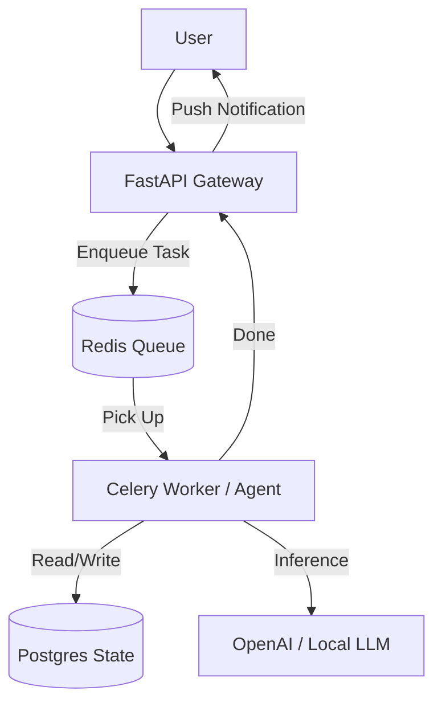

# 🏗️ Production Architecture — Scaling to Millions
> **Level:** Advanced | **Language:** Hinglish | **Goal:** Master the infrastructure design for deploying agents in high-concurrency environments with state management and task queues.

---

## 🧭 1. Beginner-Friendly Hinglish Explanation
Production Architecture ka matlab hai **"AI ko ek majboot ghar dena"**. 

- **Local Development:** Aapka agent laptop par sahi chal raha hai.
- **Production:** Jab 10,000 log ek saath puchenge, tab kya hoga? 
    - Laptop crash ho jayega. 
    - Database slow ho jayega. 
    - API rate limits hit ho jayengi.

Production architecture sikhata hai ki kaise **Redis, Celery, aur Kubernetes** ka use karke hum AI ko ek "Commercial" level par chalate hain.

---

## 🧠 2. Deep Technical Explanation
A production agent system requires an **Asynchronous Event-Driven Architecture**.
1. **API Gateway (FastAPI):** Receives the user request and immediately returns a `task_id`. It doesn't wait for the LLM to finish.
2. **Task Queue (Redis + Celery):** The request is sent to a queue. Background "Workers" pick up the task.
3. **State Persistence (Postgres/Redis):** The agent's memory (history) must be saved in a distributed database so any worker can resume the conversation.
4. **Load Balancing:** Distributing traffic across multiple GPU/CPU servers.
5. **Caching Layer:** Using **Semantic Cache** (GPTCache) to store answers to common questions, saving tokens and time.

---

## 🏗️ 3. Architecture Diagrams



---

## 💻 4. Production-Ready Code Example (Worker Concept)

```python
from celery import Celery

# Hinglish Logic: Ye worker background mein agent ko chalayega
app = Celery('agent_tasks', broker='redis://localhost:6379/0')

@app.task
def run_agent_task(query, thread_id):
    # 1. Load state from DB
    # 2. Run LangGraph/LangChain logic
    # 3. Save new state
    # 4. Notify user via Webhook
    return f"Task completed for {thread_id}"
```

---

## 🌍 5. Real-World Use Cases
- **Customer Support:** Handling thousands of chats simultaneously without slowing down.
- **Batch Document Processing:** Uploading 1000 PDFs and letting 10 workers process them in parallel.
- **Autonomous SEO Agents:** Running daily crawls and content generation tasks in the background.

---

## ❌ 6. Failure Cases
- **Zombie Workers:** Worker crash ho gaya par task "Running" hi dikha raha hai.
- **Database Bottleneck:** Saare workers ek saath DB par likhne ki koshish kar rahe hain (Use connection pooling).
- **Rate Limiting:** OpenAI ne aapki company ka access band kar diya high traffic ki wajah se.

---

## 🛠️ 7. Debugging Guide
- **Flower:** Use the Flower dashboard to monitor Celery workers in real-time.
- **Prometheus/Grafana:** Monitor CPU, RAM, and GPU usage of your agent pods.

---

## ⚖️ 8. Tradeoffs
- **Async Architecture:** Super scalable and reliable but very complex to code and debug.
- **Sync Architecture:** Simple to build but fails immediately under high load.

---

## ✅ 9. Best Practices
- **Retry Logic:** Agar model fail ho, toh automatic exponential backoff retry lagayein.
- **Max Timeouts:** Har task par ek `time_limit` set karein taaki wo infinite loop mein na phasa rahe.

---

## 🛡️ 10. Security Concerns
- **Sensitive Context in Redis:** Redis data ko encrypt karein agar usme private chats hain.

---

## 📈 11. Scaling Challenges
- **Cold Starts:** New GPU instances start hone mein 2-3 minute lagte hain. Use "Always-on" clusters for critical tasks.

---

## 💰 12. Cost Considerations
- **Idle Worker Cost:** Workers chal rahe hain par koi task nahi hai. Use **KEDA** for auto-scaling workers based on queue size.

---

## 📝 13. Interview Questions
1. **"Agents ke liye Sync vs Async architecture kab choose karoge?"**
2. **"Redis ka role kya hai task orchestration mein?"**
3. **"State persistence production mein kaise handle karenge?"**

---

## ⚠️ 14. Common Mistakes
- **No Heartbeats:** Workers ke alive hone ka status na check karna.
- **Hardcoding Model Parameters:** Model names aur temperatures ko config files mein na rakhna.

---

## 🚀 15. Latest 2026 Industry Patterns
- **Serverless Agents:** Running agents on AWS Lambda or Modal where you only pay for the exact seconds the code runs.
- **Micro-agent Mesh:** Breaking one big agent into 10 tiny containers that talk via a service mesh.

---

> **Expert Tip:** Production is about **Resilience**. Your agent should be able to restart, fail, and recover without the user ever noticing.
