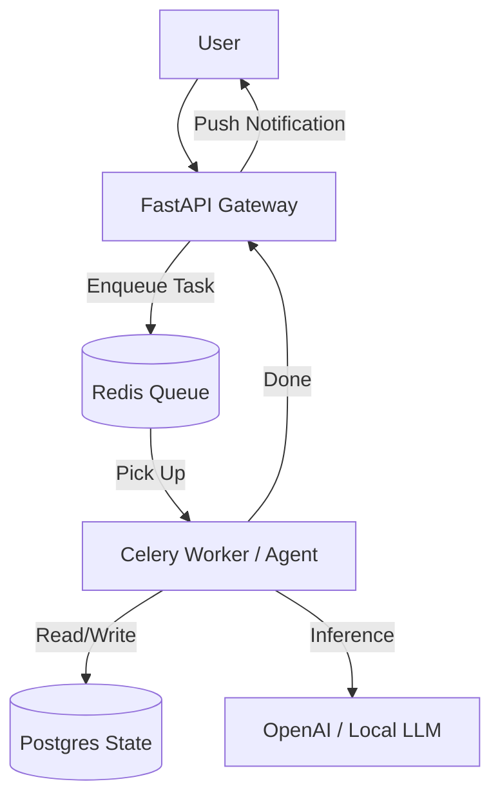

# 🏗️ Production Architecture — Scaling to Millions
> **Level:** Advanced | **Language:** Hinglish | **Goal:** State management aur task queues ke sath high-concurrency environments mein agents deploy karne ke infrastructure design ko master karein.

---

## 🧭 1. Beginner-Friendly Hinglish Explanation
Production Architecture ka matlab hai **"AI ko ek majboot ghar dena"**. 

- **Local Development:** Aapka agent laptop par sahi chal raha hai.
- **Production:** Jab 10,000 log ek saath puchenge, tab kya hoga? 
    - Laptop crash ho jayega. 
    - Database slow ho jayega. 
    - API rate limits hit ho jayengi.

Production architecture sikhata hai ki kaise **Redis, Celery, aur Kubernetes** ka use karke hum AI ko ek "Commercial" level par chalate hain.

---

## 🧠 2. Deep Technical Explanation
Production agent system ke liye ek **Asynchronous Event-Driven Architecture** ki zaroorat hoti hai.
1. **API Gateway (FastAPI):** User request receive karta hai aur immediately ek `task_id` return karta hai. Ye LLM ke finish hone ka wait nahi karta.
2. **Task Queue (Redis + Celery):** Request ko queue mein bheja jata hai. Background "Workers" task ko pick karte hain.
3. **State Persistence (Postgres/Redis):** Agent ki memory (history) ek distributed database mein save honi chahiye taaki koi bhi worker conversation resume kar sake.
4. **Load Balancing:** Multiple GPU/CPU servers ke across traffic distribute karna.
5. **Caching Layer:** Common questions ke answers store karne ke liye **Semantic Cache** (GPTCache) ka use karna, jisse tokens aur time dono bachein.

---

## 🏗️ 3. Architecture Diagrams


```mermaid
graph TD
    U[User] --> G[FastAPI Gateway]
    G -->|Enqueue Task| R[(Redis Queue)]
    R -->|Pick Up| W[Celery Worker / Agent]
    W -->|Read/Write| DB[(Postgres State)]
    W -->|Inference| LLM[OpenAI / Local LLM]
    W -->|Done| G
    G -->|Push Notification| U
```

---

## 💻 4. Production-Ready Code Example (Worker Concept)

```python
from celery import Celery

# Hinglish Logic: Ye worker background mein agent ko chalayega
app = Celery('agent_tasks', broker='redis://localhost:6379/0')

@app.task
def run_agent_task(query, thread_id):
    # 1. Load state from DB
    # 2. Run LangGraph/LangChain logic
    # 3. Save new state
    # 4. Notify user via Webhook
    return f"Task completed for {thread_id}"
```

---

## 🌍 5. Real-World Use Cases
- **Customer Support:** Bina slow hue thousands of chats ko simultaneously handle karna.
- **Batch Document Processing:** 1000 PDFs upload karna aur 10 workers ko unhe parallel mein process karne dena.
- **Autonomous SEO Agents:** Background mein daily crawls aur content generation tasks run karna.

---

## ❌ 6. Failure Cases
- **Zombie Workers:** Worker crash ho gaya par task "Running" hi dikha raha hai.
- **Database Bottleneck:** Saare workers ek saath DB par likhne ki koshish kar rahe hain (Use connection pooling).
- **Rate Limiting:** OpenAI ne aapki company ka access band kar diya high traffic ki wajah se.

---

## 🛠️ 7. Debugging Guide
- **Flower:** Real-time mein Celery workers ko monitor karne ke liye Flower dashboard ka use karein.
- **Prometheus/Grafana:** Apne agent pods ke CPU, RAM, aur GPU usage ko monitor karein.

---

## ⚖️ 8. Tradeoffs
- **Async Architecture:** Super scalable aur reliable hai par code aur debug karna bahut complex hai.
- **Sync Architecture:** Build karna simple hai par high load hone par immediately fail ho jata hai.

---

## ✅ 9. Best Practices
- **Retry Logic:** Agar model fail ho, toh automatic exponential backoff retry lagayein.
- **Max Timeouts:** Har task par ek `time_limit` set karein taaki wo infinite loop mein na phasa rahe.

---

## 🛡️ 10. Security Concerns
- **Sensitive Context in Redis:** Redis data ko encrypt karein agar usme private chats hain.

---

## 📈 11. Scaling Challenges
- **Cold Starts:** New GPU instances start hone mein 2-3 minute lagte hain. Use "Always-on" clusters for critical tasks.

---

## 💰 12. Cost Considerations
- **Idle Worker Cost:** Workers chal rahe hain par koi task nahi hai. Use **KEDA** for auto-scaling workers based on queue size.

---

## 📝 13. Interview Questions
1. **"Agents ke liye Sync vs Async architecture kab choose karoge?"**
2. **"Redis ka role kya hai task orchestration mein?"**
3. **"State persistence production mein kaise handle karenge?"**

---

## ⚠️ 14. Common Mistakes
- **No Heartbeats:** Workers ke alive hone ka status na check karna.
- **Hardcoding Model Parameters:** Model names aur temperatures ko config files mein na rakhna.

---

## 🚀 15. Latest 2026 Industry Patterns
- **Serverless Agents:** AWS Lambda ya Modal par agents run karna jahan aap sirf code chalne ke exact seconds ke liye pay karte hain.
- **Micro-agent Mesh:** Ek bade agent ko 10 tiny containers mein break karna jo service mesh ke through baat karte hain.

---

> **Expert Tip:** Production is about **Resilience**. Your agent should be able to restart, fail, and recover without the user ever noticing.
