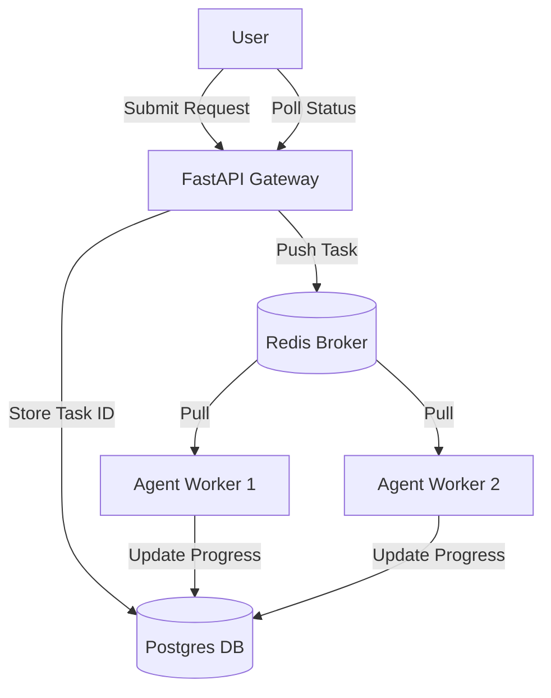

# 📬 Queue Systems & Background Jobs — Handling Long-Running Tasks
> **Level:** Advanced | **Language:** Hinglish | **Goal:** Master the use of Redis, RabbitMQ, and Celery to manage long-running agentic tasks without blocking the user interface.

---

## 🧭 1. Beginner-Friendly Hinglish Explanation
Queue System ka matlab hai **"AI ki line (Waiting Room)"**. 

Socho ek user ne bola: "Mere 50 PDFs padho aur unka summary banao."
- **Bina Queue:** User wait kar raha hai, browser loading ghoom raha hai, aur 30 second baad "Timeout" error aa jata hai.
- **Saath mein Queue:** Agent bolta hai "Theek hai, main kaam shuru kar raha hoon. Ye raha aapka Ticket ID. Jab kaam ho jayega, main bata dunga."

Queue system AI ko "Patient" banata hai aur system ko "Crash" hone se bachata hai jab bahut sara kaam ek saath aa jaye.

---

## 🧠 2. Deep Technical Explanation
Background processing is critical for agents because LLM inference is slow.
1. **The Broker (Redis/RabbitMQ):** A message storage where tasks wait to be processed.
2. **The Worker (Celery/Python):** A separate process that listens to the queue and executes the agent logic.
3. **State Management:** The worker must save the progress of the task in a database (Postgres) so the user can check the status (e.g. 50% done).
4. **Visibility Timeout:** Ensuring that if a worker crashes, the task is put back in the queue for another worker to finish.
5. **Rate Limiting Workers:** Ensuring you don't start 100 workers and hit your OpenAI API rate limit in 1 second.

---

## 🏗️ 3. Architecture Diagrams



---

## 💻 4. Production-Ready Code Example (Using Celery)

```python
from celery import Celery

# Hinglish Logic: Worker ko background mein agent chalane do
app = Celery('agent_tasks', broker='redis://localhost:6379/0')

@app.task
def long_running_agent_task(user_query, session_id):
    # 1. Run complex LangGraph logic (takes 2 mins)
    # 2. Save final answer to DB
    # 3. Send WebSocket notification to User
    return "Task Finished"
```

---

## 🌍 5. Real-World Use Cases
- **Data Scraping:** Scraping 100 websites to find price comparison data.
- **Report Generation:** Reading quarterly financials and creating a 10-page PDF report.
- **Email Swarms:** An agent that has to read 500 unread emails and categorize them.

---

## ❌ 6. Failure Cases
- **Poison Pills:** Ek aisi task jo worker ko crash kar rahi hai baar-baar.
- **Memory Leak:** Worker har task ke baad RAM kha raha hai aur akhir mein server hang ho gaya.
- **Queue Overload:** 1 million tasks queue mein hain par workers sirf 2 hain (Use **Autoscaling**).

---

## 🛠️ 7. Debugging Guide
- **Flower Dashboard:** Use Flower to see: "Kaunse tasks fail ho rahe hain aur kyu?"
- **Logs:** Humesha worker logs mein `task_id` include karein.

---

## ⚖️ 8. Tradeoffs
- **Queue System:** High reliability and handles spikes, but adds infrastructure complexity and latency.
- **Synchronous:** Fast for simple tasks but crashes under load.

---

## ✅ 9. Best Practices
- **Idempotency:** Task ko aisi banayein ki agar wo 2 baar chale, toh koi problem na ho.
- **Timeouts:** Har task ka ek `hard_timeout` rakhein (e.g. 10 mins).

---

## 🛡️ 10. Security Concerns
- **Task Injection:** Attacker queue mein malicious tasks push kar deta hai. Use **HMAC signatures** for task messages.

---

## 📈 11. Scaling Challenges
- **KEDA Scaling:** Automatically adding more worker pods to Kubernetes when the Redis queue gets too long.

---

## 💰 12. Cost Considerations
- **Idle Worker Cost:** Workers chal rahe hain par queue khali hai. Use serverless workers (e.g. AWS Fargate) to save money.

---

## 📝 13. Interview Questions
1. **"Agents ke liye background jobs kyu zaruri hain?"**
2. **"Redis vs RabbitMQ for agent task brokers?"**
3. **"Worker crashes ko queue system kaise handle karta hai?"**

---

## 🚀 15. Latest 2026 Industry Patterns
- **Temporal.io for Agents:** Using Temporal to manage long-running "Workflows" that can survive server restarts and take months to finish.
- **Distributed Agents:** Different workers for different agent roles (e.g. "Research Queue" vs "Email Queue").

---

> **Expert Tip:** Production agents are **Asynchronous** by default. If your user is staring at a loading spinner, your architecture is already failing.
