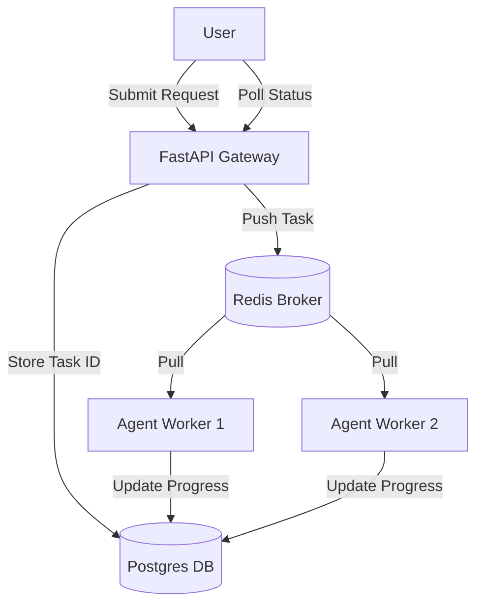

# 📬 Queue Systems & Background Jobs — Handling Long-Running Tasks
> **Level:** Advanced | **Language:** Hinglish | **Goal:** User interface ko block kiye bina long-running agentic tasks ko manage karne ke liye Redis, RabbitMQ, aur Celery ke use ko master karein.

---

## 🧭 1. Beginner-Friendly Hinglish Explanation
Queue System ka matlab hai **"AI ki line (Waiting Room)"**. 

Socho ek user ne bola: "Mere 50 PDFs padho aur unka summary banao."
- **Bina Queue:** User wait kar raha hai, browser loading ghoom raha hai, aur 30 second baad "Timeout" error aa jata hai.
- **Saath mein Queue:** Agent bolta hai "Theek hai, main kaam shuru kar raha hoon. Ye raha aapka Ticket ID. Jab kaam ho jayega, main bata dunga."

Queue system AI ko "Patient" banata hai aur system ko "Crash" hone se bachata hai jab bahut sara kaam ek saath aa jaye.

---

## 🧠 2. Deep Technical Explanation
Agents ke liye background processing critical hai kyunki LLM inference slow hota hai.
1. **The Broker (Redis/RabbitMQ):** Ek message storage jahan tasks process hone ka wait karte hain.
2. **The Worker (Celery/Python):** Ek separate process jo queue ko listen karta hai aur agent logic ko execute karta hai.
3. **State Management:** Worker ko database (Postgres) mein task ki progress save karni hogi taaki user status check kar sake (e.g. 50% done).
4. **Visibility Timeout:** Ensure karna ki agar worker crash ho jaye, toh task wapas queue mein daal diya jaye taaki doosra worker use finish kar sake.
5. **Rate Limiting Workers:** Ensure karna ki aap 100 workers start na karein aur 1 second mein apni OpenAI API rate limit hit na kar dein.

---

## 🏗️ 3. Architecture Diagrams


```mermaid
graph TD
    U[User] -->|Submit Request| G[FastAPI Gateway]
    G -->|Store Task ID| DB[(Postgres DB)]
    G -->|Push Task| R[(Redis Broker)]
    R -->|Pull| W1[Agent Worker 1]
    R -->|Pull| W2[Agent Worker 2]
    W1 & W2 -->|Update Progress| DB
    U -->|Poll Status| G
```

---

## 💻 4. Production-Ready Code Example (Using Celery)

```python
from celery import Celery

# Hinglish Logic: Worker ko background mein agent chalane do
app = Celery('agent_tasks', broker='redis://localhost:6379/0')

@app.task
def long_running_agent_task(user_query, session_id):
    # 1. Run complex LangGraph logic (takes 2 mins)
    # 2. Save final answer to DB
    # 3. Send WebSocket notification to User
    return "Task Finished"
```

---

## 🌍 5. Real-World Use Cases
- **Data Scraping:** Price comparison data dhoondhne ke liye 100 websites scrape karna.
- **Report Generation:** Quarterly financials read karna aur 10-page PDF report create karna.
- **Email Swarms:** Ek agent jise 500 unread emails read karke unhe categorize karna ho.

---

## ❌ 6. Failure Cases
- **Poison Pills:** Ek aisi task jo worker ko crash kar rahi hai baar-baar.
- **Memory Leak:** Worker har task ke baad RAM kha raha hai aur akhir mein server hang ho gaya.
- **Queue Overload:** 1 million tasks queue mein hain par workers sirf 2 hain (Use **Autoscaling**).

---

## 🛠️ 7. Debugging Guide
- **Flower Dashboard:** Use Flower to see: "Kaunse tasks fail ho rahe hain aur kyu?"
- **Logs:** Humesha worker logs mein `task_id` include karein.

---

## ⚖️ 8. Tradeoffs
- **Queue System:** High reliability aur spikes handle karta hai, par infrastructure complexity aur latency add karta hai.
- **Synchronous:** Simple tasks ke liye fast hai par load hone par crash ho jata hai.

---

## ✅ 9. Best Practices
- **Idempotency:** Task ko aisi banayein ki agar wo 2 baar chale, toh koi problem na ho.
- **Timeouts:** Har task ka ek `hard_timeout` rakhein (e.g. 10 mins).

---

## 🛡️ 10. Security Concerns
- **Task Injection:** Attacker queue mein malicious tasks push kar deta hai. Use **HMAC signatures** for task messages.

---

## 📈 11. Scaling Challenges
- **KEDA Scaling:** Jab Redis queue bahut lambi ho jaye toh automatically Kubernetes mein aur worker pods add karna.

---

## 💰 12. Cost Considerations
- **Idle Worker Cost:** Workers chal rahe hain par queue khali hai. Use serverless workers (e.g. AWS Fargate) to save money.

---

## 📝 13. Interview Questions
1. **"Agents ke liye background jobs kyu zaruri hain?"**
2. **"Redis vs RabbitMQ for agent task brokers?"**
3. **"Worker crashes ko queue system kaise handle karta hai?"**

---

## 🚀 15. Latest 2026 Industry Patterns
- **Temporal.io for Agents:** Long-running "Workflows" ko manage karne ke liye Temporal ka use karna jo server restarts ko survive kar sakein aur finish hone mein months le sakein.
- **Distributed Agents:** Different agent roles ke liye different workers (e.g. "Research Queue" vs "Email Queue").

---

> **Expert Tip:** Production agents are **Asynchronous** by default. If your user is staring at a loading spinner, your architecture is already failing.
