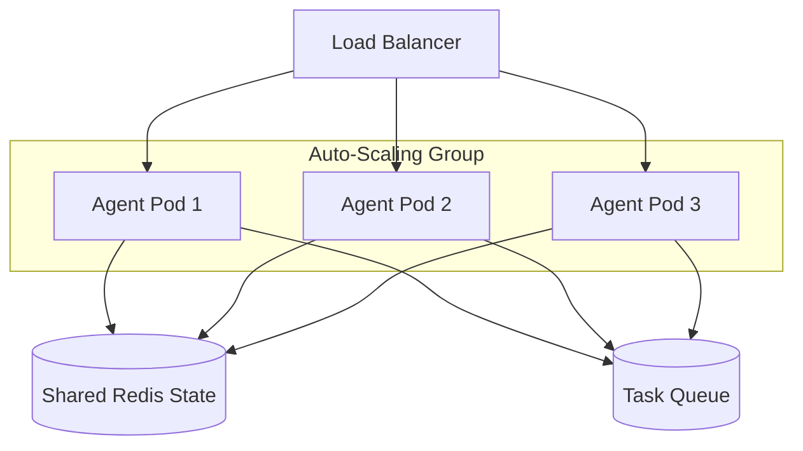

# 🚀 Scalable Agent Systems — Handling the Traffic Wave
> **Level:** Advanced | **Language:** Hinglish | **Goal:** Master the strategies for scaling AI agent systems horizontally and vertically to handle thousands of concurrent users.

---

## 🧭 1. Beginner-Friendly Hinglish Explanation
Scalability ka matlab hai **"System ko bada banana"**. 

Socho aapka agent ek dukaan hai. 
- **Vertical Scaling:** Ek bada dukaan banana jisme zyada log aa sakein (Zyada CPU/RAM).
- **Horizontal Scaling:** Waisi hi 10 aur dukaane (Servers) khol dena.

Agentic AI mein scaling mushkil hai kyunki AI "Heavy" hota hai aur har user ka apna ek "Context" (Yaadash) hota hai. Hum sikhange ki kaise **Kubernetes aur Load Balancers** ka use karke hum AI ko "Unlimited" bada bana sakte hain.

---

## 🧠 2. Deep Technical Explanation
Scaling agent systems involves three main dimensions: **Compute**, **Memory**, and **Inference**.
1. **Horizontal Pod Autoscaling (HPA):** Using Kubernetes to automatically increase the number of agent pods based on CPU or custom metrics (like "Pending Tasks").
2. **Stateless Logic:** keeping the agent logic stateless by offloading memory to an external **Redis** or **Postgres** cluster. This allows any worker pod to pick up any user session.
3. **Inference Scaling:** Using load balancers to distribute requests across multiple LLM providers (OpenAI, Anthropic, or local vLLM nodes).
4. **Queue-based Processing:** Using **RabbitMQ** or **Redis Streams** to buffer requests so the system doesn't crash during a sudden traffic spike.
5. **Database Sharding:** If you have millions of threads, splitting the state database into multiple pieces for faster read/write.

---

## 🏗️ 3. Architecture Diagrams



---

## 💻 4. Production-Ready Code Example (Worker Scalability)

```python
# Hinglish Logic: Worker ko kisi bhi thread ka kaam karne do, bas DB se load karo
def agent_worker(thread_id, user_query):
    # 1. Load context from Redis (Stateful Scaling)
    history = redis_client.get(f"history:{thread_id}")
    
    # 2. Process logic
    # response = agent.invoke(user_query, history)
    
    # 3. Save back
    # redis_client.set(f"history:{thread_id}", new_history)
```

---

## 🌍 5. Real-World Use Cases
- **Viral AI Apps:** Apps that go from 0 to 1 million users in a week (like ChatGPT or Character.ai).
- **Global Customer Service:** Serving users across different timezones with a "Elastic" workforce of agents.
- **Data Crawling:** Scaling to 1000s of parallel agents to scrape the entire web in hours.

---

## ❌ 6. Failure Cases
- **Redis Overload:** Saare pods ek hi Redis par itni speed se likh rahe hain ki Redis hi slow ho gaya.
- **State Race Conditions:** Do pods ek hi user ke state ko edit karne ki koshish kar rahe hain (Use Locks).
- **GPU Bottleneck:** Local models use karte waqt GPU memory (VRAM) khatam ho jana.

---

## 🛠️ 7. Debugging Guide
- **Log Aggregation:** Use ELK or Datadog to see logs from all 100 pods in one place.
- **Bottleneck Analysis:** Check karein: "Kya LLM response slow hai ya humara database?"

---

## ⚖️ 8. Tradeoffs
- **High Scalability:** Complex architecture, high cloud bill, but handles any load.
- **Low Scalability:** Simple and cheap but crashes when 100 people use it.

---

## ✅ 9. Best Practices
- **Graceful Degradation:** Agar system load bahut zyada hai, toh "Lite" model (GPT-4o-mini) par switch kar dein.
- **Health Checks:** Kubernetes ko batayein ki pod "Ready" hai ya nahi before sending traffic.

---

## 🛡️ 10. Security Concerns
- **DDoS on Wallet:** Attacker millions of requests bhej kar aapka API bill $10,000 kar sakta hai. Use **Rate Limiting**.

---

## 📈 11. Scaling Challenges
- **Large Context Windows:** Handling 128k context for thousands of users in memory is impossible. Use **RAG** or **Summarization**.

---

## 💰 12. Cost Considerations
- **Spot Instances:** Use "Spare" cloud servers that are 70% cheaper but can be taken back any time.

---

## 📝 13. Interview Questions
1. **"Stateless architecture agents ke liye kyu zaruri hai?"**
2. **"Horizontal vs Vertical scaling mein agents ke liye kya better hai?"**
3. **"Rate limiting scaling mein kaise help karti hai?"**

---

## 🚀 15. Latest 2026 Industry Patterns
- **KEDA (Kubernetes Event-driven Autoscaling):** Scaling agent pods based on the number of messages in a Redis queue.
- **Multi-Cloud Failover:** If AWS goes down, automatically scaling up on Azure within seconds.

---

> **Expert Tip:** Scaling is not about having "Big Servers", it's about having **"Flexible Architectures"**.
