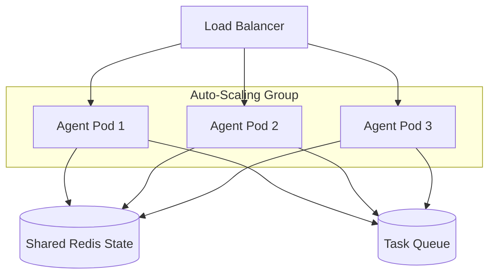

# 🚀 Scalable Agent Systems — Handling the Traffic Wave
> **Level:** Advanced | **Language:** Hinglish | **Goal:** Thousands of concurrent users handle karne ke liye AI agent systems ko horizontally aur vertically scale karne ki strategies ko master karein.

---

## 🧭 1. Beginner-Friendly Hinglish Explanation
Scalability ka matlab hai **"System ko bada banana"**. 

Socho aapka agent ek dukaan hai. 
- **Vertical Scaling:** Ek bada dukaan banana jisme zyada log aa sakein (Zyada CPU/RAM).
- **Horizontal Scaling:** Waisi hi 10 aur dukaane (Servers) khol dena.

Agentic AI mein scaling mushkil hai kyunki AI "Heavy" hota hai aur har user ka apna ek "Context" (Yaadash) hota hai. Hum sikhange ki kaise **Kubernetes aur Load Balancers** ka use karke hum AI ko "Unlimited" bada bana sakte hain.

---

## 🧠 2. Deep Technical Explanation
Scaling agent systems teen main dimensions ko involve karta hai: **Compute**, **Memory**, aur **Inference**.
1. **Horizontal Pod Autoscaling (HPA):** CPU ya custom metrics (jaise "Pending Tasks") ke basis par automatically agent pods ke number ko badhane ke liye Kubernetes ka use karna.
2. **Stateless Logic:** Memory ko external **Redis** ya **Postgres** cluster par offload karke agent logic ko stateless rakhna. Ye kisi bhi worker pod ko koi bhi user session pick karne deta hai.
3. **Inference Scaling:** Requests ko multiple LLM providers (OpenAI, Anthropic, ya local vLLM nodes) ke across distribute karne ke liye load balancers ka use karna.
4. **Queue-based Processing:** Requests ko buffer karne ke liye **RabbitMQ** ya **Redis Streams** ka use karna taaki sudden traffic spike ke dauran system crash na ho.
5. **Database Sharding:** Agar aapke paas millions of threads hain, toh faster read/write ke liye state database ko multiple pieces mein split karna.

---

## 🏗️ 3. Architecture Diagrams


```mermaid
graph TD
    LB[Load Balancer] --> A1[Agent Pod 1]
    LB --> A2[Agent Pod 2]
    LB --> A3[Agent Pod 3]
    
    A1 & A2 & A3 --> S[(Shared Redis State)]
    A1 & A2 & A3 --> Q[(Task Queue)]
    
    subgraph "Auto-Scaling Group"
    A1
    A2
    A3
    end
```

---

## 💻 4. Production-Ready Code Example (Worker Scalability)

```python
# Hinglish Logic: Worker ko kisi bhi thread ka kaam karne do, bas DB se load karo
def agent_worker(thread_id, user_query):
    # 1. Load context from Redis (Stateful Scaling)
    history = redis_client.get(f"history:{thread_id}")
    
    # 2. Process logic
    # response = agent.invoke(user_query, history)
    
    # 3. Save back
    # redis_client.set(f"history:{thread_id}", new_history)
```

---

## 🌍 5. Real-World Use Cases
- **Viral AI Apps:** Aise apps jo ek week mein 0 se 1 million users tak chale jate hain (jaise ChatGPT ya Character.ai).
- **Global Customer Service:** Agents ke "Elastic" workforce ke sath different timezones ke users ko serve karna.
- **Data Crawling:** Ghanton mein poora web scrape karne ke liye thousands of parallel agents tak scale karna.

---

## ❌ 6. Failure Cases
- **Redis Overload:** Saare pods ek hi Redis par itni speed se likh rahe hain ki Redis hi slow ho gaya.
- **State Race Conditions:** Do pods ek hi user ke state ko edit karne ki koshish kar rahe hain (Use Locks).
- **GPU Bottleneck:** Local models use karte waqt GPU memory (VRAM) khatam ho jana.

---

## 🛠️ 7. Debugging Guide
- **Log Aggregation:** Sabhi 100 pods ke logs ek jagah dekhne ke liye ELK ya Datadog ka use karein.
- **Bottleneck Analysis:** Check karein: "Kya LLM response slow hai ya humara database?"

---

## ⚖️ 8. Tradeoffs
- **High Scalability:** Complex architecture, high cloud bill, par koi bhi load handle kar leta hai.
- **Low Scalability:** Simple aur cheap hai par jab 100 log use karte hain toh crash ho jata hai.

---

## ✅ 9. Best Practices
- **Graceful Degradation:** Agar system load bahut zyada hai, toh "Lite" model (GPT-4o-mini) par switch kar dein.
- **Health Checks:** Kubernetes ko batayein ki pod "Ready" hai ya nahi before sending traffic.

---

## 🛡️ 10. Security Concerns
- **DDoS on Wallet:** Attacker millions of requests bhej kar aapka API bill $10,000 kar sakta hai. Use **Rate Limiting**.

---

## 📈 11. Scaling Challenges
- **Large Context Windows:** Thousands of users ke liye memory mein 128k context handle karna impossible hai. **RAG** ya **Summarization** use karein.

---

## 💰 12. Cost Considerations
- **Spot Instances:** "Spare" cloud servers use karein jo 70% cheaper hote hain par kisi bhi time wapas liye ja sakte hain.

---

## 📝 13. Interview Questions
1. **"Stateless architecture agents ke liye kyu zaruri hai?"**
2. **"Horizontal vs Vertical scaling mein agents ke liye kya better hai?"**
3. **"Rate limiting scaling mein kaise help karti hai?"**

---

## 🚀 15. Latest 2026 Industry Patterns
- **KEDA (Kubernetes Event-driven Autoscaling):** Redis queue mein messages ke number ke basis par agent pods scale karna.
- **Multi-Cloud Failover:** Agar AWS down ho, toh seconds ke andar automatically Azure par scale up karna.

---

> **Expert Tip:** Scaling is not about having "Big Servers", it's about having **"Flexible Architectures"**.
