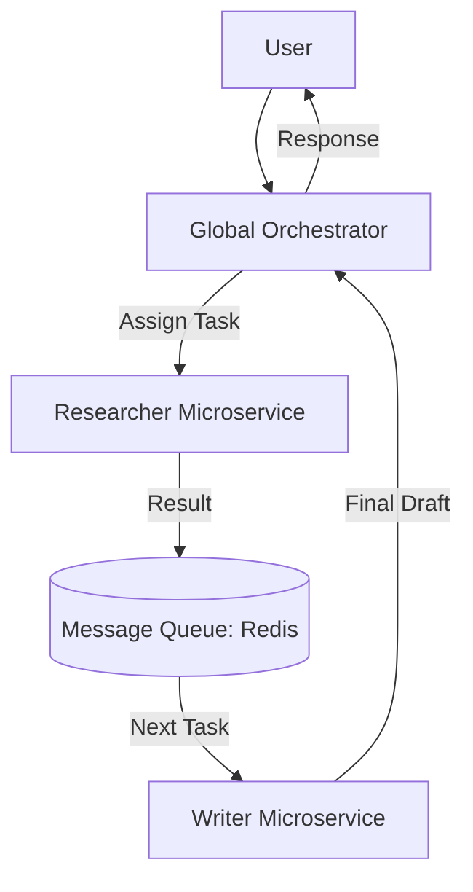

# 🕸️ Deploying Multi-Agent Systems — Orchestrating the Swarm
> **Level:** Advanced | **Language:** Hinglish | **Goal:** Master the deployment of complex, multi-agent architectures (CrewAI, LangGraph) using microservices, message queues, and service meshes.

---

## 🧭 1. Beginner-Friendly Hinglish Explanation
Multi-Agent Deployment ka matlab hai **"AI ki puri team ko live karna"**. 

Socho ek agent nahi, balki 5 agents hain:
- Researcher
- Writer
- Fact-checker
- Translator
- Publisher

Ab aap in sabko ek hi server par nahi rakh sakte kyunki agar "Researcher" crash hua, toh poori team band ho jayegi. 
**Multi-Agent Deployment** mein hum har agent ko ek "Microservice" banate hain. Wo aapas mein **Redis** ya **HTTP** ke through baat karte hain. Isse system "Reliable" banta hai aur aap har agent ko alag se scale kar sakte ho.

---

## 🧠 2. Deep Technical Explanation
Deploying multi-agent systems requires a **Distributed Systems** approach.
1. **The Orchestrator:** A central service (like a LangGraph API) that holds the "Global State" and tells which agent to run next.
2. **Worker Agents:** Each agent type (Researcher, Writer) runs as a separate deployment or service.
3. **Communication (Pub/Sub):** Using **Redis Streams** or **Kafka** for agents to send results to each other.
4. **State Syncing:** Every agent must read from and write to a shared "Brain" (Postgres/Redis) so the orchestrator knows the current status.
5. **Service Mesh (Istio):** Managing the complex networking, retries, and security between 10+ different agent services.

---

## 🏗️ 3. Architecture Diagrams



---

## 💻 4. Production-Ready Code Example (Docker Compose for Swarm)

```yaml
# Hinglish Logic: Ek hi command se poori team start karo
services:
  orchestrator:
    build: ./orchestrator
    ports: ["8000:8000"]
  researcher:
    build: ./researcher
    environment: ["BROKER_URL=redis://redis:6379"]
  writer:
    build: ./writer
    environment: ["BROKER_URL=redis://redis:6379"]
  redis:
    image: redis:alpine
```

---

## 🌍 5. Real-World Use Cases
- **Autonomous Newsroom:** A swarm of agents that find news, write articles, and post to social media.
- **Supply Chain Management:** Agents for "Inventory", "Shipping", and "Payments" coordinating across different company systems.
- **Complex Software Dev:** Different agents for "Frontend", "Backend", and "DevOps" building an app together.

---

## ❌ 6. Failure Cases
- **Partial Failure:** Researcher ne kaam kiya par Writer crash ho gaya. Ab user ko "Incomplete" data mil raha hai.
- **Latency Stacking:** Har agent 5 second leta hai. 5 agents = 25 seconds wait time for the user.
- **Data Inconsistency:** Researcher ne state badal di par Fact-checker purana data hi padh raha hai.

---

## 🛠️ 7. Debugging Guide
- **Distributed Tracing:** Use **OpenTelemetry** to see the "Life of a request" as it travels through 5 different agents.
- **Dead Letter Queues (DLQ):** Tasks jo kisi bhi agent se poori nahi hui, unhe ek alag queue mein dalein for human review.

---

## ⚖️ 8. Tradeoffs
- **Microservices Agents:** High reliability, independent scaling, but very complex to deploy and debug.
- **Monolithic Agent:** Easy to build and fast, but if one part fails, everything fails.

---

## ✅ 9. Best Practices
- **Standardized Messaging:** Use a common JSON schema for all agents to talk to each other.
- **Agent Health Monitoring:** Alert if the "Writer Agent" is idle for too long while tasks are pending.

---

## 🛡️ 10. Security Concerns
- **Internal Attacks:** One compromised agent trying to "Socially Engineer" another agent into giving it admin access.

---

## 📈 11. Scaling Challenges
- **Resource Contention:** Multiple agents fighting for the same GPU or Database connection.

---

## 💰 12. Cost Considerations
- **Orchestration Overhead:** More agents = More API calls = More money. Use small models for the "Triage/Coordination" step.

---

## 📝 13. Interview Questions
1. **"Multi-agent system ko microservices mein kyu break karte hain?"**
2. **"Agent synchronization issues ko kaise handle karenge?"**
3. **"Service mesh ka role multi-agent deployment mein kya hai?"**

---

## 🚀 15. Latest 2026 Industry Patterns
- **Agentic Kubernetes Operators:** A specialized Kubernetes operator that manages agent lifecycles, retries, and scaling automatically.
- **Heterogeneous Scaling:** Scaling the "Researcher" to 50 pods while keeping the "Writer" at 2 pods (because research is more parallelizable).

---

> **Expert Tip:** A swarm is only as strong as its **Communication**. Focus 80% on the "Plumbing" (Queues/State) and 20% on the "Brain".
