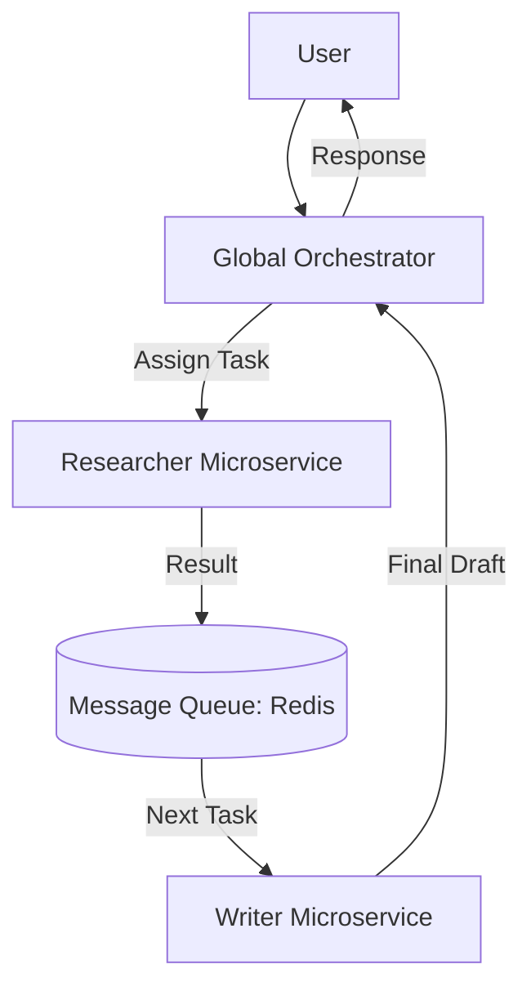

# 🕸️ Deploying Multi-Agent Systems — Orchestrating the Swarm
> **Level:** Advanced | **Language:** Hinglish | **Goal:** Microservices, message queues, aur service meshes ka use karke complex, multi-agent architectures (CrewAI, LangGraph) ke deployment ko master karein.

---

## 🧭 1. Beginner-Friendly Hinglish Explanation
Multi-Agent Deployment ka matlab hai **"AI ki puri team ko live karna"**. 

Socho ek agent nahi, balki 5 agents hain:
- Researcher
- Writer
- Fact-checker
- Translator
- Publisher

Ab aap in sabko ek hi server par nahi rakh sakte kyunki agar "Researcher" crash hua, toh poori team band ho jayegi. 
**Multi-Agent Deployment** mein hum har agent ko ek "Microservice" banate hain. Wo aapas mein **Redis** ya **HTTP** ke through baat karte hain. Isse system "Reliable" banta hai aur aap har agent ko alag se scale kar sakte ho.

---

## 🧠 2. Deep Technical Explanation
Multi-agent systems deploy karne ke liye ek **Distributed Systems** approach ki zaroorat hoti hai.
1. **The Orchestrator:** Ek central service (jaise LangGraph API) jo "Global State" hold karti hai aur batati hai ki next kis agent ko run karna hai.
2. **Worker Agents:** Har agent type (Researcher, Writer) ek separate deployment ya service ke roop mein run hota hai.
3. **Communication (Pub/Sub):** Agents ko ek doosre ko results bhejne ke liye **Redis Streams** ya **Kafka** ka use karna.
4. **State Syncing:** Har agent ko ek shared "Brain" (Postgres/Redis) par read aur write karna chahiye taaki orchestrator ko current status pata ho.
5. **Service Mesh (Istio):** 10+ different agent services ke beech complex networking, retries, aur security ko manage karna.

---

## 🏗️ 3. Architecture Diagrams


```mermaid
graph TD
    U[User] --> O[Global Orchestrator]
    O -->|Assign Task| R[Researcher Microservice]
    R -->|Result| MQ[(Message Queue: Redis)]
    MQ -->|Next Task| W[Writer Microservice]
    W -->|Final Draft| O
    O -->|Response| U
```

---

## 💻 4. Production-Ready Code Example (Docker Compose for Swarm)

```yaml
# Hinglish Logic: Ek hi command se poori team start karo
services:
  orchestrator:
    build: ./orchestrator
    ports: ["8000:8000"]
  researcher:
    build: ./researcher
    environment: ["BROKER_URL=redis://redis:6379"]
  writer:
    build: ./writer
    environment: ["BROKER_URL=redis://redis:6379"]
  redis:
    image: redis:alpine
```

---

## 🌍 5. Real-World Use Cases
- **Autonomous Newsroom:** Agents ka ek swarm jo news dhoondhta hai, articles likhta hai, aur social media par post karta hai.
- **Supply Chain Management:** Different company systems ke across coordinate karne wale "Inventory", "Shipping", aur "Payments" ke agents.
- **Complex Software Dev:** Ek sath app build karne wale "Frontend", "Backend", aur "DevOps" ke different agents.

---

## ❌ 6. Failure Cases
- **Partial Failure:** Researcher ne kaam kiya par Writer crash ho gaya. Ab user ko "Incomplete" data mil raha hai.
- **Latency Stacking:** Har agent 5 second leta hai. 5 agents = user ke liye 25 seconds wait time.
- **Data Inconsistency:** Researcher ne state badal di par Fact-checker purana data hi padh raha hai.

---

## 🛠️ 7. Debugging Guide
- **Distributed Tracing:** "Life of a request" dekhne ke liye **OpenTelemetry** use karein jab ye 5 different agents ke through travel kare.
- **Dead Letter Queues (DLQ):** Tasks jo kisi bhi agent se poori nahi hui, unhe ek alag queue mein dalein for human review.

---

## ⚖️ 8. Tradeoffs
- **Microservices Agents:** High reliability aur independent scaling hai par deploy aur debug karna bahut complex hai.
- **Monolithic Agent:** Build karna easy hai aur fast hai, par agar ek part fail hua toh sab fail ho jata hai.

---

## ✅ 9. Best Practices
- **Standardized Messaging:** Sabhi agents ko ek doosre se baat karne ke liye ek common JSON schema use karein.
- **Agent Health Monitoring:** Agar tasks pending hone par bhi "Writer Agent" bahut time tak idle rahe, toh alert karein.

---

## 🛡️ 10. Security Concerns
- **Internal Attacks:** Ek compromised agent jo doosre agent ko admin access dene ke liye "Socially Engineer" karne ki koshish kar raha ho.

---

## 📈 11. Scaling Challenges
- **Resource Contention:** Same GPU ya Database connection ke liye multiple agents ka aapas mein ladna.

---

## 💰 12. Cost Considerations
- **Orchestration Overhead:** More agents = More API calls = More money. "Triage/Coordination" step ke liye small models use karein.

---

## 📝 13. Interview Questions
1. **"Multi-agent system ko microservices mein kyu break karte hain?"**
2. **"Agent synchronization issues ko kaise handle karenge?"**
3. **"Service mesh ka role multi-agent deployment mein kya hai?"**

---

## 🚀 15. Latest 2026 Industry Patterns
- **Agentic Kubernetes Operators:** Ek specialized Kubernetes operator jo agent lifecycles, retries, aur scaling ko automatically manage karta hai.
- **Heterogeneous Scaling:** "Researcher" ko 50 pods tak scale karna jabki "Writer" ko 2 pods par hi rakhna (kyunki research zyada parallelizable hai).

---

> **Expert Tip:** A swarm is only as strong as its **Communication**. Focus 80% on the "Plumbing" (Queues/State) and 20% on the "Brain".
