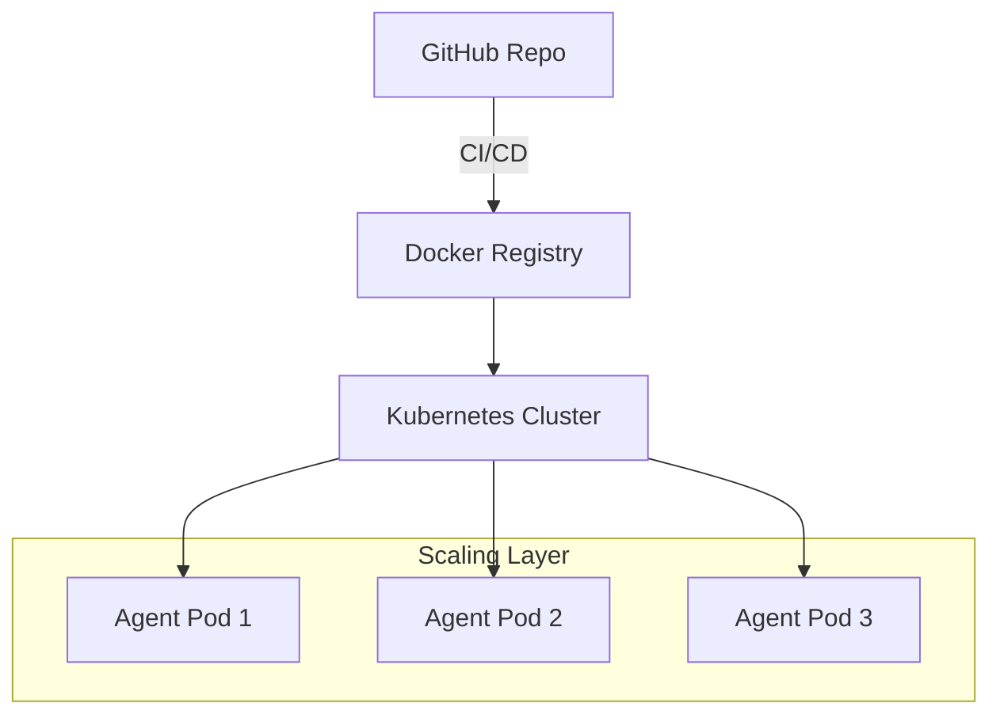

# 🚢 Deployment & Scaling — Going Global
> **Level:** Advanced | **Language:** Hinglish | **Goal:** Master the tools and workflows for deploying agents to the cloud (AWS, Azure, GCP) and scaling them to handle global traffic.

---

## 🧭 1. Beginner-Friendly Hinglish Explanation
Deployment aur Scaling ka matlab hai **"AI ko live karna aur bada banana"**. 

- **Deployment:** Aapka code Github se nikal kar ek real server (like AWS) par chal raha hai jahan koi bhi use access kar sakta hai.
- **Scaling:** Jab 10 users se 10,000 users ho jate hain, toh server ko kaise "Double" ya "Triple" karna hai bina system crash kiye.

Jaise ek dukaan se puri chain (Franchise) banayi jati hai, scaling wahi process hai agentic apps ke liye.

---

## 🧠 2. Deep Technical Explanation
Deploying agents is different from normal web apps because of **GPU dependencies** and **Long-running requests**.
1. **Dockerization:** Packaging your agent, dependencies, and environment variables into a "Container" that runs anywhere.
2. **Kubernetes (K8s):** Orchestrating multiple containers. It automatically replaces "Dead" agents and starts new ones during high traffic.
3. **GPU Clouds:** Using specialized providers like **Lambda Labs**, **CoreWeave**, or **RunPod** for hosting local models (Llama/Mistral).
4. **CI/CD Pipelines:** Automatically testing and deploying new "Prompts" or "Code" every time you push to GitHub.
5. **Horizontal Pod Autoscaling (HPA):** Scaling agents based on custom metrics like "Pending Tasks" or "GPU Memory".

---

## 🏗️ 3. Architecture Diagrams



---

## 💻 4. Production-Ready Code Example (Simple Dockerfile)

```dockerfile
# Hinglish Logic: Ye file batati hai ki agent ko container mein kaise pack karein
FROM python:3.11-slim

WORKDIR /app
COPY requirements.txt .
RUN pip install -r requirements.txt

COPY . .

# Start the agent API
CMD ["uvicorn", "main:app", "--host", "0.0.0.0", "--port", "8000"]
```

---

## 🌍 5. Real-World Use Cases
- **Global SaaS Apps:** Agents that serve users across USA, India, and Europe with low latency.
- **Retail Holiday Sales:** Scaling up from 5 agents to 500 agents during "Black Friday" or "Diwali Sale".
- **Medical AI:** Deploying secure, isolated agents within a hospital's private cloud.

---

## ❌ 6. Failure Cases
- **OOM (Out of Memory):** Model ne itni RAM kha li ki server crash ho gaya.
- **Cold Start Delay:** Naya agent start hone mein itna time lag raha hai ki user ne app band kar di.
- **Configuration Drift:** Dev server aur Prod server ki settings alag hona.

---

## 🛠️ 7. Debugging Guide
- **Container Logs:** `docker logs -f [container_id]` karke real-time errors dekhein.
- **K8s Dashboard:** Pods ka health aur resource usage visualize karein.

---

## ⚖️ 8. Tradeoffs
- **Managed Deployment (Vercel/Heroku):** Very easy but limited control and high cost.
- **Self-Managed (K8s on AWS):** Full control and cheaper at scale, but requires a DevOps expert.

---

## ✅ 9. Best Practices
- **Health Checks:** `/health` endpoint banayein taaki server ko pata chale agent "Zinda" hai ya nahi.
- **Zero Downtime:** Naya version launch karte waqt purana version tab tak band na karein jab tak naya "Ready" na ho.

---

## 🛡️ 10. Security Concerns
- **Exposed API Keys:** Galti se Docker image mein `.env` file bhej dena. Humesha "Secrets Manager" use karein.

---

## 📈 11. Scaling Challenges
- **Stateful Scaling:** Agar agent memory RAM mein hai, toh naya pod user ko "Pehchanta" nahi. Humesha memory database (Redis) mein rakhein.

---

## 💰 12. Cost Considerations
- **Reserved Instances:** 1 saal ka server advance book karne par 70% tak bachat ho sakti hai.

---

## 📝 13. Interview Questions
1. **"Agent deployment mein Docker kyu zaruri hai?"**
2. **"Kubernetes agents ko scale karne mein kaise help karta hai?"**
3. **"Stateful vs Stateless scaling kya hota hai?"**

---

## ⚠️ 14. Common Mistakes
- **No Resource Limits:** Ek agent ko poore CPU ka access de dena, jisse baaki services band ho jayein.
- **Ignoring Logs:** Purane logs delete na karna, jisse disk full ho jaye.

---

## 🚀 15. Latest 2026 Industry Patterns
- **Edge Deployment:** Running agents on the "Edge" (like Cloudflare Workers) to reduce latency to <10ms.
- **Serverless GPU:** Running models on "Spot Instances" that cost 90% less but can be taken back any time.

---

> **Expert Tip:** Scaling is not just about "More Servers". It's about **Efficiency**. The best deployment is the one that uses the least resources for the most work.
